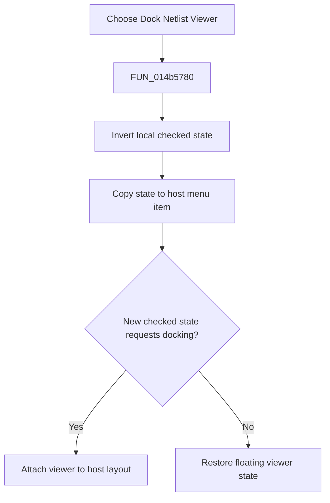

# Dock Netlist Viewer

> Analysis status: Reviewed from the recovered handler, synchronized menu state, and host docking path.

## Control

| Property | Recovered value |
| --- | --- |
| Form | NetlistViewer |
| Component path | NetlistViewer.MainMenu.MFile.MIDockViewer |
| Control class | TMenuItem |
| Caption | Dock Netlist Viewer |
| Hint | Not present in the recovered resource. |
| Text | Not present in the recovered resource. |
| Handler name | MIDockViewerClick |
| Handler address | 014b5780 |
| Graph node | `resource:dfm:NetlistViewer/NetlistViewer.MainMenu.MFile.MIDockViewer` |
| Handler node | `function:014b5780` |
| Graph layer | UI |

## What happens when clicked

The menu item toggles its checked state and applies the same state to the host application's matching Netlist Viewer menu item. It then calls the host docking helper with that new state. The host helper attaches or detaches the viewer, updates related host controls, and preserves or restores the floating bounds as needed. Repeating the click reverses the state; there is no local error or rollback branch.

## Click flow

## Handler evidence

- Source: [DecompiledSources/Tina16/functions/00000000014B5780__FUN_014b5780.c](../../../DecompiledSources/Tina16/functions/00000000014B5780__FUN_014b5780.c)
- Recovered role: Toggle Netlist Viewer docking and synchronize host menu state.
- Current graph summary: Handles 1 Delphi UI event: NetlistViewer.MainMenu.MFile.MIDockViewer.OnClick.
- Current graph behavior: Not present in the recovered resource.
- Current graph evidence: Not present in the recovered resource.
- Complexity: moderate
- Distinct outgoing calls: 2

## Direct calls

- `function:007e2d20` — FUN_007e2d20
- `function:01c8a4d0` — FUN_01c8a4d0

## Resource evidence

- Kind: Not present in the recovered resource.
- Modal result: Not present in the recovered resource.
- Checked state: Not present in the recovered resource.
- List items: Not present in the recovered resource.
- Image reference: Not present in the recovered resource.
- Extracted glyph: None.

## Nearby label candidates

Nearby labels are layout candidates only. They are not proof of behavior.

- No same-parent label candidate is available.

## Analysis limits

- The host docking routine contains additional layout state whose original Delphi field names are not recovered.
- The local handler does not persist the checked value directly.
