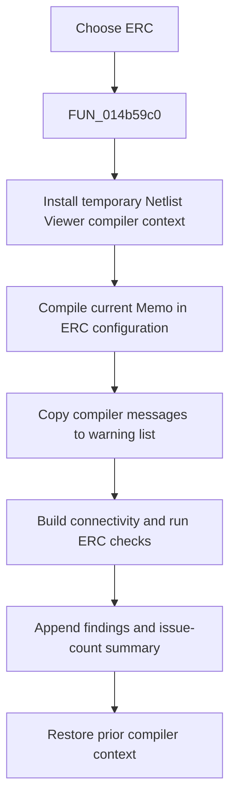

# ERC

> Analysis status: Reviewed from the recovered handler, compiler setup, message transfer, and ERC engine.

## Control

| Property | Recovered value |
| --- | --- |
| Form | NetlistViewer |
| Component path | NetlistViewer.MainMenu.MAnalysis.MIERC |
| Control class | TMenuItem |
| Caption | ERC |
| Hint | Not present in the recovered resource. |
| Text | Not present in the recovered resource. |
| Handler name | MIERCClick |
| Handler address | 014b59c0 |
| Graph node | `resource:dfm:NetlistViewer/NetlistViewer.MainMenu.MAnalysis.MIERC` |
| Handler node | `function:014b59c0` |
| Graph layer | UI |

## What happens when clicked

The menu item runs electrical-rules checking for the current `Memo`. The handler temporarily installs the Netlist Viewer as the active compiler context, calls the shared compile front end in its ERC configuration, copies generated compiler messages into the warning list, clears the host message sink, and then runs the ERC engine. The engine rebuilds connectivity, checks nodes, pins, wires, identifiers, and configured ERC matrix rules, appends findings with source locations, and adds an issue-count summary. The handler restores the prior global compiler context before return.

## Click flow

## Handler evidence

- Source: [DecompiledSources/Tina16/functions/00000000014B59C0__FUN_014b59c0.c](../../../DecompiledSources/Tina16/functions/00000000014B59C0__FUN_014b59c0.c)
- Recovered role: Compile the current netlist and run electrical-rules checks.
- Current graph summary: Handles 1 Delphi UI event: NetlistViewer.MainMenu.MAnalysis.MIERC.OnClick.
- Current graph behavior: Not present in the recovered resource.
- Current graph evidence: Not present in the recovered resource.
- Complexity: complex
- Distinct outgoing calls: 5

## Direct calls

- `function:00ee4600` — FUN_00ee4600
- `function:014b4920` — FUN_014b4920
- `function:014b49a0` — FUN_014b49a0
- `function:016cedb0` — FUN_016cedb0
- `function:019a9ed0` — FUN_019a9ed0

## Resource evidence

- Kind: Not present in the recovered resource.
- Modal result: Not present in the recovered resource.
- Checked state: Not present in the recovered resource.
- List items: Not present in the recovered resource.
- Image reference: Not present in the recovered resource.
- Extracted glyph: None.

## Nearby label candidates

Nearby labels are layout candidates only. They are not proof of behavior.

- No same-parent label candidate is available.

## Analysis limits

- The recovered path has no cancel transaction and does not prove persistence of the results.
- Some compile option field names remain unknown, but the ERC engine responsibilities are established by its data flow and existing annotation.
