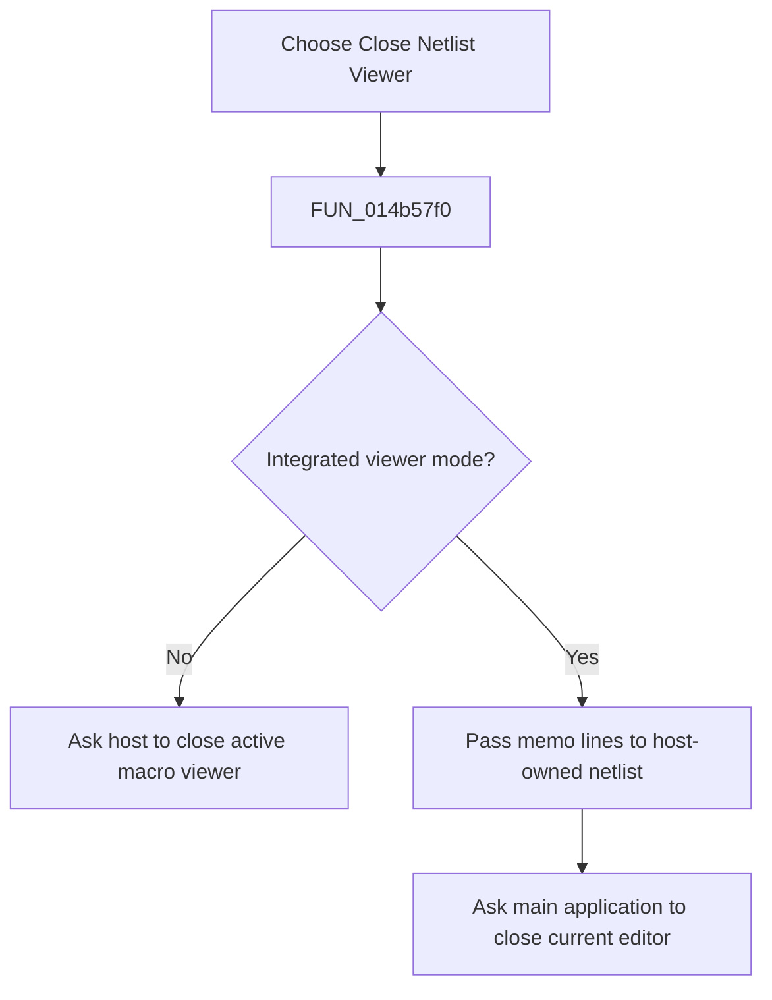

# &Close Netlist Viewer

> Analysis status: Reviewed from the shared close handler and host close paths.

## Control

| Property | Recovered value |
| --- | --- |
| Form | NetlistViewer |
| Component path | NetlistViewer.MainMenu.MFile.MIExit |
| Control class | TMenuItem |
| Caption | &Close Netlist Viewer |
| Hint | Not present in the recovered resource. |
| Text | Not present in the recovered resource. |
| Handler name | MIExitClick |
| Handler address | 014b57f0 |
| Graph node | `resource:dfm:NetlistViewer/NetlistViewer.MainMenu.MFile.MIExit` |
| Handler node | `function:014b57f0` |
| Graph layer | UI |

## What happens when clicked

The menu item runs the same branch-free handler as the toolbar close button. In standalone viewer mode, it asks the host to close the active macro viewer. In the integrated mode, it first sends the current memo lines to the host-owned netlist object and then asks the main application to close the current editor. The handler has no local prompt or return-value check; any close veto or unsaved-work handling belongs to the host paths.

## Click flow

## Handler evidence

- Source: [DecompiledSources/Tina16/functions/00000000014B57F0__FUN_014b57f0.c](../../../DecompiledSources/Tina16/functions/00000000014B57F0__FUN_014b57f0.c)
- Recovered role: Close the Netlist Viewer through the active host mode.
- Current graph summary: Handles 2 Delphi UI events: NetlistViewer.BtnPanel.ToolClose.OnClick, NetlistViewer.MainMenu.MFile.MIExit.OnClick.
- Current graph behavior: Not present in the recovered resource.
- Current graph evidence: Not present in the recovered resource.
- Complexity: moderate
- Distinct outgoing calls: 2

## Direct calls

- `function:01c8d180` — Handles 2 Delphi UI events: SchematicEditor.MainMenu.mnFile.mnCloseMacro.OnClick, SchematicEditor.SchPopup.pmCloseMacro.OnClick.
- `function:01c94450` — Handles 1 Delphi UI event: SchematicEditor.MainMenu.mnFile.mnClose.OnClick.

## Resource evidence

- Kind: Not present in the recovered resource.
- Modal result: Not present in the recovered resource.
- Checked state: Not present in the recovered resource.
- List items: Not present in the recovered resource.
- Image reference: Not present in the recovered resource.
- Extracted glyph: None.

## Nearby label candidates

Nearby labels are layout candidates only. They are not proof of behavior.

- No same-parent label candidate is available.

## Analysis limits

- The recovered handler does not itself prove whether a downstream host close can prompt or be vetoed.
- The menu and toolbar controls share this handler without a `Sender` branch.
