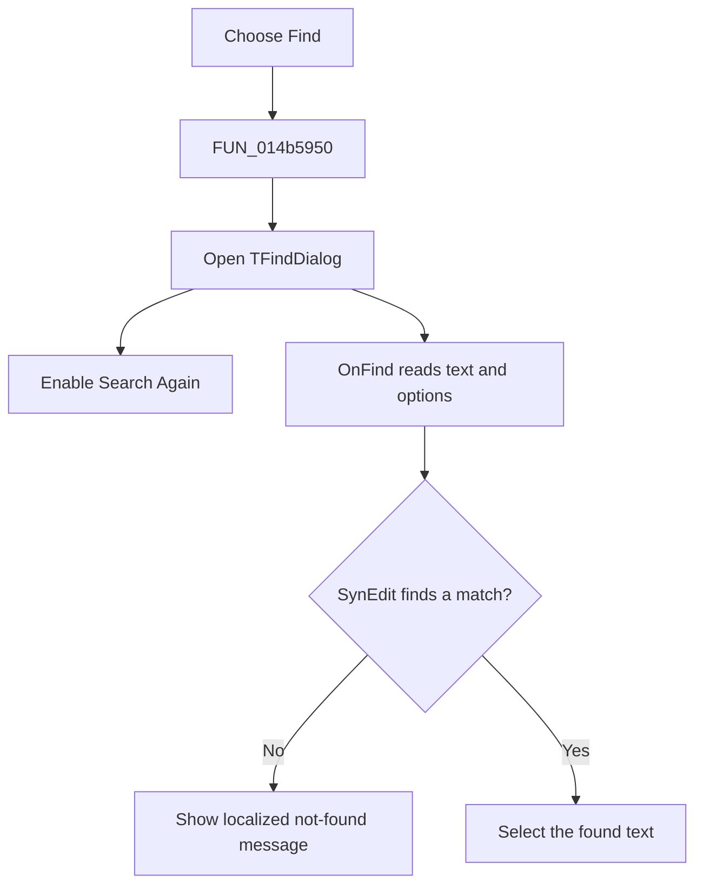

# &Find...

> Analysis status: Reviewed from the recovered handler, dialog resource, and find callback.

## Control

| Property | Recovered value |
| --- | --- |
| Form | NetlistViewer |
| Component path | NetlistViewer.MainMenu.MEdit.MIFind |
| Control class | TMenuItem |
| Caption | &Find... |
| Hint | Not present in the recovered resource. |
| Text | Not present in the recovered resource. |
| Handler name | MIFindClick |
| Handler address | 014b5950 |
| Graph node | `resource:dfm:NetlistViewer/NetlistViewer.MainMenu.MEdit.MIFind` |
| Handler node | `function:014b5950` |
| Graph layer | UI |

## What happens when clicked

The menu item opens the form's modeless `TFindDialog`. After the dialog call returns, it enables **Search Again**. Searches occur through the dialog's `OnFind` handler: it reads the dialog text and direction, case, and whole-word options, searches `Memo`, and shows a localized not-found message when SynEdit returns no match. This click does not change document text.

## Click flow

## Handler evidence

- Source: [DecompiledSources/Tina16/functions/00000000014B5950__FUN_014b5950.c](../../../DecompiledSources/Tina16/functions/00000000014B5950__FUN_014b5950.c)
- Recovered role: Open Find and enable repeat searches in the Netlist Viewer.
- Current graph summary: Handles 1 Delphi UI event: NetlistViewer.MainMenu.MEdit.MIFind.OnClick.
- Current graph behavior: Not present in the recovered resource.
- Current graph evidence: Not present in the recovered resource.
- Complexity: simple
- Distinct outgoing calls: 1

## Direct calls

- `function:007e2da0` — FUN_007e2da0

## Resource evidence

- Kind: Not present in the recovered resource.
- Modal result: Not present in the recovered resource.
- Checked state: Not present in the recovered resource.
- List items: Not present in the recovered resource.
- Image reference: Not present in the recovered resource.
- Extracted glyph: None.

## Nearby label candidates

Nearby labels are layout candidates only. They are not proof of behavior.

- No same-parent label candidate is available.

## Analysis limits

- The localized not-found string is addressed through resource ID `0x3ea`; its exact text is not recovered here.
- The find callback, not the menu click wrapper, selects a match.
