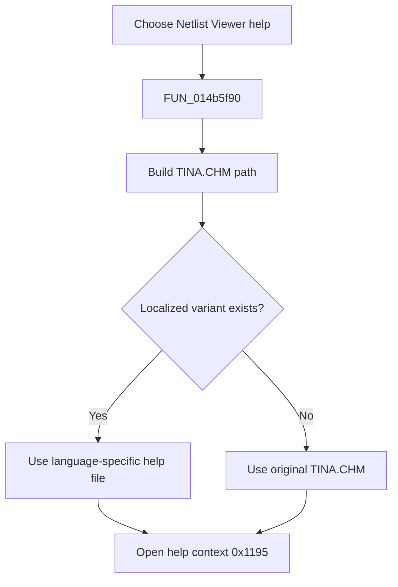

# &Netlist Viewer

> Analysis status: Reviewed from the recovered handler, localized help resolver, and VCL help call.

## Control

| Property | Recovered value |
| --- | --- |
| Form | NetlistViewer |
| Component path | NetlistViewer.MainMenu.MHelp.MINetlistEditor |
| Control class | TMenuItem |
| Caption | &Netlist Viewer |
| Hint | Not present in the recovered resource. |
| Text | Not present in the recovered resource. |
| Handler name | MINetlistEditorClick |
| Handler address | 014b5f90 |
| Graph node | `resource:dfm:NetlistViewer/NetlistViewer.MainMenu.MHelp.MINetlistEditor` |
| Handler node | `function:014b5f90` |
| Graph layer | UI |

## What happens when clicked

The menu item builds the path to `TINA.CHM`, asks the localization helper for an existing language-specific variant, and passes the selected help file with context ID `0x1195` to the application help system. If the localized file does not exist, the helper returns the original `TINA.CHM` path. The wrapper does not change the document or handle a help-launch failure locally.

## Click flow

## Handler evidence

- Source: [DecompiledSources/Tina16/functions/00000000014B5F90__FUN_014b5f90.c](../../../DecompiledSources/Tina16/functions/00000000014B5F90__FUN_014b5f90.c)
- Recovered role: Open the localized Netlist Viewer help topic.
- Current graph summary: Handles 1 Delphi UI event: NetlistViewer.MainMenu.MHelp.MINetlistEditor.OnClick.
- Current graph behavior: Not present in the recovered resource.
- Current graph evidence: Not present in the recovered resource.
- Complexity: complex
- Distinct outgoing calls: 3

## Direct calls

- `function:00414560` — Delphi UnicodeString array finalization helper
- `function:00416cd0` — FUN_00416cd0
- `function:01b1def0` — FUN_01b1def0

## Resource evidence

- Kind: Not present in the recovered resource.
- Modal result: Not present in the recovered resource.
- Checked state: Not present in the recovered resource.
- List items: Not present in the recovered resource.
- Image reference: Not present in the recovered resource.
- Extracted glyph: None.

## Nearby label candidates

Nearby labels are layout candidates only. They are not proof of behavior.

- No same-parent label candidate is available.

## Analysis limits

- The recovered source identifies context ID `0x1195` but not its original symbolic constant.
- Help-system errors follow the VCL application path.
