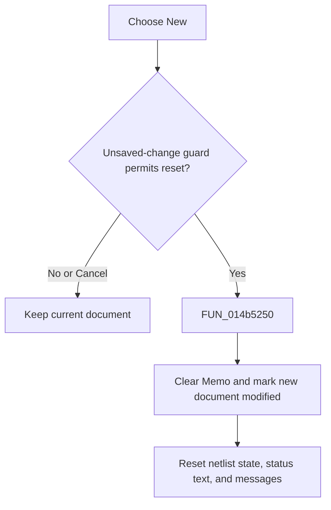

# &New

> Analysis status: Reviewed from the recovered handler, unsaved-change guard, and reset path.

## Control

| Property | Recovered value |
| --- | --- |
| Form | NetlistViewer |
| Component path | NetlistViewer.MainMenu.MFile.MINew |
| Control class | TMenuItem |
| Caption | &New |
| Hint | Not present in the recovered resource. |
| Text | Not present in the recovered resource. |
| Handler name | MINewClick |
| Handler address | 014b5250 |
| Graph node | `resource:dfm:NetlistViewer/NetlistViewer.MainMenu.MFile.MINew` |
| Handler node | `function:014b5250` |
| Graph layer | UI |

## What happens when clicked

The menu item first checks the current `Memo` for unsaved changes. If modified, it shows a localized Yes/No/Cancel save prompt: Cancel stops the command, Yes runs the shared Save handler, and No continues without saving. An accepted command clears `Memo`, marks the new document modified, resets the associated netlist state, clears the recovered status text, and clears the message list. The prompt helper does not verify that Save succeeded before New continues.

## Click flow

## Handler evidence

- Source: [DecompiledSources/Tina16/functions/00000000014B5250__FUN_014b5250.c](../../../DecompiledSources/Tina16/functions/00000000014B5250__FUN_014b5250.c)
- Recovered role: Start a new Netlist Viewer document after the unsaved-change guard.
- Current graph summary: Handles 1 Delphi UI event: NetlistViewer.MainMenu.MFile.MINew.OnClick.
- Current graph behavior: Not present in the recovered resource.
- Current graph evidence: Not present in the recovered resource.
- Complexity: complex
- Distinct outgoing calls: 5

## Direct calls

- `function:0064de00` — VCL control text setter with change suppression
- `function:00c0dad0` — FUN_00c0dad0
- `function:00c0fae0` — FUN_00c0fae0
- `function:014b4510` — FUN_014b4510
- `function:019953b0` — FUN_019953b0

## Resource evidence

- Kind: Not present in the recovered resource.
- Modal result: Not present in the recovered resource.
- Checked state: Not present in the recovered resource.
- List items: Not present in the recovered resource.
- Image reference: Not present in the recovered resource.
- Extracted glyph: None.

## Nearby label candidates

Nearby labels are layout candidates only. They are not proof of behavior.

- No same-parent label candidate is available.

## Analysis limits

- The exact localized save-prompt text is not present in the form resource.
- A Yes response calls Save, but the guard has no recovered save-success check.
