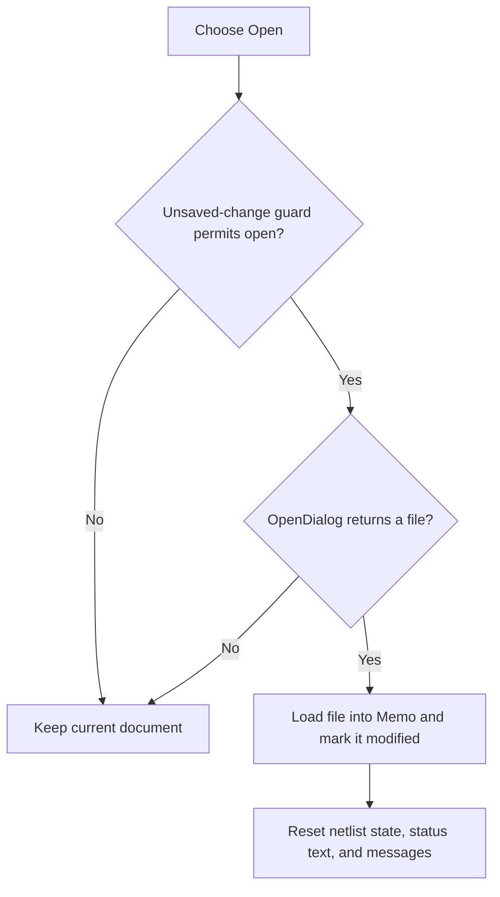

# &Open...

> Analysis status: Reviewed from the recovered handler, unsaved-change guard, and file-dialog path.

## Control

| Property | Recovered value |
| --- | --- |
| Form | NetlistViewer |
| Component path | NetlistViewer.MainMenu.MFile.MIOpen |
| Control class | TMenuItem |
| Caption | &Open... |
| Hint | Not present in the recovered resource. |
| Text | Not present in the recovered resource. |
| Handler name | MIOpenClick |
| Handler address | 014b52c0 |
| Graph node | `resource:dfm:NetlistViewer/NetlistViewer.MainMenu.MFile.MIOpen` |
| Handler node | `function:014b52c0` |
| Graph layer | UI |

## What happens when clicked

The menu item first uses the same unsaved-change guard as New. If the guard permits the operation, it opens `TOpenDialog`. Canceling either prompt or file dialog preserves the current document. After a file is selected, the handler loads it into `Memo`, marks the loaded document modified, resets the associated netlist state, clears the recovered status text, and clears the message list. File-read errors follow the normal Delphi exception path.

## Click flow

## Handler evidence

- Source: [DecompiledSources/Tina16/functions/00000000014B52C0__FUN_014b52c0.c](../../../DecompiledSources/Tina16/functions/00000000014B52C0__FUN_014b52c0.c)
- Recovered role: Load a netlist file after the unsaved-change guard.
- Current graph summary: Handles 1 Delphi UI event: NetlistViewer.MainMenu.MFile.MIOpen.OnClick.
- Current graph behavior: Not present in the recovered resource.
- Current graph evidence: Not present in the recovered resource.
- Complexity: complex
- Distinct outgoing calls: 6

## Direct calls

- `function:00414480` — Delphi UnicodeString clear and finalization helper
- `function:0064de00` — VCL control text setter with change suppression
- `function:00724270` — FUN_00724270
- `function:00c0dad0` — FUN_00c0dad0
- `function:014b4510` — FUN_014b4510
- `function:019953b0` — FUN_019953b0

## Resource evidence

- Kind: Not present in the recovered resource.
- Modal result: Not present in the recovered resource.
- Checked state: Not present in the recovered resource.
- List items: Not present in the recovered resource.
- Image reference: Not present in the recovered resource.
- Extracted glyph: None.

## Nearby label candidates

Nearby labels are layout candidates only. They are not proof of behavior.

- No same-parent label candidate is available.

## Analysis limits

- The handler has no local file-read recovery branch.
- The loaded document is explicitly marked modified in the recovered source.
