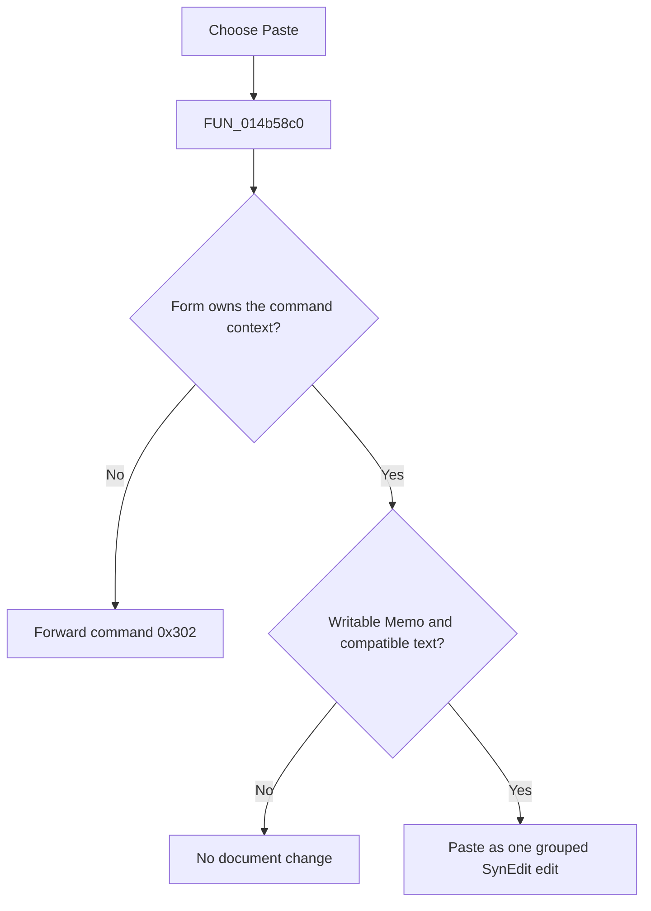

# &Paste

> Analysis status: Reviewed from the recovered handler and SynEdit paste engine.

## Control

| Property | Recovered value |
| --- | --- |
| Form | NetlistViewer |
| Component path | NetlistViewer.MainMenu.MEdit.MIPaste |
| Control class | TMenuItem |
| Caption | &Paste |
| Hint | Not present in the recovered resource. |
| Text | Not present in the recovered resource. |
| Handler name | MIPasteClick |
| Handler address | 014b58c0 |
| Graph node | `resource:dfm:NetlistViewer/NetlistViewer.MainMenu.MEdit.MIPaste` |
| Handler node | `function:014b58c0` |
| Graph layer | UI |

## What happens when clicked

The menu item calls the same handler as the toolbar **Paste** button. If the form owns the command context, it pastes compatible standard clipboard text into the writable `Memo`. SynEdit preserves normal, line, or column selection mode and records one grouped undo action. A read-only editor or clipboard without supported text is a no-op. If another window owns the command context, the handler forwards numeric command `0x302` to that window instead.

## Click flow

## Handler evidence

- Source: [DecompiledSources/Tina16/functions/00000000014B58C0__FUN_014b58c0.c](../../../DecompiledSources/Tina16/functions/00000000014B58C0__FUN_014b58c0.c)
- Recovered role: Paste clipboard text into the active Netlist Viewer editing context.
- Current graph summary: Handles 2 Delphi UI events: NetlistViewer.BtnPanel.PasteButton.OnClick, NetlistViewer.MainMenu.MEdit.MIPaste.OnClick.
- Current graph behavior: Not present in the recovered resource.
- Current graph evidence: Not present in the recovered resource.
- Complexity: moderate
- Distinct outgoing calls: 2

## Direct calls

- `function:0065b870` — FUN_0065b870
- `function:00bf9d90` — FUN_00bf9d90

## Resource evidence

- Kind: Not present in the recovered resource.
- Modal result: Not present in the recovered resource.
- Checked state: Not present in the recovered resource.
- List items: Not present in the recovered resource.
- Image reference: Not present in the recovered resource.
- Extracted glyph: None.

## Nearby label candidates

Nearby labels are layout candidates only. They are not proof of behavior.

- No same-parent label candidate is available.

## Analysis limits

- The rebuilt source does not give numeric command `0x302` a symbolic name.
- The toolbar and menu controls share this handler without a `Sender` branch.
