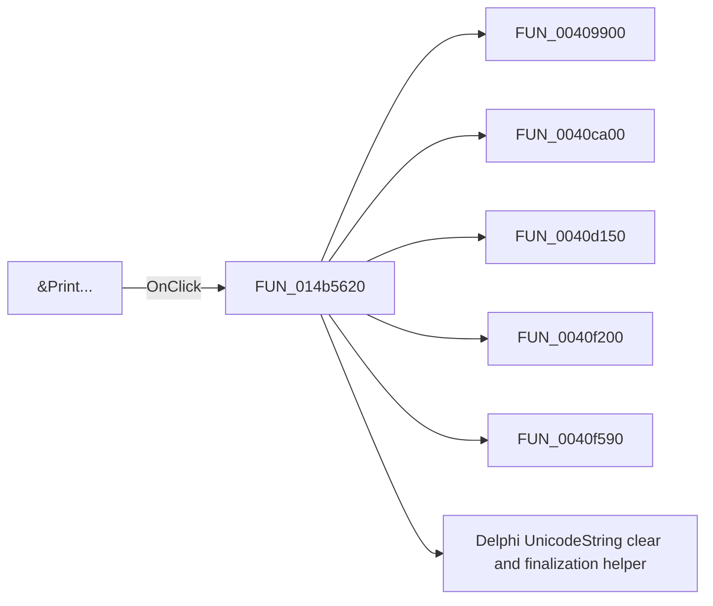

# &Print...

> Analysis status: Pending individual source review.

## Control

| Property | Recovered value |
| --- | --- |
| Form | NetlistViewer |
| Component path | NetlistViewer.MainMenu.MFile.MIPrint |
| Control class | TMenuItem |
| Caption | &Print... |
| Hint | Not present in the recovered resource. |
| Text | Not present in the recovered resource. |
| Handler name | MIPrintClick |
| Handler address | 014b5620 |
| Graph node | `resource:dfm:NetlistViewer/NetlistViewer.MainMenu.MFile.MIPrint` |
| Handler node | `function:014b5620` |
| Graph layer | UI |

## What happens when clicked

Pending individual analysis. An agent must read the recovered handler source and its relevant callees before it replaces this text.

## Click flow

## Handler evidence

- Source: [DecompiledSources/Tina16/functions/00000000014B5620__FUN_014b5620.c](../../../DecompiledSources/Tina16/functions/00000000014B5620__FUN_014b5620.c)
- Recovered role: Not present in the recovered resource.
- Current graph summary: Handles 1 Delphi UI event: NetlistViewer.MainMenu.MFile.MIPrint.OnClick.
- Current graph behavior: Not present in the recovered resource.
- Current graph evidence: Not present in the recovered resource.
- Complexity: complex
- Distinct outgoing calls: 11

## Direct calls

- `function:00409900` — FUN_00409900
- `function:0040ca00` — FUN_0040ca00
- `function:0040d150` — FUN_0040d150
- `function:0040f200` — FUN_0040f200
- `function:0040f590` — FUN_0040f590
- `function:00414480` — Delphi UnicodeString clear and finalization helper
- `function:005ff880` — FUN_005ff880
- `function:0069c880` — FUN_0069c880
- `function:0069db00` — FUN_0069db00
- `function:0069e8a0` — FUN_0069e8a0
- `function:00bf2c10` — FUN_00bf2c10

## Resource evidence

- Kind: Not present in the recovered resource.
- Modal result: Not present in the recovered resource.
- Checked state: Not present in the recovered resource.
- List items: Not present in the recovered resource.
- Image reference: Not present in the recovered resource.
- Extracted glyph: None.

## Nearby label candidates

Nearby labels are layout candidates only. They are not proof of behavior.

- No same-parent label candidate is available.

## Analysis limits

- Do not infer behavior from the control class, caption, hint, glyph, or nearby label alone.
- Do not replace the pending status until the handler source and relevant call path provide enough evidence.
