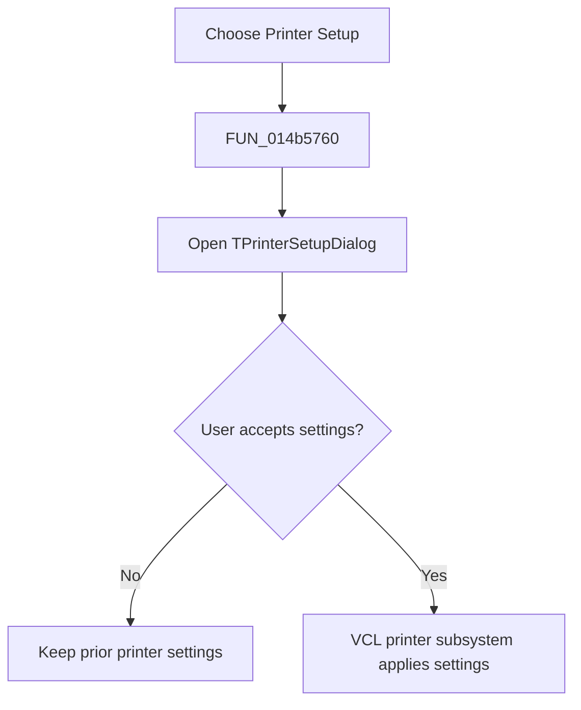

# Printer &Setup...

> Analysis status: Reviewed from the recovered wrapper and printer setup resource.

## Control

| Property | Recovered value |
| --- | --- |
| Form | NetlistViewer |
| Component path | NetlistViewer.MainMenu.MFile.MIPrinterSetup |
| Control class | TMenuItem |
| Caption | Printer &Setup... |
| Hint | Not present in the recovered resource. |
| Text | Not present in the recovered resource. |
| Handler name | MIPrinterSetupClick |
| Handler address | 014b5760 |
| Graph node | `resource:dfm:NetlistViewer/NetlistViewer.MainMenu.MFile.MIPrinterSetup` |
| Handler node | `function:014b5760` |
| Graph layer | UI |

## What happens when clicked

The menu item performs one operation: it opens the form's `TPrinterSetupDialog`. The dialog and VCL printer subsystem own any accepted printer configuration. The wrapper does not read the dialog result, print the document, change `Memo`, or show a local error message.

## Click flow

## Handler evidence

- Source: [DecompiledSources/Tina16/functions/00000000014B5760__FUN_014b5760.c](../../../DecompiledSources/Tina16/functions/00000000014B5760__FUN_014b5760.c)
- Recovered role: Open the printer setup dialog.
- Current graph summary: Handles 1 Delphi UI event: NetlistViewer.MainMenu.MFile.MIPrinterSetup.OnClick.
- Current graph behavior: Not present in the recovered resource.
- Current graph evidence: Not present in the recovered resource.
- Complexity: simple
- Distinct outgoing calls: 0

## Direct calls

- No direct call edge is present in the recovered graph.

## Resource evidence

- Kind: Not present in the recovered resource.
- Modal result: Not present in the recovered resource.
- Checked state: Not present in the recovered resource.
- List items: Not present in the recovered resource.
- Image reference: Not present in the recovered resource.
- Extracted glyph: None.

## Nearby label candidates

Nearby labels are layout candidates only. They are not proof of behavior.

- No same-parent label candidate is available.

## Analysis limits

- The dialog invocation is a virtual call, so the graph has no direct static call edge for it.
- The wrapper does not expose which printer properties the platform dialog changes.
