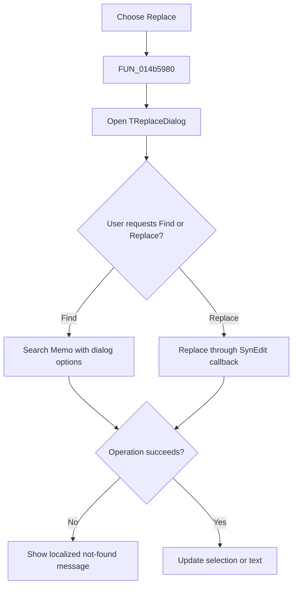

# &Replace...

> Analysis status: Reviewed from the recovered handler, dialog resource, and replace callbacks.

## Control

| Property | Recovered value |
| --- | --- |
| Form | NetlistViewer |
| Component path | NetlistViewer.MainMenu.MEdit.MIReplace |
| Control class | TMenuItem |
| Caption | &Replace... |
| Hint | Not present in the recovered resource. |
| Text | Not present in the recovered resource. |
| Handler name | MIReplaceClick |
| Handler address | 014b5980 |
| Graph node | `resource:dfm:NetlistViewer/NetlistViewer.MainMenu.MEdit.MIReplace` |
| Handler node | `function:014b5980` |
| Graph layer | UI |

## What happens when clicked

The menu item opens the form's modeless `TReplaceDialog`. It does not replace text in the click wrapper. Later `OnFind` and `OnReplace` events read the dialog's search text, replacement text, direction, case, whole-word, and replace-mode options and call the SynEdit search or replace helper. A failed operation shows the same localized not-found message used by Find.

## Click flow

## Handler evidence

- Source: [DecompiledSources/Tina16/functions/00000000014B5980__FUN_014b5980.c](../../../DecompiledSources/Tina16/functions/00000000014B5980__FUN_014b5980.c)
- Recovered role: Open the Netlist Viewer replace dialog.
- Current graph summary: Handles 1 Delphi UI event: NetlistViewer.MainMenu.MEdit.MIReplace.OnClick.
- Current graph behavior: Not present in the recovered resource.
- Current graph evidence: Not present in the recovered resource.
- Complexity: simple
- Distinct outgoing calls: 0

## Direct calls

- No direct call edge is present in the recovered graph.

## Resource evidence

- Kind: Not present in the recovered resource.
- Modal result: Not present in the recovered resource.
- Checked state: Not present in the recovered resource.
- List items: Not present in the recovered resource.
- Image reference: Not present in the recovered resource.
- Extracted glyph: None.

## Nearby label candidates

Nearby labels are layout candidates only. They are not proof of behavior.

- No same-parent label candidate is available.

## Analysis limits

- The virtual `TReplaceDialog.Execute` call has no static call edge, so the graph reports zero direct calls for the wrapper.
- Text replacement happens only after a dialog event; opening the dialog is not itself a document mutation.
