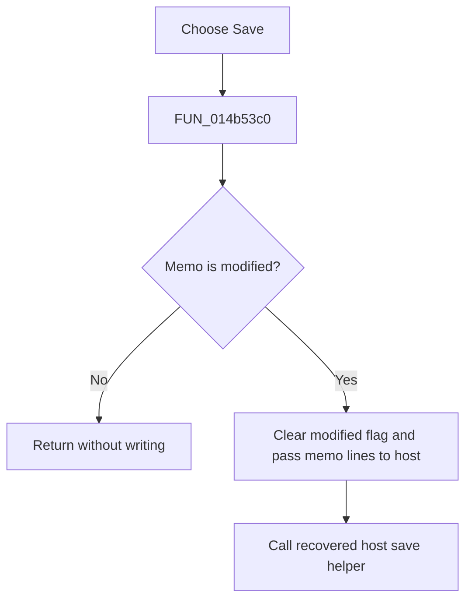

# &Save

> Analysis status: Reviewed from the recovered handler, document state, and host save path.

## Control

| Property | Recovered value |
| --- | --- |
| Form | NetlistViewer |
| Component path | NetlistViewer.MainMenu.MFile.MISave |
| Control class | TMenuItem |
| Caption | &Save |
| Hint | Not present in the recovered resource. |
| Text | Not present in the recovered resource. |
| Handler name | MISaveClick |
| Handler address | 014b53c0 |
| Graph node | `resource:dfm:NetlistViewer/NetlistViewer.MainMenu.MFile.MISave` |
| Handler node | `function:014b53c0` |
| Graph layer | UI |

## What happens when clicked

The menu item runs the same branch-free handler as the toolbar **Save** button. If `Memo.Modified` is clear, it returns without a write. Otherwise, it clears the modified flag, sends the current memo lines to the host-owned netlist object, and calls the recovered save helper. It does not show `SaveDialog`, test a save result, or contain a local error branch.

## Click flow

## Handler evidence

- Source: [DecompiledSources/Tina16/functions/00000000014B53C0__FUN_014b53c0.c](../../../DecompiledSources/Tina16/functions/00000000014B53C0__FUN_014b53c0.c)
- Recovered role: Save a modified Netlist Viewer document through the host.
- Current graph summary: Handles 2 Delphi UI events: NetlistViewer.BtnPanel.SaveButton.OnClick, NetlistViewer.MainMenu.MFile.MISave.OnClick.
- Current graph behavior: Not present in the recovered resource.
- Current graph evidence: Not present in the recovered resource.
- Complexity: moderate
- Distinct outgoing calls: 2

## Direct calls

- `function:00c0dad0` — FUN_00c0dad0
- `function:014a1f90` — FUN_014a1f90

## Resource evidence

- Kind: Not present in the recovered resource.
- Modal result: Not present in the recovered resource.
- Checked state: Not present in the recovered resource.
- List items: Not present in the recovered resource.
- Image reference: Not present in the recovered resource.
- Extracted glyph: None.

## Nearby label candidates

Nearby labels are layout candidates only. They are not proof of behavior.

- No same-parent label candidate is available.

## Analysis limits

- The recovered `FUN_014a1f90` body is an incomplete rebuilt stub and does not expose the original persistence result.
- The handler clears `Memo.Modified` before the host calls and has no recovered rollback branch.
