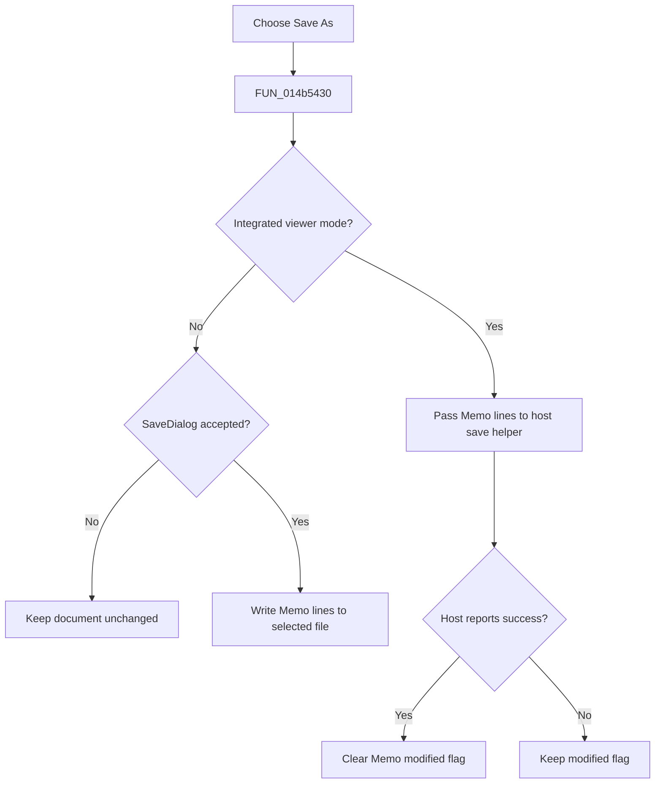

# Save &As...

> Analysis status: Reviewed from the recovered handler, mode branch, and save-dialog path.

## Control

| Property | Recovered value |
| --- | --- |
| Form | NetlistViewer |
| Component path | NetlistViewer.MainMenu.MFile.MISaveAs |
| Control class | TMenuItem |
| Caption | Save &As... |
| Hint | Not present in the recovered resource. |
| Text | Not present in the recovered resource. |
| Handler name | MISaveAsClick |
| Handler address | 014b5430 |
| Graph node | `resource:dfm:NetlistViewer/NetlistViewer.MainMenu.MFile.MISaveAs` |
| Handler node | `function:014b5430` |
| Graph layer | UI |

## What happens when clicked

The menu item has two mode-dependent paths. In standalone mode, it builds a default file name, opens `TSaveDialog`, and writes the current `Memo` lines to the selected file only when the dialog is accepted. In integrated mode, it sends the memo lines to the host-owned netlist object and calls the recovered host save helper; it clears `Memo.Modified` only when that helper reports success. A canceled dialog is a no-op. The recovered standalone branch does not clear the modified flag after the file write.

## Click flow

## Handler evidence

- Source: [DecompiledSources/Tina16/functions/00000000014B5430__FUN_014b5430.c](../../../DecompiledSources/Tina16/functions/00000000014B5430__FUN_014b5430.c)
- Recovered role: Save the current Netlist Viewer source to a selected file or host target.
- Current graph summary: Handles 1 Delphi UI event: NetlistViewer.MainMenu.MFile.MISaveAs.OnClick.
- Current graph behavior: Not present in the recovered resource.
- Current graph evidence: Not present in the recovered resource.
- Complexity: complex
- Distinct outgoing calls: 11

## Direct calls

- `function:00414480` — Delphi UnicodeString clear and finalization helper
- `function:00414560` — Delphi UnicodeString array finalization helper
- `function:00416ad0` — FUN_00416ad0
- `function:00416ba0` — FUN_00416ba0
- `function:004414c0` — FUN_004414c0
- `function:00441640` — FUN_00441640
- `function:00441920` — FUN_00441920
- `function:00724270` — FUN_00724270
- `function:00724380` — FUN_00724380
- `function:00c0dad0` — FUN_00c0dad0
- `function:014a1f90` — FUN_014a1f90

## Resource evidence

- Kind: Not present in the recovered resource.
- Modal result: Not present in the recovered resource.
- Checked state: Not present in the recovered resource.
- List items: Not present in the recovered resource.
- Image reference: Not present in the recovered resource.
- Extracted glyph: None.

## Nearby label candidates

Nearby labels are layout candidates only. They are not proof of behavior.

- No same-parent label candidate is available.

## Analysis limits

- The rebuilt `FUN_014a1f90` helper is incomplete, so the original host persistence result is not recovered.
- The exact default extension comes from a global string whose symbolic name is not recovered.
