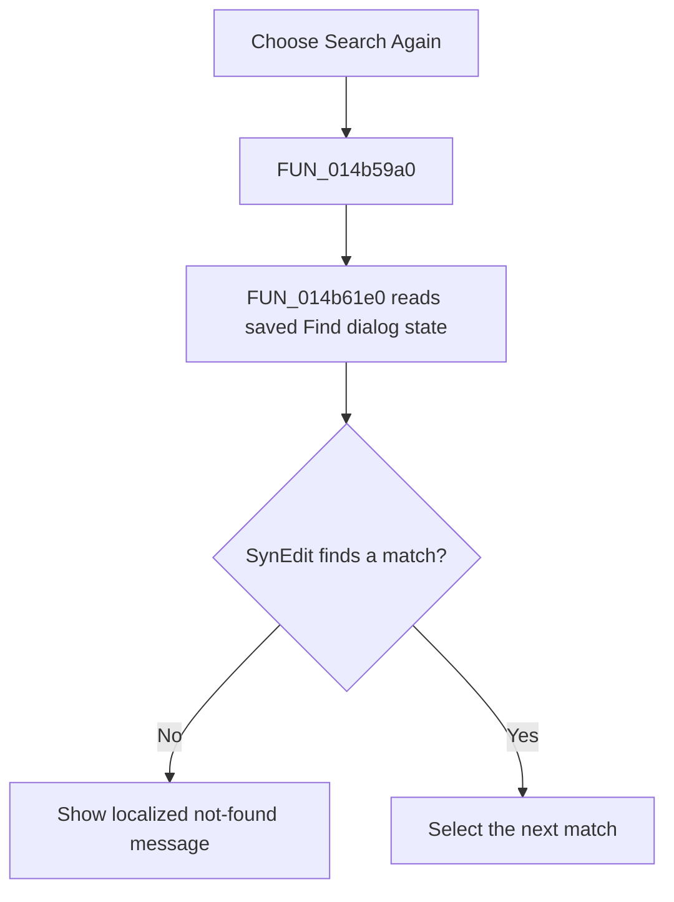

# Search &Again

> Analysis status: Reviewed from the recovered handler and shared find callback.

## Control

| Property | Recovered value |
| --- | --- |
| Form | NetlistViewer |
| Component path | NetlistViewer.MainMenu.MEdit.MISearchAgain |
| Control class | TMenuItem |
| Caption | Search &Again |
| Hint | Not present in the recovered resource. |
| Text | Not present in the recovered resource. |
| Handler name | MISearchAgainClick |
| Handler address | 014b59a0 |
| Graph node | `resource:dfm:NetlistViewer/NetlistViewer.MainMenu.MEdit.MISearchAgain` |
| Handler node | `function:014b59a0` |
| Graph layer | UI |

## What happens when clicked

The menu item repeats a search without reopening the dialog. It calls the shared Find callback with the existing `TFindDialog`, so the current search text and direction, case, and whole-word options are reused. SynEdit selects the next match. If no match is found, the callback shows a localized not-found message. The command does not change document text.

## Click flow

## Handler evidence

- Source: [DecompiledSources/Tina16/functions/00000000014B59A0__FUN_014b59a0.c](../../../DecompiledSources/Tina16/functions/00000000014B59A0__FUN_014b59a0.c)
- Recovered role: Repeat the current Netlist Viewer find operation.
- Current graph summary: Handles 1 Delphi UI event: NetlistViewer.MainMenu.MEdit.MISearchAgain.OnClick.
- Current graph behavior: Not present in the recovered resource.
- Current graph evidence: Not present in the recovered resource.
- Complexity: simple
- Distinct outgoing calls: 1

## Direct calls

- `function:014b61e0` — Handles 2 Delphi UI events: NetlistViewer.FindDialog.OnFind, NetlistViewer.ReplaceDialog.OnFind.

## Resource evidence

- Kind: Not present in the recovered resource.
- Modal result: Not present in the recovered resource.
- Checked state: Not present in the recovered resource.
- List items: Not present in the recovered resource.
- Image reference: Not present in the recovered resource.
- Extracted glyph: None.

## Nearby label candidates

Nearby labels are layout candidates only. They are not proof of behavior.

- No same-parent label candidate is available.

## Analysis limits

- The command uses `FindDialog`, not `ReplaceDialog`.
- The exact localized not-found text is not present in the recovered UI resource.
