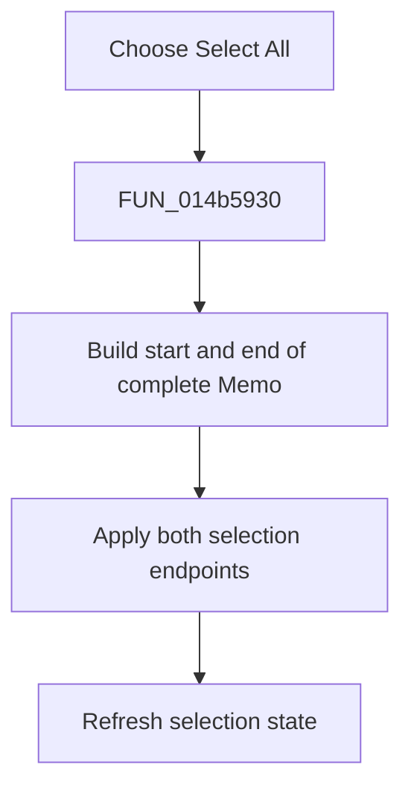

# &Select All

> Analysis status: Reviewed from the recovered handler and SynEdit selection engine.

## Control

| Property | Recovered value |
| --- | --- |
| Form | NetlistViewer |
| Component path | NetlistViewer.MainMenu.MEdit.MISelectAll |
| Control class | TMenuItem |
| Caption | &Select All |
| Hint | Not present in the recovered resource. |
| Text | Not present in the recovered resource. |
| Handler name | MISelectAllClick |
| Handler address | 014b5930 |
| Graph node | `resource:dfm:NetlistViewer/NetlistViewer.MainMenu.MEdit.MISelectAll` |
| Handler node | `function:014b5930` |
| Graph layer | UI |

## What happens when clicked

The menu item selects the complete `Memo` document. SynEdit sets the selection from line 1, column 1 through the last character of the final line and refreshes selection state. The operation does not change text or write the clipboard. An empty document produces an empty full-document selection.

## Click flow

## Handler evidence

- Source: [DecompiledSources/Tina16/functions/00000000014B5930__FUN_014b5930.c](../../../DecompiledSources/Tina16/functions/00000000014B5930__FUN_014b5930.c)
- Recovered role: Select the complete Netlist Viewer document.
- Current graph summary: Handles 1 Delphi UI event: NetlistViewer.MainMenu.MEdit.MISelectAll.OnClick.
- Current graph behavior: Not present in the recovered resource.
- Current graph evidence: Not present in the recovered resource.
- Complexity: simple
- Distinct outgoing calls: 1

## Direct calls

- `function:00bfa390` — FUN_00bfa390

## Resource evidence

- Kind: Not present in the recovered resource.
- Modal result: Not present in the recovered resource.
- Checked state: Not present in the recovered resource.
- List items: Not present in the recovered resource.
- Image reference: Not present in the recovered resource.
- Extracted glyph: None.

## Nearby label candidates

Nearby labels are layout candidates only. They are not proof of behavior.

- No same-parent label candidate is available.

## Analysis limits

- The helper does not copy, delete, or otherwise mutate the selected text.
- The recovered path has no local error dialog.
