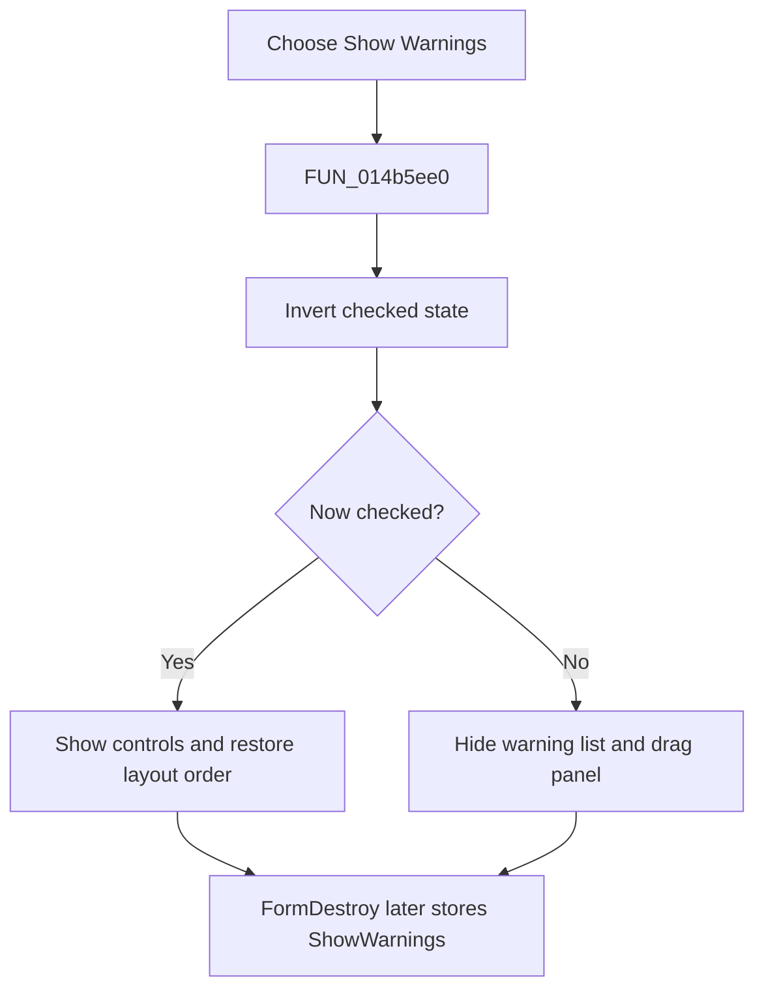

# Show &Warnings

> Analysis status: Reviewed from the recovered handler, form lifecycle, and panel state.

## Control

| Property | Recovered value |
| --- | --- |
| Form | NetlistViewer |
| Component path | NetlistViewer.MainMenu.MAnalysis.MIShowWarnings |
| Control class | TMenuItem |
| Caption | Show &Warnings |
| Hint | Not present in the recovered resource. |
| Text | Not present in the recovered resource. |
| Handler name | MIShowWarningsClick |
| Handler address | 014b5ee0 |
| Graph node | `resource:dfm:NetlistViewer/NetlistViewer.MainMenu.MAnalysis.MIShowWarnings` |
| Handler node | `function:014b5ee0` |
| Graph layer | UI |

## What happens when clicked

The menu item inverts its checked state. When cleared, it hides the warning list and its adjacent drag panel. When checked, it makes those controls visible and reapplies their recovered layout order so the memo, splitter, and message area are arranged together. It does not clear or rebuild messages. `FormDestroy` writes the checked state to the `Netlist Editor/ShowWarnings` setting, and `FormShow` restores it on the next viewer instance.

## Click flow

## Handler evidence

- Source: [DecompiledSources/Tina16/functions/00000000014B5EE0__FUN_014b5ee0.c](../../../DecompiledSources/Tina16/functions/00000000014B5EE0__FUN_014b5ee0.c)
- Recovered role: Toggle and persist the Netlist Viewer warning pane.
- Current graph summary: Handles 1 Delphi UI event: NetlistViewer.MainMenu.MAnalysis.MIShowWarnings.OnClick.
- Current graph behavior: Not present in the recovered resource.
- Current graph evidence: Not present in the recovered resource.
- Complexity: complex
- Distinct outgoing calls: 3

## Direct calls

- `function:0064c650` — FUN_0064c650
- `function:0064dbe0` — FUN_0064dbe0
- `function:007e2d20` — FUN_007e2d20

## Resource evidence

- Kind: Not present in the recovered resource.
- Modal result: Not present in the recovered resource.
- Checked state: Not present in the recovered resource.
- List items: Not present in the recovered resource.
- Image reference: Not present in the recovered resource.
- Extracted glyph: None.

## Nearby label candidates

Nearby labels are layout candidates only. They are not proof of behavior.

- No same-parent label candidate is available.

## Analysis limits

- The layout helper calls expose control order but not original alignment-property names.
- The click changes visibility only; it does not remove warning records.
