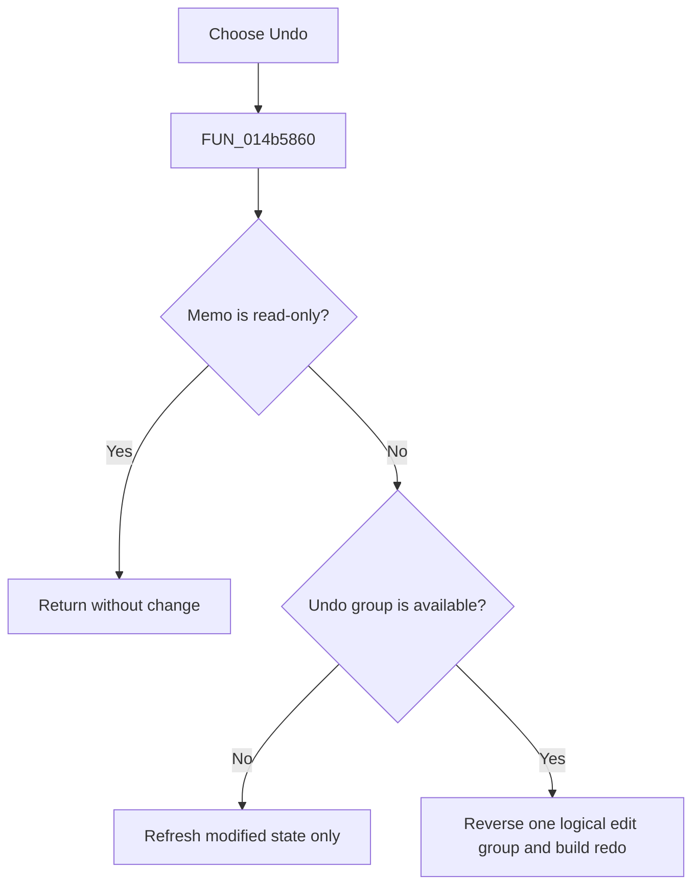

# &Undo

> Analysis status: Reviewed from the recovered handler and grouped SynEdit undo engine.

## Control

| Property | Recovered value |
| --- | --- |
| Form | NetlistViewer |
| Component path | NetlistViewer.MainMenu.MEdit.MIUndo |
| Control class | TMenuItem |
| Caption | &Undo |
| Hint | Not present in the recovered resource. |
| Text | Not present in the recovered resource. |
| Handler name | MIUndoClick |
| Handler address | 014b5860 |
| Graph node | `resource:dfm:NetlistViewer/NetlistViewer.MainMenu.MEdit.MIUndo` |
| Handler node | `function:014b5860` |
| Graph layer | UI |

## What happens when clicked

The menu item asks `Memo` to undo one logical SynEdit edit group. The engine restores recorded text, caret, selection, and selection mode as needed and creates reciprocal redo items. A read-only editor returns immediately. An empty undo stack changes no content, but the helper still refreshes the modified state against the saved initial-state marker.

## Click flow

## Handler evidence

- Source: [DecompiledSources/Tina16/functions/00000000014B5860__FUN_014b5860.c](../../../DecompiledSources/Tina16/functions/00000000014B5860__FUN_014b5860.c)
- Recovered role: Undo one grouped Netlist Viewer edit.
- Current graph summary: Handles 1 Delphi UI event: NetlistViewer.MainMenu.MEdit.MIUndo.OnClick.
- Current graph behavior: Not present in the recovered resource.
- Current graph evidence: Not present in the recovered resource.
- Complexity: simple
- Distinct outgoing calls: 1

## Direct calls

- `function:00c00ff0` — FUN_00c00ff0

## Resource evidence

- Kind: Not present in the recovered resource.
- Modal result: Not present in the recovered resource.
- Checked state: Not present in the recovered resource.
- List items: Not present in the recovered resource.
- Image reference: Not present in the recovered resource.
- Extracted glyph: None.

## Nearby label candidates

Nearby labels are layout candidates only. They are not proof of behavior.

- No same-parent label candidate is available.

## Analysis limits

- The menu wrapper always targets `Memo` and adds no sender-dependent behavior.
- Exact undo item reason names are SynEdit internal state, not Netlist Viewer commands.
