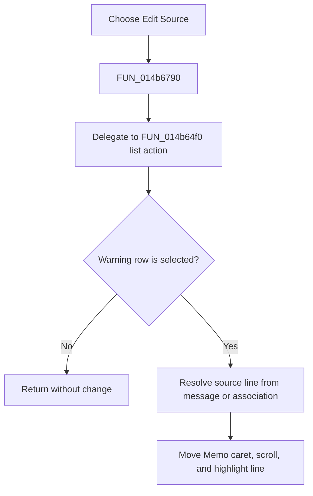

# &Edit Source

> Analysis status: Reviewed from the shared list action, message association, and SynEdit navigation path.

## Control

| Property | Recovered value |
| --- | --- |
| Form | NetlistViewer |
| Component path | NetlistViewer.ListBoxPopup.pmiEditSource |
| Control class | TMenuItem |
| Caption | &Edit Source |
| Hint | Not present in the recovered resource. |
| Text | Not present in the recovered resource. |
| Handler name | pmiEditSourceClick |
| Handler address | 014b6790 |
| Graph node | `resource:dfm:NetlistViewer/NetlistViewer.ListBoxPopup.pmiEditSource` |
| Handler node | `function:014b6790` |
| Graph layer | UI |

## What happens when clicked

The popup item delegates to the same routine as a double-click on the warning list. With no selected row, it is a no-op. Otherwise, it reads the selected message and its optional associated source object, resolves a source line either from the message text or by scanning the current memo source, moves the `Memo` caret to that line, scrolls it into view, refreshes the cursor status, and enables the special-line highlight. It does not open an external source editor despite the resource caption.

## Click flow

## Handler evidence

- Source: [DecompiledSources/Tina16/functions/00000000014B6790__FUN_014b6790.c](../../../DecompiledSources/Tina16/functions/00000000014B6790__FUN_014b6790.c)
- Recovered role: Navigate the Netlist Viewer memo to the selected diagnostic source line.
- Current graph summary: Handles 1 Delphi UI event: NetlistViewer.ListBoxPopup.pmiEditSource.OnClick.
- Current graph behavior: Not present in the recovered resource.
- Current graph evidence: Not present in the recovered resource.
- Complexity: simple
- Distinct outgoing calls: 1

## Direct calls

- `function:014b64f0` — Handles 1 Delphi UI event: NetlistViewer.ListBox.OnDblClick.

## Resource evidence

- Kind: Not present in the recovered resource.
- Modal result: Not present in the recovered resource.
- Checked state: Not present in the recovered resource.
- List items: Not present in the recovered resource.
- Image reference: Not present in the recovered resource.
- Extracted glyph: None.

## Nearby label candidates

Nearby labels are layout candidates only. They are not proof of behavior.

- No same-parent label candidate is available.

## Analysis limits

- The caption says `Edit Source`, but the recovered handler navigates within `Memo`; no external editor launch is present.
- Original types for the optional message-associated objects are not recovered.
