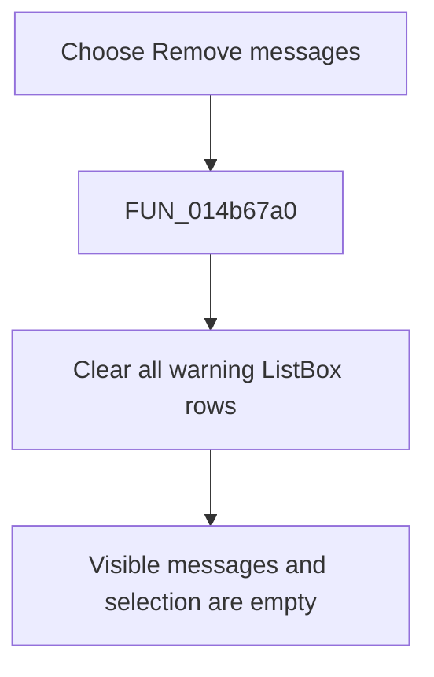

# &Remove messages

> Analysis status: Reviewed from the recovered handler and list resource.

## Control

| Property | Recovered value |
| --- | --- |
| Form | NetlistViewer |
| Component path | NetlistViewer.ListBoxPopup.pmiRemoveMessages |
| Control class | TMenuItem |
| Caption | &Remove messages |
| Hint | Not present in the recovered resource. |
| Text | Not present in the recovered resource. |
| Handler name | pmiRemoveMessagesClick |
| Handler address | 014b67a0 |
| Graph node | `resource:dfm:NetlistViewer/NetlistViewer.ListBoxPopup.pmiRemoveMessages` |
| Handler node | `function:014b67a0` |
| Graph layer | UI |

## What happens when clicked

The popup item clears all visible rows from the Netlist Viewer warning `ListBox`. The virtual list clear operation also removes the current list selection. The wrapper has no confirmation, filter, or empty-list branch; clearing an already empty list is a visible no-op. It does not clear `Memo`, rerun compilation, or prove that host-owned diagnostic objects are destroyed.

## Click flow

## Handler evidence

- Source: [DecompiledSources/Tina16/functions/00000000014B67A0__FUN_014b67a0.c](../../../DecompiledSources/Tina16/functions/00000000014B67A0__FUN_014b67a0.c)
- Recovered role: Clear the visible Netlist Viewer message list.
- Current graph summary: Handles 1 Delphi UI event: NetlistViewer.ListBoxPopup.pmiRemoveMessages.OnClick.
- Current graph behavior: Not present in the recovered resource.
- Current graph evidence: Not present in the recovered resource.
- Complexity: simple
- Distinct outgoing calls: 0

## Direct calls

- No direct call edge is present in the recovered graph.

## Resource evidence

- Kind: Not present in the recovered resource.
- Modal result: Not present in the recovered resource.
- Checked state: Not present in the recovered resource.
- List items: Not present in the recovered resource.
- Image reference: Not present in the recovered resource.
- Extracted glyph: None.

## Nearby label candidates

Nearby labels are layout candidates only. They are not proof of behavior.

- No same-parent label candidate is available.

## Analysis limits

- The list clear is a virtual call and therefore has no static direct-call edge in the graph.
- The handler clears the UI list only; it does not establish ownership or destruction of external diagnostic records.
