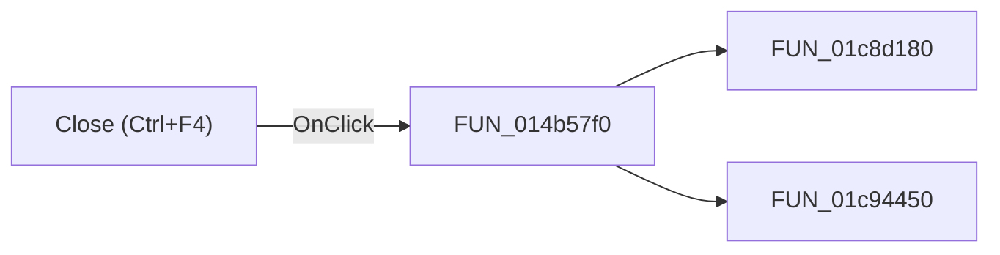

# Close (Ctrl+F4)

> Analysis status: Pending individual source review.

## Control

| Property | Recovered value |
| --- | --- |
| Form | NetlistViewer |
| Component path | NetlistViewer.BtnPanel.ToolClose |
| Control class | TSpeedButton |
| Caption | Not present in the recovered resource. |
| Hint | Close (Ctrl+F4) |
| Text | Not present in the recovered resource. |
| Handler name | MIExitClick |
| Handler address | 014b57f0 |
| Graph node | `resource:dfm:NetlistViewer/NetlistViewer.BtnPanel.ToolClose` |
| Handler node | `function:014b57f0` |
| Graph layer | UI |

## What happens when clicked

Pending individual analysis. An agent must read the recovered handler source and its relevant callees before it replaces this text.

## Click flow

## Handler evidence

- Source: [DecompiledSources/Tina16/functions/00000000014B57F0__FUN_014b57f0.c](../../../DecompiledSources/Tina16/functions/00000000014B57F0__FUN_014b57f0.c)
- Recovered role: Not present in the recovered resource.
- Current graph summary: Handles 2 Delphi UI events: NetlistViewer.BtnPanel.ToolClose.OnClick, NetlistViewer.MainMenu.MFile.MIExit.OnClick.
- Current graph behavior: Not present in the recovered resource.
- Current graph evidence: Not present in the recovered resource.
- Complexity: moderate
- Distinct outgoing calls: 2

## Direct calls

- `function:01c8d180` — Handles 2 Delphi UI events: SchematicEditor.MainMenu.mnFile.mnCloseMacro.OnClick, SchematicEditor.SchPopup.pmCloseMacro.OnClick.
- `function:01c94450` — Handles 1 Delphi UI event: SchematicEditor.MainMenu.mnFile.mnClose.OnClick.

## Resource evidence

- Kind: Not present in the recovered resource.
- Modal result: Not present in the recovered resource.
- Checked state: Not present in the recovered resource.
- List items: Not present in the recovered resource.
- Image reference: Not present in the recovered resource.
- Extracted glyph: [`0288_NetlistViewer_NetlistViewer_BtnPanel_ToolClose_Glyph_Data.png`](../../../glyph/0288_NetlistViewer_NetlistViewer_BtnPanel_ToolClose_Glyph_Data.png)

## Nearby label candidates

Nearby labels are layout candidates only. They are not proof of behavior.

- No same-parent label candidate is available.

## Analysis limits

- Do not infer behavior from the control class, caption, hint, glyph, or nearby label alone.
- Do not replace the pending status until the handler source and relevant call path provide enough evidence.
