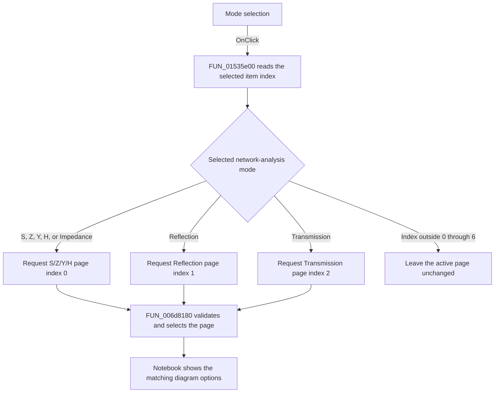

#  Mode

> Analysis status: Reviewed from recovered source and UI resource evidence.

## Control

| Property | Recovered value |
| --- | --- |
| Form | NetworkAnalysisDlg |
| Component path | NetworkAnalysisDlg.ModeRG |
| Control class | TRadioGroup |
| Caption |  Mode  |
| Hint | Not present in the recovered resource. |
| Text | Not present in the recovered resource. |
| Handler name | ModeRGClick |
| Handler address | 01535e00 |
| Graph node | `resource:dfm:NetworkAnalysisDlg/NetworkAnalysisDlg.ModeRG` |
| Handler node | `function:01535e00` |
| Graph layer | UI |

## What happens when clicked

The handler reads the selected `ModeRG` item index. It selects the diagram-option page in `NetworkAnalysisDlg.Notebook` with this fixed mapping:

| Selected item | Notebook page |
| --- | --- |
| S, Z, Y, H, or Impedance | S/Z/Y/H options |
| Transmission | Transmission options |
| Reflection | Reflection options |

`FUN_006d8180` checks that the requested page index exists and then makes that page active. For the seven resource items, the handler passes only the recovered page indexes 0, 1, and 2. An item index outside 0 through 6 causes no page-selection call and leaves the active page unchanged. The handler does not write the network-analysis settings record and does not close the dialog. Selecting an item that already uses the active page only selects the same page again.

## Click flow

## Handler evidence

- Source: [DecompiledSources/Tina16/functions/0000000001535E00__FUN_01535e00.c](../../../DecompiledSources/Tina16/functions/0000000001535E00__FUN_01535e00.c)
- Recovered role: Selects the diagram-options notebook page for the chosen network-analysis mode.
- Current graph summary: Handles 1 Delphi UI event: NetworkAnalysisDlg.ModeRG.OnClick.
- Current graph behavior: Maps the seven radio-group indexes to notebook page indexes 0, 1, or 2 and calls the notebook page-selection helper. An index outside the recovered item range causes no action.
- Current graph evidence: The handler reads the radio-group item index at offset `0x4A8`. Its recovered branches map indexes 0 through 3 and 6 to page 0, index 4 to page 2, and index 5 to page 1. `FUN_006d8180` validates the index and selects that page.
- Complexity: simple
- Distinct outgoing calls: 1

## Direct calls

- `function:006d8180` — Validates a notebook page index and selects the matching page.

## Related source

- [FUN_006d8180](../../../DecompiledSources/Tina16/functions/00000000006D8180__FUN_006d8180.c) — Notebook page-index selector.

## Resource evidence

- Kind: Not present in the recovered resource.
- Modal result: Not present in the recovered resource.
- Checked state: Not present in the recovered resource.
- List items: ("S", "Z", "Y", "H", "Transmission", "Reflection", "Impedance")
- Image reference: Not present in the recovered resource.
- Extracted glyph: None.

## Nearby label candidates

Nearby labels are layout candidates only. They are not proof of behavior.

- Rank 1: &Number of points at distance 26.
- Rank 2: &End frequency at distance 51.
- Rank 3: &Start frequency at distance 78.

## Analysis limits

- The recovered source proves the page mapping and selection. It does not establish a separate computation when the page changes.
- The nearby labels are not used to identify the radio-group behavior.
