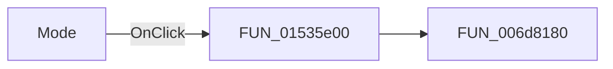

#  Mode

> Analysis status: Pending individual source review.

## Control

| Property | Recovered value |
| --- | --- |
| Form | NetworkAnalysisDlg |
| Component path | NetworkAnalysisDlg.ModeRG |
| Control class | TRadioGroup |
| Caption |  Mode  |
| Hint | Not present in the recovered resource. |
| Text | Not present in the recovered resource. |
| Handler name | ModeRGClick |
| Handler address | 01535e00 |
| Graph node | `resource:dfm:NetworkAnalysisDlg/NetworkAnalysisDlg.ModeRG` |
| Handler node | `function:01535e00` |
| Graph layer | UI |

## What happens when clicked

Pending individual analysis. An agent must read the recovered handler source and its relevant callees before it replaces this text.

## Click flow

## Handler evidence

- Source: [DecompiledSources/Tina16/functions/0000000001535E00__FUN_01535e00.c](../../../DecompiledSources/Tina16/functions/0000000001535E00__FUN_01535e00.c)
- Recovered role: Not present in the recovered resource.
- Current graph summary: Handles 1 Delphi UI event: NetworkAnalysisDlg.ModeRG.OnClick.
- Current graph behavior: Not present in the recovered resource.
- Current graph evidence: Not present in the recovered resource.
- Complexity: simple
- Distinct outgoing calls: 1

## Direct calls

- `function:006d8180` — FUN_006d8180

## Resource evidence

- Kind: Not present in the recovered resource.
- Modal result: Not present in the recovered resource.
- Checked state: Not present in the recovered resource.
- List items: ("S", "Z", "Y", "H", "Transmission", "Reflection", "Impedance")
- Image reference: Not present in the recovered resource.
- Extracted glyph: None.

## Nearby label candidates

Nearby labels are layout candidates only. They are not proof of behavior.

- Rank 1: &Number of points at distance 26.
- Rank 2: &End frequency at distance 51.
- Rank 3: &Start frequency at distance 78.

## Analysis limits

- Do not infer behavior from the control class, caption, hint, glyph, or nearby label alone.
- Do not replace the pending status until the handler source and relevant call path provide enough evidence.
