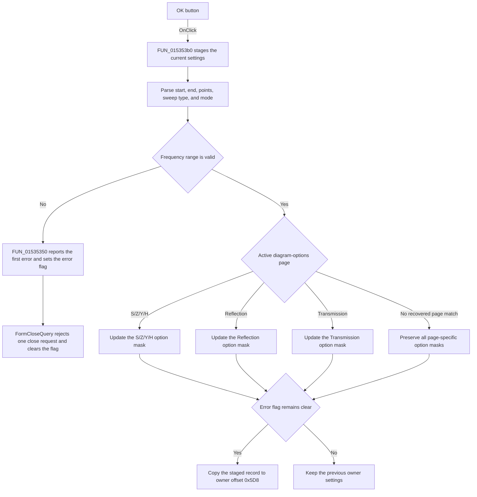

# OKBtn

> Analysis status: Reviewed from recovered source, state, and UI resource evidence.

## Control

| Property | Recovered value |
| --- | --- |
| Form | NetworkAnalysisDlg |
| Component path | NetworkAnalysisDlg.OKBtn |
| Control class | TBitBtn |
| Caption | Not present in the recovered resource. |
| Hint | Not present in the recovered resource. |
| Text | Not present in the recovered resource. |
| Handler name | OKBtnClick |
| Handler address | 015353b0 |
| Graph node | `resource:dfm:NetworkAnalysisDlg/NetworkAnalysisDlg.OKBtn` |
| Handler node | `function:015353b0` |
| Graph layer | UI |

## What happens when clicked

The handler first copies the current network-analysis settings from the owner object into a local staged record. It then parses the start frequency, end frequency, and point count from the three editor controls. It also reads the sweep-type and mode radio-group indexes.

The frequency range is invalid when the end frequency is not greater than the start frequency, the start frequency is not positive, or the end frequency is greater than `1e50`. On this path, `FUN_01535350` forwards a localized validation message to `FUN_01b1cf30`. That helper shows only the first validation message and sets the dialog error flag. The dialog's recovered `FormCloseQuery` handler rejects the next close request when this flag is set, and then clears the flag.

The handler updates the diagram-option bit mask for only the active notebook page. The S/Z/Y/H page stores its five checkbox states, the Reflection page stores its five checkbox states, and the Transmission page stores its six checkbox states. The staged copy preserves the option masks for the other pages. If the active page does not match one of these three recovered page objects, no page-specific mask changes.

If no validation error was recorded, the handler copies the complete staged record back to the owner settings at owner offset `0x5D8`. If validation failed, it does not commit the record. The recovered click handler does not directly close the dialog or set a modal result. `bkOK` is recovered resource metadata; any inherited button close behavior is outside this handler.

## Click flow

## Handler evidence

- Source: [DecompiledSources/Tina16/functions/00000000015353B0__FUN_015353b0.c](../../../DecompiledSources/Tina16/functions/00000000015353B0__FUN_015353b0.c)
- Recovered role: Validates and commits the Network Analysis dialog settings.
- Current graph summary: Handles 1 Delphi UI event: NetworkAnalysisDlg.OKBtn.OnClick.
- Current graph behavior: Stages the owner settings, parses the numeric controls, validates the frequency range, updates the active page's option mask, and commits only when the error flag remains clear.
- Current graph evidence: `FUN_015353b0` copies the owner record from offset `0x5D8`, reads two float editors with `FUN_00b90090`, reads the point editor with `FUN_00f04d50`, tests the recovered range limits, updates one of three page-specific masks, and conditionally copies the staged record back. `FUN_01535350`, `FUN_01b1cf30`, and `FUN_01535da0` establish the first-error and close-veto path.
- Complexity: complex
- Distinct outgoing calls: 9

## Direct calls

- `function:00414480` — Delphi UnicodeString clear and finalization helper
- `function:00417580` — FUN_00417580
- `function:00417740` — FUN_00417740
- `function:00417c40` — FUN_00417c40
- `function:00b89270` — FUN_00b89270
- `function:00b8e520` — FUN_00b8e520
- `function:00b90090` — FUN_00b90090
- `function:00f04d50` — FUN_00f04d50
- `function:01535350` — FUN_01535350

## Related source

- [FUN_01535350](../../../DecompiledSources/Tina16/functions/0000000001535350__FUN_01535350.c) — Forwards a validation message to the dialog error helper.
- [FUN_01b1cf30](../../../DecompiledSources/Tina16/functions/0000000001B1CF30__FUN_01b1cf30.c) — Shows only the first error and sets the error flag.
- [FUN_01535da0](../../../DecompiledSources/Tina16/functions/0000000001535DA0__FUN_01535da0.c) — Uses the error flag to veto one close request and then clears it.
- [FUN_00b90090](../../../DecompiledSources/Tina16/functions/0000000000B90090__FUN_00b90090.c) — Parses and bounds-checks a floating-point editor.
- [FUN_00f04d50](../../../DecompiledSources/Tina16/functions/0000000000F04D50__FUN_00f04d50.c) — Parses and bounds-checks the integer point editor.

## Resource evidence

- Kind: bkOK
- Modal result: Not present in the recovered resource.
- Checked state: Not present in the recovered resource.
- List items: Not present in the recovered resource.
- Image reference: Not present in the recovered resource.
- Extracted glyph: None.

## Nearby label candidates

Nearby labels are layout candidates only. They are not proof of behavior.

- Rank 1: [Hz] at distance 42.
- Rank 2: [Hz] at distance 69.
- Rank 3: &Start frequency at distance 277.

## Analysis limits

- The recovered code proves the staged update, range checks, option-mask changes, and conditional commit. It does not prove which inherited VCL action initiates a close after the click handler returns.
- The numeric parsing helpers can raise an exception for invalid editor text or bounds. This handler has no recovered local recovery path for those exceptions.
- The nearby labels support the form layout only. They are not the basis for the implementation claims.
