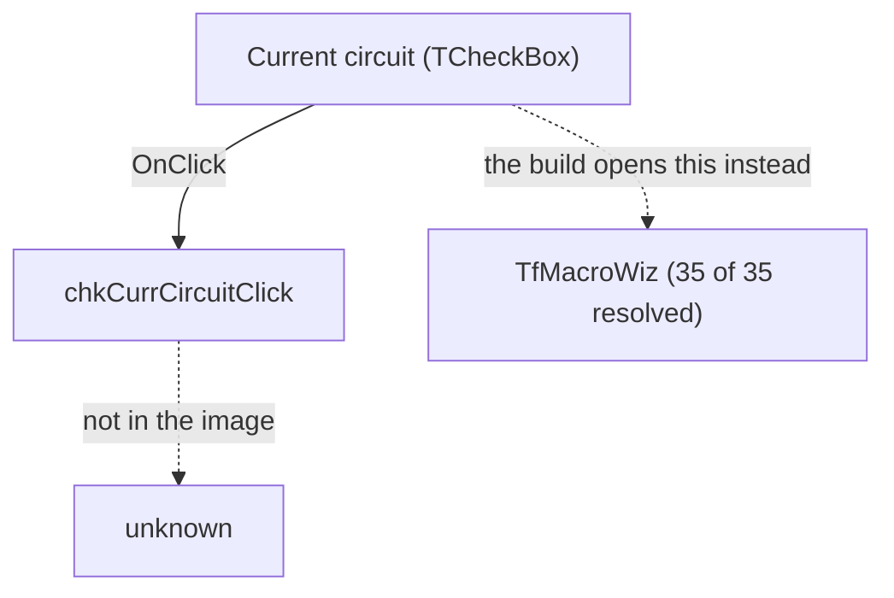

# Current circuit

> Analysis status: The form is superseded by one whose handlers are recovered; this control's own handler is not in the image.

## Control

| Property | Recovered value |
| --- | --- |
| Form | NewMacroCompForm |
| Component path | NewMacroCompForm.chkCurrCircuit |
| Control class | TCheckBox |
| Caption | &Current circuit |
| Hint | Not present in the recovered resource. |
| Kind | Not present in the recovered resource. |
| Handler name | chkCurrCircuitClick |
| Handler address | Not in the image - see below. |
| Graph node | `resource:dfm:NewMacroCompForm/NewMacroCompForm.chkCurrCircuit` |
| Handler node | `concept:dfm-handler:TNewMacroCompForm/chkCurrCircuitClick` |
| Graph layer | UI |

## What happens when clicked

`chkCurrCircuit` sits on NewMacroCompForm - the older New Macro Wizard: a name, a content file, a shape file, default label and parameters, and three ways to say where the macro comes from.

Choosing `Tools > New Macro Wizard...` on the running original opens `TfMacroWiz`, not this form - the window that appears is of that class. `TfMacroWiz` is captioned `New Macro Wizard` as well, covers the same ground (a macro name, where the macro comes from, default label and parameters, and an HDL component option), and every one of its thirty-five event bindings carries an address. So this form is the older one, and the build no longer opens it.

What `chkCurrCircuitClick` did in this older form is not in the image, and there is no longer a reason to want it: the behaviour the build actually runs belongs to `TfMacroWiz`, which is recovered in full.

## Click flow

## Inputs

- Whatever `chkCurrCircuitClick` reads from the form. Not known: the handler is not in the image.

## Decisions

- Not known. No decision can be attributed to a handler that is not in the image, and the caption is not evidence of one.

## State changes

- Not not known. Nothing in the image says what `chkCurrCircuitClick` writes.

## Outputs

- Not known.

## Errors and no-op behaviour

- Not known. Whether `chkCurrCircuitClick` can fail, and what it does when there is nothing to do, is not in the image.

## Why the handler is not in the image

`TNewMacroCompForm` is one of 26 form classes in this image whose event bindings resolve to nothing at all. Across the whole resource, 320 forms carry at least one binding: 293 resolve every one of theirs, 26 resolve none of theirs, and one resolves some. This form is in the second group - 9 bindings, 0 resolved.

The cause is known and is not a gap in the analysis. A Delphi event binding is followed by finding the class's published method table, which hangs off its VMT. For these 26 classes the image holds the class name only inside the DFM stream: there is no second instance of it to anchor a VMT, so no published method table can be found and no handler name can be turned into an address. The pages that would hold them are the ones the protector left encrypted. No further static work on this image will recover them.

## Evidence

- Resource: [DecompiledSources/Tina16/resources/dfm/ui-evidence.json](../../../DecompiledSources/Tina16/resources/dfm/ui-evidence.json)
- The form the build uses instead: `TfMacroWiz`, 35 of 35 bindings resolved.
- The other controls on this form that do something: `NewMacroCompForm` (New Macro Wizard), `sbBrowseShape` (TSpeedButton), `sbBrowseContent` (TSpeedButton), `OKBtn` (OK), `EName` (TEdit), `chkAutoShape` (&Auto-generated), `chkEmptyCircuit` (&Empty circuit).
- No extracted glyph is associated with this control.

## Analysis limits

- The caption, the hint, the control class and the labels near it are not evidence of behaviour and none of them was used as such here.
- Recovering `chkCurrCircuitClick` needs the class table, which needs the protected pages. Watching the running program would settle what the control does without settling how, and for this form the command that would have opened it was watched, and it opened `TfMacroWiz` instead.
