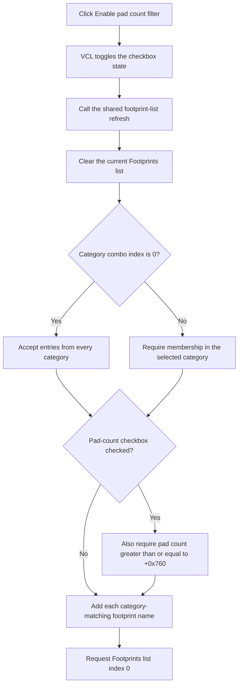

# Refresh the footprint list with or without the pad-count filter

> Analysis status: Reviewed from the recovered click handler, shared list-refresh helper, footprint-list population helper, library and category controls, form creation, and checkbox resource state.

## Control

| Property | Recovered value |
| --- | --- |
| Form | NewModuleForm |
| Form caption | New Footprint |
| Component path | NewModuleForm.pcModule.tsLibrary.cbxPadCountFilter |
| Control class | TCheckBox |
| Caption | Enable pad count filter |
| Initial state | Checked (`cbChecked`) |
| Handler name | cbxPadCountFilterClick |
| Handler address | 00ebc6f0 |
| Graph node | `resource:dfm:NewModuleForm/NewModuleForm.pcModule.tsLibrary.cbxPadCountFilter` |
| Handler node | `function:00ebc6f0` |
| Graph layer | UI |

## What happens when clicked

The VCL changes the checkbox state before it invokes `TNewModuleForm.cbxPadCountFilterClick`. The handler then delegates directly to the shared footprint-list refresh. It does not write a separate saved filter value.

The refresh reads these current inputs:

- the selected footprint library and its loaded entry collection;
- the selected category from `cbxCategoryFilter`;
- the new checked state of `cbxPadCountFilter`;
- the pad-count threshold stored in form field `+0x760`.

Category index `0` is the unfiltered category case. For another index, the refresh reads the combo-box text and requires the footprint's comma-separated category data to contain that category.

The shared population helper first clears `lbEntries.Items`. It then scans all footprints in the selected library:

- checkbox clear: do not test the footprint's pad count;
- checkbox checked: include the footprint only when its pad count is greater than or equal to the threshold;
- category not selected: include entries from every category;
- category selected: also require exact membership in the parsed category list.

For every accepted entry, the helper adds the footprint name, not the stored category data, to `lbEntries`. After population, the refresh requests list index `0`. This selects the first result when one exists. The recovered source does not explicitly handle an empty result list.

## Click flow

## Handler and filter evidence

- [FUN_00ebc6f0](../../../DecompiledSources/Tina16/functions/0000000000EBC6F0__FUN_00ebc6f0.c) contains only the call to the shared refresh.
- [FUN_00ebc110](../../../DecompiledSources/Tina16/functions/0000000000EBC110__FUN_00ebc110.c) reads the category control, checkbox state, selected library data, and threshold, calls the population helper, and requests index `0`.
- [FUN_00eb9b70](../../../DecompiledSources/Tina16/functions/0000000000EB9B70__FUN_00eb9b70.c) clears the destination list, parses category values, applies the optional minimum pad-count test, and adds accepted footprint names.
- [FUN_00ebbfa0](../../../DecompiledSources/Tina16/functions/0000000000EBBFA0__FUN_00ebbfa0.c) loads the selected library's category items and invokes the same refresh when the library changes.
- [FUN_00ebc270](../../../DecompiledSources/Tina16/functions/0000000000EBC270__FUN_00ebc270.c) initializes the library list and selects an initial library before the first shared refresh.
- The DuckDB graph identifies `FUN_00ebc110` as both the category-change handler and the common pad-count click refresh target.

## Resource evidence

- The checkbox starts checked and has no hint, action, image, or extracted glyph.
- The same tab contains `Library`, `Category`, `Footprints`, `cbxLibraryFilter`, `cbxCategoryFilter`, and `lbEntries`.
- The nearby labels agree with the source data flow. They are not the sole evidence for the filter behavior.

## State, no-op, and error behavior

- Every click rebuilds the list and resets its requested selection to index `0`, even if the effective result set does not change.
- The handler does not change the selected library, selected category, threshold, or footprint data.
- Clearing the checkbox does not remove the category filter. It removes only the pad-count test.
- The refresh has no message, explicit failure result, rollback, or local exception handler.
- An empty result leaves no accepted name to select. The list control's exact response to the index-`0` request is not explicit in this call path.

## Analysis limits

- The source proves that form field `+0x760` is a minimum pad-count threshold. Its external origin and user-facing unit are not recovered in this control path.
- The internal footprint object names are not recovered. The pad-count comparison is established by the object's count getter and the threshold test.
- This click changes the displayed candidate list only. It does not create a footprint or commit a selected result.
