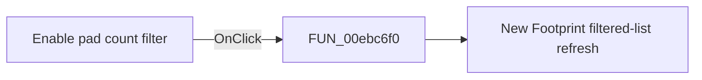

# Enable pad count filter

> Analysis status: Pending individual source review.

## Control

| Property | Recovered value |
| --- | --- |
| Form | NewModuleForm |
| Component path | NewModuleForm.pcModule.tsLibrary.cbxPadCountFilter |
| Control class | TCheckBox |
| Caption | Enable pad count filter |
| Hint | Not present in the recovered resource. |
| Text | Not present in the recovered resource. |
| Handler name | cbxPadCountFilterClick |
| Handler address | 00ebc6f0 |
| Graph node | `resource:dfm:NewModuleForm/NewModuleForm.pcModule.tsLibrary.cbxPadCountFilter` |
| Handler node | `function:00ebc6f0` |
| Graph layer | UI |

## What happens when clicked

Pending individual analysis. An agent must read the recovered handler source and its relevant callees before it replaces this text.

## Click flow

## Handler evidence

- Source: [DecompiledSources/Tina16/functions/0000000000EBC6F0__FUN_00ebc6f0.c](../../../DecompiledSources/Tina16/functions/0000000000EBC6F0__FUN_00ebc6f0.c)
- Recovered role: New Footprint pad-count filter click handler
- Current graph summary: Rebuilds the Footprints list after the pad-count filter changes. Handles 1 Delphi UI event: NewModuleForm.pcModule.tsLibrary.cbxPadCountFilter.OnClick.
- Current graph behavior: Rebuilds the Footprints list after the pad-count filter changes.
- Current graph evidence: cbxPadCountFilter has caption Enable pad count filter and resolves here. The function only calls the shared list refresh.
- Complexity: simple
- Distinct outgoing calls: 1

## Direct calls

- `function:00ebc110` — New Footprint filtered-list refresh

## Resource evidence

- Kind: Not present in the recovered resource.
- Modal result: Not present in the recovered resource.
- Checked state: true
- List items: Not present in the recovered resource.
- Image reference: Not present in the recovered resource.
- Extracted glyph: None.

## Nearby label candidates

Nearby labels are layout candidates only. They are not proof of behavior.

- Rank 1: Category at distance 49.
- Rank 2: Library at distance 95.
- Rank 3: Footprints at distance 272.

## Analysis limits

- Do not infer behavior from the control class, caption, hint, glyph, or nearby label alone.
- Do not replace the pending status until the handler source and relevant call path provide enough evidence.
