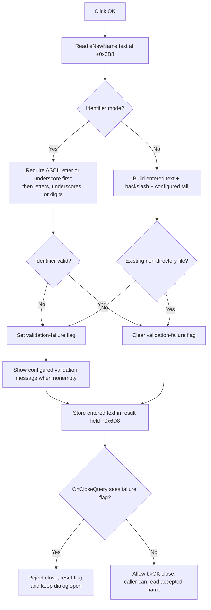

# Validate and accept a new name

> Analysis status: Complete. The recovered handler, validation helpers, modal close guard, known callers, and UI resource establish both validation modes and their outcomes.

## Control

| Property | Recovered value |
| --- | --- |
| Form | NewName |
| Form caption | New name |
| Component path | NewName.bOK |
| Control class | TBitBtn |
| Kind | bkOK |
| Input control | NewName.eNewName (`TEdit`, form field `+0x6B8`) |
| Handler name | bOKClick |
| Handler address | 0106bab0 |
| Graph node | `resource:dfm:NewName/NewName.bOK` |
| Handler node | `function:0106bab0` |
| Graph layer | UI |

## What happens when clicked

The command reads the exact text from `eNewName`, validates it in the dialog's current mode, stores it as the dialog result string, and blocks the modal close when validation fails.

`FormCreate` selects identifier mode by default. The two recovered direct callers keep this default. One caller renames an HDL project, and the other creates a package library. Both callers read the stored name only when the modal result is OK.

## Default identifier validation

In identifier mode, `FUN_01055790` applies these rules:

- The name must contain at least one UTF-16 code unit.
- The first character must be an ASCII letter (`A-Z` or `a-z`) or underscore (`_`).
- Every later character must be an ASCII letter, underscore, or digit (`0-9`).
- Spaces, punctuation, path separators, and non-ASCII letters are rejected.

The handler does not trim whitespace, change case, normalize Unicode, or check name uniqueness. For example, `_name2` is valid, but `2name`, `new name`, and an empty string are invalid. A caller can still reject a syntactically valid name later. The new-library caller does this when package creation fails after the dialog has closed.

## Alternate file validation

When the mode flag is clear, the handler does not run identifier validation. It builds this path:

`<entered text>\<configured tail>`

It then calls `FUN_00440a20` with link following enabled. The name is accepted only when that path identifies an existing non-directory file under the helper's recovered file and reparse-point rules.

There is no separate empty-input check in this mode. The entered text is used as the path prefix exactly as supplied. The configured tail comes from form field `+0x6E8`. A read-only check of the rebuilt image confirms that the constant between both strings is a Unicode backslash.

No recovered direct caller invokes the mode or configured-tail setter. The file-validation branch is present and complete in the handler, but the recovered caller graph only proves active use of the default identifier mode.

## Invalid-name handling

The handler stores the validation failure in form flag `+0x6F0`. When that flag is set, it passes the configured message at `+0x6E0` to `FUN_016fd940`. The known callers supply localized invalid-project-name or invalid-library-name text.

The `bkOK` button then reaches the form's `OnCloseQuery` handler:

- A valid name leaves `+0x6F0` clear, so the close is allowed and the caller receives modal result OK.
- An invalid name sets `+0x6F0`, so `OnCloseQuery` rejects the close and keeps the dialog open.
- `OnCloseQuery` resets the failure flag after either decision. A later correction can be checked again, and Cancel is not permanently blocked.
- If the configured error string is empty, the message wrapper does nothing. The close guard still keeps the dialog open.

The entered text is copied to result field `+0x6D8` on both valid and invalid attempts. Known callers read that field only after modal result OK, so they do not consume the invalid attempt.

## State and failure behavior

- A valid click changes only the dialog's stored result text before the VCL modal close. It does not create, rename, or persist an object itself.
- An invalid click stores the attempted text, shows the configured message when present, and keeps the dialog open.
- Repeating OK reruns validation against the current edit text. There is no cached success result.
- The handler has no local exception block. A text-read, allocation, file-system, or message-display exception has no local recovery.
- The button's `bkOK` kind supplies normal OK modal-result behavior. The handler does not call `Close` or set the modal result directly.

## Click flow

## Handler and call-path evidence

- [bOKClick source](../../../DecompiledSources/Tina16/functions/000000000106BAB0__FUN_0106bab0.c) reads the edit, selects a validation mode, records failure, shows the configured message, and stores the result text.
- [Identifier validator](../../../DecompiledSources/Tina16/functions/0000000001055790__FUN_01055790.c) rejects empty text, checks the first character, and checks all remaining characters.
- [ASCII letter and underscore predicate](../../../DecompiledSources/Tina16/functions/0000000001B215C0__FUN_01b215c0.c) and [ASCII digit predicate](../../../DecompiledSources/Tina16/functions/0000000001B215F0__FUN_01b215f0.c) define the accepted identifier characters.
- [File-existence helper](../../../DecompiledSources/Tina16/functions/0000000000440A20__FUN_00440a20.c) checks file attributes, excludes directories, and handles reparse points according to its Boolean parameter.
- [Configured-message wrapper](../../../DecompiledSources/Tina16/functions/00000000016FD940__FUN_016fd940.c) skips an empty message and forwards a nonempty one to the shared dialog routine.
- [FormCloseQuery source](../../../DecompiledSources/Tina16/functions/000000000106BA80__FUN_0106ba80.c) allows close only when the validation-failure flag is clear, then resets that flag.
- [FormCreate source](../../../DecompiledSources/Tina16/functions/000000000106BAA0__FUN_0106baa0.c) selects identifier mode by default.
- [FormShow source](../../../DecompiledSources/Tina16/functions/000000000106BC30__FUN_0106bc30.c) copies the stored result string into `eNewName` before editing.
- [HDL project caller](../../../DecompiledSources/Tina16/functions/0000000001084CD0__FUN_01084cd0.c) supplies an initial name and invalid-project-name message, then consumes the result only after modal result OK.
- [Package library caller](../../../DecompiledSources/Tina16/functions/00000000014EC9A0__FUN_014ec9a0.c) supplies localized caption and error text, then tries package creation only after modal result OK.
- [Recovered UI evidence](../../../DecompiledSources/Tina16/resources/dfm/ui-evidence.json) supplies the form, `eNewName`, `bkOK` kind, layout, two-glyph metadata, and event bindings.
- The read-only graph confirms the `triggers` edge and seven distinct outgoing calls from the handler.
- Complexity: complex; seven distinct outgoing calls.

## Direct calls

- `function:0064dd90` - read the current Unicode text from `eNewName`.
- `function:01055790` - validate the default ASCII identifier syntax.
- `function:00416cd0` - concatenate entered text, backslash, and configured tail for file mode.
- `function:00440a20` - test the constructed path for an existing file.
- `function:016fd940` - display the configured validation message when nonempty.
- `function:00414ad0` - assign the entered text to result field `+0x6D8`.
- `function:00414560` - finalize temporary Delphi UnicodeStrings.

## Resource evidence

- `bOK` is a `TBitBtn` with kind `bkOK`, `NumGlyphs = 2`, and `OnClick = bOKClick` at `0106bab0`.
- `eNewName` is the only `TEdit` and is directly below label **New name**. The handler reads form field `+0x6B8`, which matches its recovered component slot.
- The button has no recovered caption, hint, action, image reference, or `Glyph.Data`. No glyph file was extracted.
- The nearby **New name** label supports the input context, but the handler and validators prove the behavior.

## Analysis limits

- The public names of the mode, message, configured-tail, and result-string properties are not recovered. Their field roles are established by setters, lifecycle code, handler use, and known callers.
- No recovered direct caller selects file mode. The article documents its exact code path without assigning it to an unsupported user workflow.
- Identifier mode checks syntax only. Object-specific uniqueness, reserved-word, and creation rules can run later in each caller.
