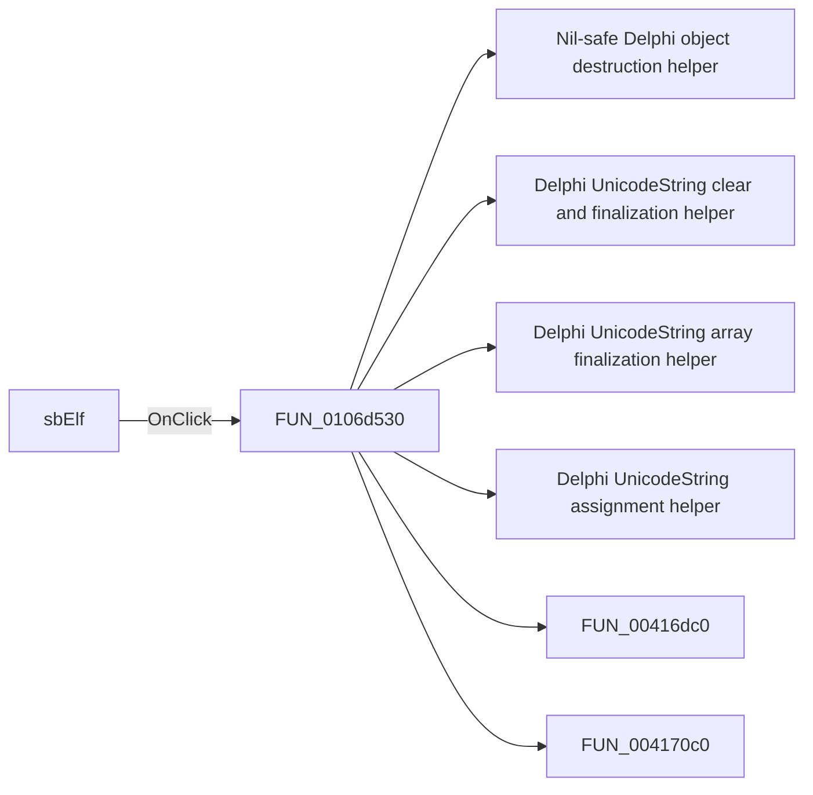

# sbElf

> Analysis status: Pending individual source review.

## Control

| Property | Recovered value |
| --- | --- |
| Form | NewXMCProject |
| Component path | NewXMCProject.sbElf |
| Control class | TSpeedButton |
| Caption | Not present in the recovered resource. |
| Hint | Not present in the recovered resource. |
| Text | Not present in the recovered resource. |
| Handler name | sbElfClick |
| Handler address | 0106d530 |
| Graph node | `resource:dfm:NewXMCProject/NewXMCProject.sbElf` |
| Handler node | `function:0106d530` |
| Graph layer | UI |

## What happens when clicked

Pending individual analysis. An agent must read the recovered handler source and its relevant callees before it replaces this text.

## Click flow

## Handler evidence

- Source: [DecompiledSources/Tina16/functions/000000000106D530__FUN_0106d530.c](../../../DecompiledSources/Tina16/functions/000000000106D530__FUN_0106d530.c)
- Recovered role: Not present in the recovered resource.
- Current graph summary: Handles 1 Delphi UI event: NewXMCProject.sbElf.OnClick.
- Current graph behavior: Not present in the recovered resource.
- Current graph evidence: Not present in the recovered resource.
- Complexity: complex
- Distinct outgoing calls: 14

## Direct calls

- `function:00410f20` — Nil-safe Delphi object destruction helper
- `function:00414480` — Delphi UnicodeString clear and finalization helper
- `function:00414560` — Delphi UnicodeString array finalization helper
- `function:00414ad0` — Delphi UnicodeString assignment helper
- `function:00416dc0` — FUN_00416dc0
- `function:004170c0` — FUN_004170c0
- `function:00450070` — FUN_00450070
- `function:0064dd90` — VCL control Unicode text reader
- `function:0064de00` — VCL control text setter with change suppression
- `function:00724270` — FUN_00724270
- `function:01604ed0` — FUN_01604ed0
- `function:01605520` — FUN_01605520
- `function:01b21190` — FUN_01b21190
- `function:01b21460` — FUN_01b21460

## Resource evidence

- Kind: Not present in the recovered resource.
- Modal result: Not present in the recovered resource.
- Checked state: Not present in the recovered resource.
- List items: Not present in the recovered resource.
- Image reference: Not present in the recovered resource.
- Extracted glyph: [`0292_NewXMCProject_NewXMCProject_sbElf_Glyph_Data.png`](../../../glyph/0292_NewXMCProject_NewXMCProject_sbElf_Glyph_Data.png)

## Nearby label candidates

Nearby labels are layout candidates only. They are not proof of behavior.

- Rank 1: Select ELF file from the Debug target: at distance 331.
- Rank 2: Workspace: at distance 357.
- Rank 3: Project: at distance 405.

## Analysis limits

- Do not infer behavior from the control class, caption, hint, glyph, or nearby label alone.
- Do not replace the pending status until the handler source and relevant call path provide enough evidence.
