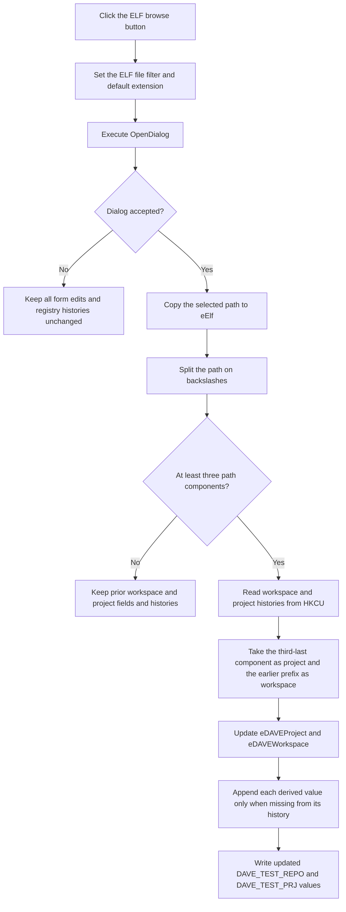

# Select an ELF file and derive its workspace and project

> Analysis status: Reviewed from the recovered click handler, file-dialog and path helpers, registry history readers and writers, form resource, and extracted two-frame glyph.

## Control

| Property | Recovered value |
| --- | --- |
| Form | NewXMCProject |
| Form caption | New Eclipse Project |
| Component path | NewXMCProject.sbElf |
| Control class | TSpeedButton |
| Caption | Not present in the recovered resource. |
| Handler name | sbElfClick |
| Handler address | 0106d530 |
| Graph node | `resource:dfm:NewXMCProject/NewXMCProject.sbElf` |
| Handler node | `function:0106d530` |
| Graph layer | UI |

## What happens when clicked

`TNewXMCProject.sbElfClick` configures the form's `TOpenDialog` with filter `ELF file (*.elf)|*.elf` and a static default-extension value. It then executes the dialog.

If the user accepts, the handler copies the selected path to `eElf` at form field `+0x6c0`. It splits the path on backslashes. When the result contains at least three components, it also derives the Eclipse project and workspace:

- project: the third path component from the end;
- workspace: the selected path prefix before the first occurrence of that project component, without the preceding backslash.

For the expected path shape `C:\workspace\project\Debug\file.elf`, the derived project is `project` and the derived workspace is `C:\workspace`.

The handler stores the project in form string `+0x708` and displays it in disabled edit `eDAVEProject` at `+0x6f8`. It stores the workspace in form string `+0x710` and displays it in disabled edit `eDAVEWorkspace` at `+0x6e8`.

The source does not check that the directory before the file is named `Debug`. It does not inspect the selected file's ELF contents. The derivation depends only on path components.

## Registry-backed history update

For a path with at least three components, the handler reads four values under the application's current-user registry key:

- `DAVE_TEST_REPO`: delimiter-separated workspace history;
- `DAVE_TEST_PRJ`: delimiter-separated project history;
- `DAVE_TEST_WORKSPACE_IDX`: stored workspace index;
- `DAVE_TEST_PRJ_IDX`: stored project index.

The two indexes are read but are not used by this click handler. Missing values under an existing key are created with empty or zero defaults.

The handler converts both history strings to lists. It appends the derived workspace or project only when that value is not already present. It converts the lists back to delimiter-separated text and writes `DAVE_TEST_REPO` and `DAVE_TEST_PRJ`. Before the workspace history is written, the registry writer removes double-quote characters from it.

## Click flow

## Handler and path evidence

- [FUN_0106d530](../../../DecompiledSources/Tina16/functions/000000000106D530__FUN_0106d530.c) configures and executes the dialog, updates `eElf`, splits the path, derives both fields, updates the edits, de-duplicates history entries, and saves them.
- [FUN_00724270](../../../DecompiledSources/Tina16/functions/0000000000724270__FUN_00724270.c) returns the selected file name from the dialog.
- [FUN_01b21190](../../../DecompiledSources/Tina16/functions/0000000001B21190__FUN_01b21190.c) splits a Unicode string on the supplied delimiter and returns a string list.
- [FUN_01604ed0](../../../DecompiledSources/Tina16/functions/0000000001604ED0__FUN_01604ed0.c) opens the current-user application registry key and reads or initializes the four history values.
- [FUN_01605520](../../../DecompiledSources/Tina16/functions/0000000001605520__FUN_01605520.c) removes quotes from the workspace history and writes the two updated string values.
- [FUN_01605430](../../../DecompiledSources/Tina16/functions/0000000001605430__FUN_01605430.c) removes all occurrences of the requested character, which is double quote in this call path.
- [FUN_0064de00](../../../DecompiledSources/Tina16/functions/000000000064DE00__FUN_0064de00.c) updates each edit only when its text differs.

## Resource and glyph evidence

- `Select ELF file from the Debug target:` identifies the intended file location. The source confirms ELF selection but does not enforce a `Debug` directory name.
- `Workspace:` and `Project:` label disabled edits `eDAVEWorkspace` and `eDAVEProject`.
- `sbElf` has a 32-by-16 raster glyph with `NumGlyphs = 2`. The two 16-by-16 frames show a folder and document browse symbol. This supports the file-browse role but does not prove the derived-path or registry behavior.
- Extracted glyph: [`0292_NewXMCProject_NewXMCProject_sbElf_Glyph_Data.png`](../../../glyph/0292_NewXMCProject_NewXMCProject_sbElf_Glyph_Data.png).

## State, error, and no-op behavior

- Canceling the dialog leaves all form edits, derived strings, and registry histories unchanged. The dialog's filter configuration remains updated.
- An accepted path with fewer than three components updates `eElf` only. It preserves prior workspace and project values.
- A missing application registry key raises an exception after `eElf` has already changed. The handler has no local catch or rollback.
- Missing individual registry values are initialized and do not stop the path.
- A registry write is attempted only after both derived edits are updated. The writer has no result check or user message in this path.
- Existing workspace and project history entries are not duplicated.

## Analysis limits

- The static default-extension text is referenced by a data address and is not recovered as plain text here.
- The path rule is positional. It can derive incorrect values from a selected ELF path that does not follow the expected workspace, project, target, and file shape.
- The registry key path is assembled from an application-global value. Its plain-text path is not present in this handler.
- This click does not create an Eclipse project or validate an ELF binary. Those actions, if any, occur outside the recovered handler.
