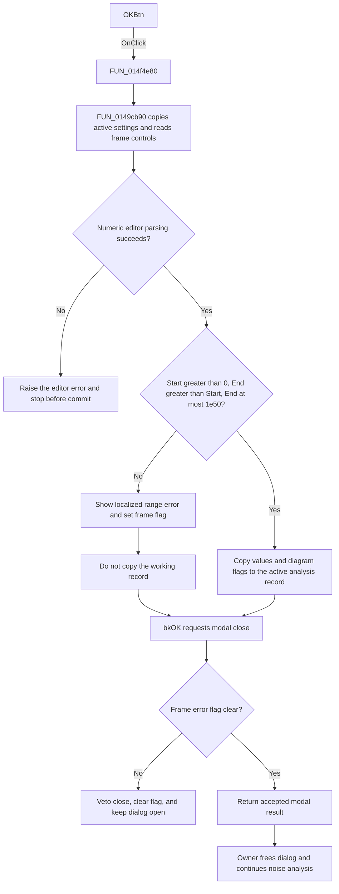

# OKBtn

> Analysis status: Handler, Noise frame, validation, close-query, modal-owner, and execution-boundary evidence reviewed.

## Control

| Property | Recovered value |
| --- | --- |
| Form | NoiseAnalDlg |
| Component path | NoiseAnalDlg.OKBtn |
| Control class | TBitBtn |
| Button kind | bkOK |
| Caption | Not present in the recovered resource. |
| Hint | Not present in the recovered resource. |
| Text | Not present in the recovered resource. |
| Handler name | OKBtnClick |
| Handler address | 014f4e80 |
| Graph node | `resource:dfm:NoiseAnalDlg/NoiseAnalDlg.OKBtn` |
| Handler node | `function:014f4e80` |
| Graph layer | UI |

## What happens when clicked

The click collects the Noise Analysis settings, validates them, and commits them to the active analysis record only when the settings are valid. It does not run the analysis directly.

The recovered `TNoiseAnalDlg.OKBtnClick` handler passes the embedded `NoiseAnalDlgFrame` at form field `+0x6b0` to [`FUN_0149cb90`](../../../DecompiledSources/Tina16/functions/000000000149CB90__FUN_0149cb90.c). That collector performs these operations:

1. It copies the current noise settings from the active analysis record to local working storage.
2. It reads Start frequency, End frequency, Number of points, S/N Signal Amplitude, and the Output Noise, Input Noise, Total Noise, and Signal to Noise check boxes.
3. It requires Start frequency to be greater than zero, End frequency to be greater than Start frequency, and End frequency to be no greater than `1e50`.
4. If the frequency range is valid and no frame error flag is set, it copies the complete working record back to the active analysis record. If an error flag is set, it does not commit the working record.

An invalid frequency range loads a localized error message and calls [`FUN_0149c990`](../../../DecompiledSources/Tina16/functions/000000000149C990__FUN_0149c990.c). That wrapper uses [`FUN_01b1cf30`](../../../DecompiledSources/Tina16/functions/0000000001B1CF30__FUN_01b1cf30.c) to show the first error for the frame and set the frame byte at `+0x538`. The collector continues to read the diagram check boxes, but the set flag blocks the final record copy.

The built-in `bkOK` behavior requests the standard modal OK result. [`FUN_014f4e30`](../../../DecompiledSources/Tina16/functions/00000000014F4E30__FUN_014f4e30.c), the form's recovered `OnCloseQuery` handler, allows closure only when the frame error byte is zero. It then clears the byte for the next attempt. Thus, an invalid range reports an error, retains the earlier active settings, and keeps the dialog open. A valid click closes the dialog with the OK result.

[`FUN_014f6590`](../../../DecompiledSources/Tina16/functions/00000000014F6590__FUN_014f6590.c) owns the modal dialog in the inspected interactive path. It creates the dialog, passes the active analysis object to it, shows the dialog modally, and frees the dialog after `ShowModal` returns. A Cancel result stops this path. An accepted OK result lets the owner continue with noise-analysis setup and execution. For example, [`FUN_01533ae0`](../../../DecompiledSources/Tina16/functions/0000000001533AE0__FUN_01533ae0.c) invokes this interactive path from `NetlistEditor.MainMenu.MAnalysis.MINoiseAnalysis` and displays the result only when the runner reports success.

## Click flow

## Handler evidence

- Source: [DecompiledSources/Tina16/functions/00000000014F4E80__FUN_014f4e80.c](../../../DecompiledSources/Tina16/functions/00000000014F4E80__FUN_014f4e80.c)
- Recovered role: Delegates Noise Analysis settings collection and validation to the embedded Noise frame.
- Current graph summary: Handles 1 Delphi UI event: NoiseAnalDlg.OKBtn.OnClick.
- Current graph behavior: Calls `FUN_0149cb90` with the frame stored at form offset `+0x6b0`. The collector reads and validates the frame and commits only when its error flag is clear.
- Current graph evidence: `FUN_014f4e80` contains one direct call. The reviewed `FUN_0149cb90` annotation identifies the Noise fields, frequency constraints, diagram-bit collection, and commit gate. `FUN_014f4e30` uses the same frame error flag to accept or veto closure.
- Complexity: simple
- Distinct outgoing calls: 1

## Direct calls

- `function:0149cb90` — Collects and validates Noise settings and commits the valid working record.

## Resource evidence

- Kind: bkOK
- Modal result: Not present in the recovered resource.
- Checked state: Not present in the recovered resource.
- List items: Not present in the recovered resource.
- Image reference: Not present in the recovered resource.
- Extracted glyph: None.

## Input and parser behavior

- [`FUN_00b90090`](../../../DecompiledSources/Tina16/functions/0000000000B90090__FUN_00b90090.c) parses the three float editors. It rejects values outside `-1e50` through `1e50` and calls a configured control validator when present.
- [`FUN_00f04d50`](../../../DecompiledSources/Tina16/functions/0000000000F04D50__FUN_00f04d50.c) parses Number of points and enforces the integer editor's stored minimum and maximum. The recovered DFM does not expose those numeric bounds.
- The recovered float-error handler, [`FUN_0149ce90`](../../../DecompiledSources/Tina16/functions/000000000149CE90__FUN_0149ce90.c), and point-error handler, [`FUN_0149ceb0`](../../../DecompiledSources/Tina16/functions/000000000149CEB0__FUN_0149ceb0.c), pass editor-specific messages to the frame error helper.
- `FUN_0149cb90` has no local exception handler. A parser exception stops the collector before its final record copy. Later control reads do not occur after the failing call.
- The collector has no additional cross-field check for Number of points or S/N Signal Amplitude. It also does not require one of the four diagram check boxes to be selected.

## Nearby label candidates

Nearby labels are layout candidates only. They are not proof of behavior.

- No same-parent label candidate is available.

The embedded Noise frame supplies the labels `Start frequency`, `End frequency`, `Number of points`, and `S/N Signal Amplitude`. Its `Diagrams` group supplies `Output Noise`, `Input Noise`, `Total Noise`, and `Signal to Noise`. These resources identify the inputs, while the collector source proves how OK uses them.

## No-op and error behavior

- Invalid frequency range: show one localized frame error, set the frame error byte, skip the record commit, veto the OK close, and clear the byte for another attempt.
- Numeric parser failure: stop the handler at that editor. The handler does not perform the final record commit or run the analysis.
- All four diagram check boxes clear: commit the four clear flags when the remaining inputs are valid. This handler does not reject that selection.
- The handler has no success message, rollback call, or local exception recovery. Because invalid cross-field data is held only in local working storage, a close veto retains the previously active noise record.
- Cancel does not call this OK handler. The modal owner treats the standard Cancel result as a request to stop before analysis execution.

## Analysis limits

- The integer editor enforces stored bounds, but their numeric values are not recovered in the DFM evidence.
- The custom editor error events are recovered, but the exact event order around a parser exception is not fully represented in the static call graph.
- The article follows the inspected interactive owner. Other callers can invoke the noise runner without showing this dialog by passing a nonzero mode.
- The OK handler commits settings. The later simulation setup and result display occur in the owner and runner paths, not in `FUN_014f4e80`.
