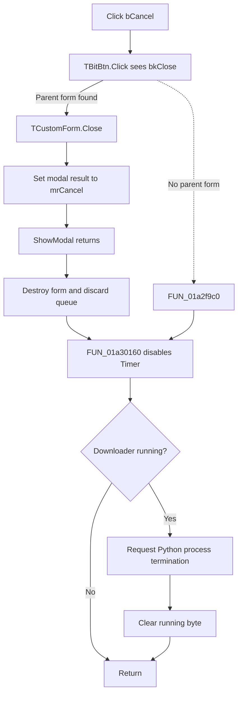

# bCancel

> Analysis status: Reviewed from the recovered handler, TBitBtn dispatch, modal callers, and form cleanup.

## Control

| Property | Recovered value |
| --- | --- |
| Form | OllamaDownload |
| Component path | OllamaDownload.bCancel |
| Control class | TBitBtn |
| Caption | Not present in the recovered resource. |
| Hint | Not present in the recovered resource. |
| Text | Not present in the recovered resource. |
| Handler name | bCancelClick |
| Handler address | 01a2f9c0 |
| Graph node | `resource:dfm:OllamaDownload/OllamaDownload.bCancel` |
| Handler node | `function:01a2f9c0` |
| Graph layer | UI |

## What happens when clicked

`bCancel` is a `bkClose` button on a modal `OllamaDownload` form. This built-in kind changes the normal path: recovered `TBitBtn.Click` finds the parent form and calls the VCL form-close routine directly. It does not dispatch the bound `bCancelClick` event when the parent form exists.

Both recovered callers use `ShowModal`. Therefore, the VCL close routine writes modal result `2` (`mrCancel`) and ends the modal wait. Each caller then destroys the form. `FormDestroy` releases the remaining model queue and calls the shared cancellation routine with timer shutdown enabled.

The bound `bCancelClick` handler contains only the same shared cancellation call. It is the fallback if `TBitBtn.Click` cannot find a parent form, and it can also be called directly. When it runs, it does not close the form or clear queued models.

The shared routine first disables the form timer. If downloader-running byte `+0x708` is clear, it returns without a process operation. If the byte is set, it asks the owning Local LLM controller to stop the Python downloader, then clears the byte. The process-stop path opens the recorded process, requests termination, waits for it, and retries failed attempts before it clears the controller's running flag.

On the normal modal click path, form destruction also discards every model that is still queued. It does not delete a model that completed before cancellation and does not roll back memo or gauge updates. There is no confirmation dialog, resume state, or local exception handler. A process-stop failure does not keep the form open because the modal result was already set before destruction started.

## Click flow

## Handler evidence

- Source: [DecompiledSources/Tina16/functions/0000000001A2F9C0__FUN_01a2f9c0.c](../../../DecompiledSources/Tina16/functions/0000000001A2F9C0__FUN_01a2f9c0.c)
- Recovered role: Handle the bound cancel event by disabling timer polling and stopping an active Ollama downloader.
- Current graph summary: Handles 1 Delphi UI event: OllamaDownload.bCancel.OnClick.
- Current graph behavior: Calls the shared cancellation routine with timer shutdown enabled. That routine stops the timer and, when a downloader is active, requests external-process termination and clears the running state.
- Current graph evidence: The handler passes `true` to `FUN_01a30160`. That function passes `false` to the timer-enabled wrapper, tests form byte `+0x708`, conditionally calls `FUN_01a41fd0` with the owner at `+0x710`, and clears `+0x708`.
- Complexity: simple
- Distinct outgoing calls: 1

## Direct calls

- `function:01a30160` — Disables timer polling when requested, stops an active Python downloader through the owning controller, and clears the form's running byte.

## Resource evidence

- Kind: bkClose
- Modal result: Not present in the recovered resource.
- Checked state: Not present in the recovered resource.
- List items: Not present in the recovered resource.
- Image reference: Not present in the recovered resource.
- Extracted glyph: None.

## Nearby label candidates

Nearby labels are layout candidates only. They are not proof of behavior.

- No same-parent label candidate is available.

## Analysis limits

- The graph `triggers` edge records the DFM event binding. The recovered `bkClose` VCL branch proves that the normal click closes the parent form without dispatching that event.
- The process-stop helper retries, but the recovered path does not report its final success or failure to this dialog.
- The recovered code does not preserve a resumable queue or partial-download transaction after the form is destroyed.
- No application-specific `OnCloseQuery` handler is present in the recovered form resource.

## Supporting sources

- [TBitBtn kind dispatch](../../../DecompiledSources/Tina16/functions/000000000082B0E0__FUN_0082b0e0.c)
- [VCL modal and modeless close routine](../../../DecompiledSources/Tina16/functions/0000000000805200__FUN_00805200.c)
- [Form destroy cleanup](../../../DecompiledSources/Tina16/functions/0000000001A2F5F0__FUN_01a2f5f0.c)
- [Shared timer and downloader stop](../../../DecompiledSources/Tina16/functions/0000000001A30160__FUN_01a30160.c)
- [Controller process-stop adapter](../../../DecompiledSources/Tina16/functions/0000000001A41FD0__FUN_01a41fd0.c)
- [Process termination and retry loop](../../../DecompiledSources/Tina16/functions/0000000001B25C70__FUN_01b25c70.c)
- [Process termination attempt](../../../DecompiledSources/Tina16/functions/0000000001B25BF0__FUN_01b25bf0.c)
- [Manual model-management modal caller](../../../DecompiledSources/Tina16/functions/0000000001A47B10__FUN_01a47b10.c)
- [Missing-model modal caller](../../../DecompiledSources/Tina16/functions/0000000001A47DD0__FUN_01a47dd0.c)
