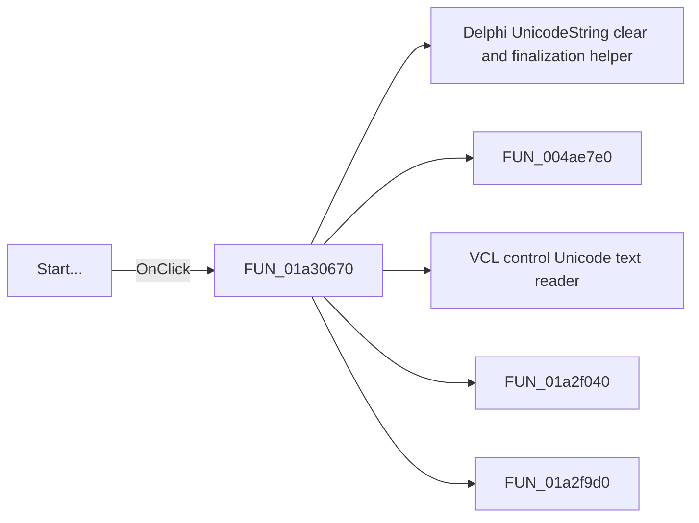

# Start...

> Analysis status: Pending individual source review.

## Control

| Property | Recovered value |
| --- | --- |
| Form | OllamaDownload |
| Component path | OllamaDownload.Panel1.bStart |
| Control class | TButton |
| Caption | Start... |
| Hint | Press the Start button to downloading the models |
| Text | Not present in the recovered resource. |
| Handler name | bStartClick |
| Handler address | 01a30670 |
| Graph node | `resource:dfm:OllamaDownload/OllamaDownload.Panel1.bStart` |
| Handler node | `function:01a30670` |
| Graph layer | UI |

## What happens when clicked

Pending individual analysis. An agent must read the recovered handler source and its relevant callees before it replaces this text.

## Click flow

## Handler evidence

- Source: [DecompiledSources/Tina16/functions/0000000001A30670__FUN_01a30670.c](../../../DecompiledSources/Tina16/functions/0000000001A30670__FUN_01a30670.c)
- Recovered role: Not present in the recovered resource.
- Current graph summary: Handles 1 Delphi UI event: OllamaDownload.Panel1.bStart.OnClick.
- Current graph behavior: Not present in the recovered resource.
- Current graph evidence: Not present in the recovered resource.
- Complexity: complex
- Distinct outgoing calls: 5

## Direct calls

- `function:00414480` — Delphi UnicodeString clear and finalization helper
- `function:004ae7e0` — FUN_004ae7e0
- `function:0064dd90` — VCL control Unicode text reader
- `function:01a2f040` — FUN_01a2f040
- `function:01a2f9d0` — FUN_01a2f9d0

## Resource evidence

- Kind: Not present in the recovered resource.
- Modal result: Not present in the recovered resource.
- Checked state: Not present in the recovered resource.
- List items: Not present in the recovered resource.
- Image reference: Not present in the recovered resource.
- Extracted glyph: None.

## Nearby label candidates

Nearby labels are layout candidates only. They are not proof of behavior.

- Rank 1: Model:  at distance 427.

## Analysis limits

- Do not infer behavior from the control class, caption, hint, glyph, or nearby label alone.
- Do not replace the pending status until the handler source and relevant call path provide enough evidence.
