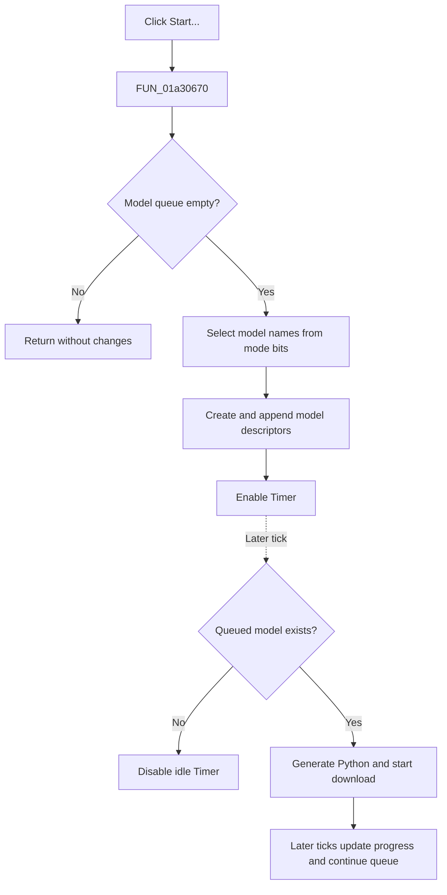

# Start...

> Analysis status: Reviewed from the recovered handler, timer workflow, and modal callers.

## Control

| Property | Recovered value |
| --- | --- |
| Form | OllamaDownload |
| Component path | OllamaDownload.Panel1.bStart |
| Control class | TButton |
| Caption | Start... |
| Hint | Press the Start button to downloading the models |
| Text | Not present in the recovered resource. |
| Handler name | bStartClick |
| Handler address | 01a30670 |
| Graph node | `resource:dfm:OllamaDownload/OllamaDownload.Panel1.bStart` |
| Handler node | `function:01a30670` |
| Graph layer | UI |

## What happens when clicked

`bStartClick` prepares work for the timer-driven Ollama downloader. It does not make a network request in the click handler.

The handler first checks the model queue at form field `+0x700`. It continues only when that queue is empty. It then uses the mode value at `+0x70c` to add model descriptors in this order:

1. If bit `2` is set, it adds the owner's embeddings-model name from offset `+0x2bb0`.
2. If bit `8` is set, it adds the owner's Tina LLM model name from offset `+0x2bb8`.
3. If bit `0x10` is set, it adds the model name supplied to the form at `+0x718`.
4. If the complete mode value is exactly `4`, it reads the current `cbModels` text and adds that value.

For each selected value, `FUN_01a2f040` creates a descriptor that owns the model string, and `FUN_004ae7e0` appends the descriptor to the queue. The handler then calls `FUN_01a2f9d0` with `true`, which enables the disabled `Timer` component.

On a later tick, `TimerTimer` takes the first queued model. It logs the model name, generates `ollama_download.py`, and starts Python code that calls `TOllamaDownloader.download`. Later timer ticks read `ollama_downloader_result.json`, update the gauge and memo, and start the next queued model after the current process finishes.

If the queue is not empty at click time, the handler performs no operation. It does not add duplicate work, restart the timer, or change the controls. If the mode does not select any supported source, including mode bit `1` by itself, the handler still enables the timer without adding a descriptor; the next idle timer tick disables itself. Exact mode `4` does not validate the combo-box text, so an empty text value can be queued. There is no local exception handler or rollback for a descriptor-allocation or queue-append failure.

## Click flow

## Handler evidence

- Source: [DecompiledSources/Tina16/functions/0000000001A30670__FUN_01a30670.c](../../../DecompiledSources/Tina16/functions/0000000001A30670__FUN_01a30670.c)
- Recovered role: Queue the mode-selected Ollama models and enable timer-driven downloading.
- Current graph summary: Handles 1 Delphi UI event: OllamaDownload.Panel1.bStart.OnClick.
- Current graph behavior: When the model queue is empty, create descriptors for the applicable embeddings, Tina LLM, supplied, or combo-box model names, append them in a fixed order, and enable the form timer.
- Current graph evidence: The handler tests queue count `+0x10`, branches on form mode `+0x70c`, reads the recovered model-name fields or `cbModels`, constructs each descriptor through `FUN_01a2f040`, appends it through `FUN_004ae7e0`, and passes `true` to the timer-enabled wrapper.
- Complexity: complex
- Distinct outgoing calls: 5

## Direct calls

- `function:00414480` — Finalizes the temporary combo-box text string.
- `function:004ae7e0` — Appends a model descriptor to the form queue.
- `function:0064dd90` — Reads the current `cbModels` text for exact mode `4`.
- `function:01a2f040` — Constructs a queued model descriptor and copies its model name.
- `function:01a2f9d0` — Passes the requested enabled state to the form's `Timer` component.

## Resource evidence

- Kind: Not present in the recovered resource.
- Modal result: Not present in the recovered resource.
- Checked state: Not present in the recovered resource.
- List items: Not present in the recovered resource.
- Image reference: Not present in the recovered resource.
- Extracted glyph: None.

## Nearby label candidates

Nearby labels are layout candidates only. They are not proof of behavior.

- Rank 1: Model:  at distance 427.

## Analysis limits

- The mode field is recovered as numeric bits. The call sites and `FormShow` messages prove the model sources, but the original Delphi enum or set type name is not recovered.
- The click handler does not prove download success. Python launch, JSON polling, progress updates, errors, and cancellation occur in the later timer workflow.
- The recovered source does not validate the exact model-name syntax or confirm whether an empty exact-mode-`4` value fails in Python.
- The nearby `Model:` label identifies the combo-box region. It does not prove the handler behavior by itself.

## Supporting sources

- [Form mode and owner assignment](../../../DecompiledSources/Tina16/functions/0000000001A2F520__FUN_01a2f520.c)
- [Form initialization and queue creation](../../../DecompiledSources/Tina16/functions/0000000001A2F5A0__FUN_01a2f5a0.c)
- [Mode-specific controls and messages](../../../DecompiledSources/Tina16/functions/0000000001A2F620__FUN_01a2f620.c)
- [Timer result polling and queue dispatch](../../../DecompiledSources/Tina16/functions/0000000001A2F9F0__FUN_01a2f9f0.c)
- [Python script generation and process launch](../../../DecompiledSources/Tina16/functions/0000000001A301A0__FUN_01a301a0.c)
- [Queued-model launch](../../../DecompiledSources/Tina16/functions/0000000001A307E0__FUN_01a307e0.c)
- [Manual model-management caller](../../../DecompiledSources/Tina16/functions/0000000001A47B10__FUN_01a47b10.c)
- [Missing-model download callers](../../../DecompiledSources/Tina16/functions/0000000001A47DD0__FUN_01a47dd0.c)
