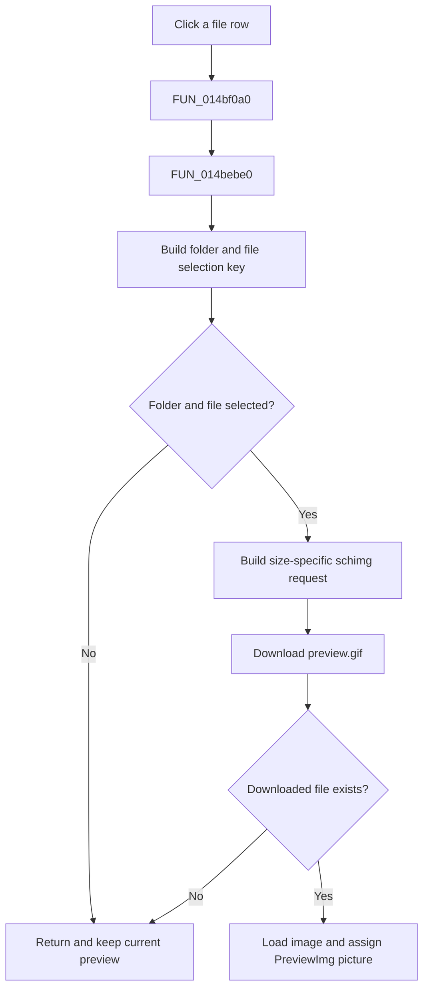

# FileList

> Analysis status: Evidence-backed source review complete.

## Control

| Property | Recovered value |
| --- | --- |
| Form | OpenWindow |
| Component path | OpenWindow.CenterPanel.FileList |
| Control class | TListView |
| Caption | Not present in the recovered resource. |
| Hint | Not present in the recovered resource. |
| Text | Not present in the recovered resource. |
| Handler name | FileListClick |
| Handler address | 014bf0a0 |
| Graph node | `resource:dfm:OpenWindow/OpenWindow.CenterPanel.FileList` |
| Handler node | `function:014bf0a0` |
| Graph layer | UI |

## What happens when clicked

`FUN_014bf0a0` refreshes the preview for the current file selection. Shared helper `FUN_014beb40` first requires both a selected folder-tree node and a selected file-list item. It combines the folder path stored on the tree node with the selected file name. If either selection is missing, the click returns without a request or preview change.

For a complete selection, `FUN_014bebe0` builds a `tina4web.dll/schimg?tsc=` request. It includes the current preview-image width and height, downloads a helper-managed `preview.gif`, tests that the file exists, loads it into an image object, and assigns that object to the Preview image control. A failed download or missing local image does not replace the previous preview. The handler has no local message, exception branch, or rollback.

The RightSplitter `OnMoved` and RightPanel `OnResize` wrappers call the same preview helper. This shared path uses the current selections and preview dimensions; it has no `Sender` branch.

## Click flow

## Handler evidence

- Source: [DecompiledSources/Tina16/functions/00000000014BF0A0__FUN_014bf0a0.c](../../../DecompiledSources/Tina16/functions/00000000014BF0A0__FUN_014bf0a0.c)
- Recovered role: Refresh the OpenWindow preview for the selected remote file.
- Current graph summary: Handles 1 Delphi UI event: OpenWindow.CenterPanel.FileList.OnClick.
- Current graph behavior: Builds a folder-and-file selection key, requests a preview sized for the preview control, and replaces the displayed image only when the downloaded file exists.
- Current graph evidence: The selected tree node and list item feed `FUN_014beb40`; the request contains `tina4web.dll/schimg?`, `tsc=`, and the preview dimensions; the success path loads `preview.gif` and assigns it through the Preview image picture object.
- Complexity: simple
- Distinct outgoing calls: 1

## Direct calls

- `function:014bebe0` — builds the current selection key, downloads its preview, and assigns a valid image to the Preview control.

## Resource evidence

- Kind: Not present in the recovered resource.
- Modal result: Not present in the recovered resource.
- Checked state: Not present in the recovered resource.
- List items: Not present in the recovered resource.
- Image reference: Not present in the recovered resource.
- Extracted glyph: None.

## Nearby label candidates

Nearby labels are layout candidates only. They are not proof of behavior.

- Rank 1: File: at distance 18.

## Analysis limits

- The recovered names for the remote service and image classes are incomplete.
- The network helper can report or transform server errors internally. This click path does not expose those details.
- The nearby **File:** label confirms layout only. The handler and preview data flow establish the behavior.
