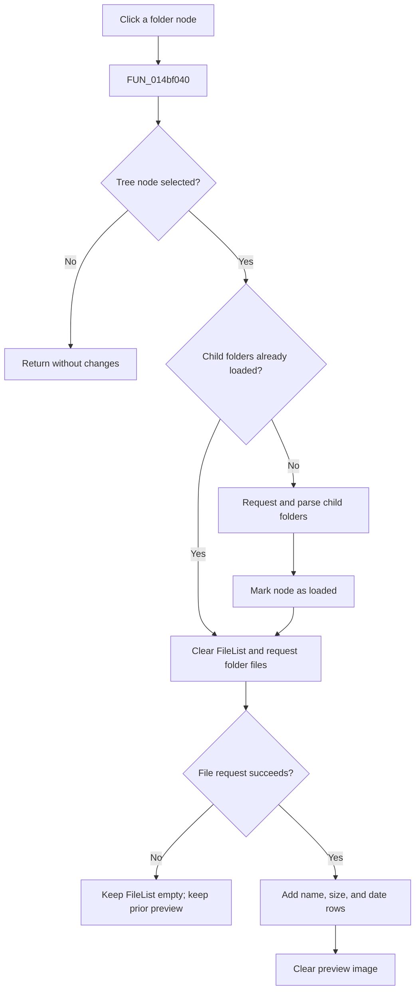

# FolderTree

> Analysis status: Evidence-backed source review complete.

## Control

| Property | Recovered value |
| --- | --- |
| Form | OpenWindow |
| Component path | OpenWindow.LeftPanel.FolderTree |
| Control class | TTreeView |
| Caption | Not present in the recovered resource. |
| Hint | Not present in the recovered resource. |
| Text | Not present in the recovered resource. |
| Handler name | FolderTreeClick |
| Handler address | 014bf040 |
| Graph node | `resource:dfm:OpenWindow/OpenWindow.LeftPanel.FolderTree` |
| Handler node | `function:014bf040` |
| Graph layer | UI |

## What happens when clicked

`FUN_014bf040` reads the selected tree node. If no node is selected, it returns without changing the folder tree, file list, or preview.

Each node data object has a load flag at `+0x30` and a folder path at `+0x10`. When the flag is clear, `FUN_014bdf00` requests `getUserFolders&parent=<path>&format=xml`, parses the returned folder records, and adds child nodes. The handler then sets the flag even if that request failed, so a later click does not retry this child-folder load through the same branch.

The handler always calls `FUN_014be5c0` for the selected folder path. That routine clears the FileList, requests `getFolderFiles&folder=<path>&format=xml`, and, on success, adds rows with the recovered `name`, `size`, and `date` fields and clears the preview image. If the file request fails, the file list remains empty and the prior preview is not cleared. The handler has no local message or rollback branch.

## Click flow

## Handler evidence

- Source: [DecompiledSources/Tina16/functions/00000000014BF040__FUN_014bf040.c](../../../DecompiledSources/Tina16/functions/00000000014BF040__FUN_014bf040.c)
- Recovered role: Lazily expand the selected remote folder and load its file rows.
- Current graph summary: Handles 1 Delphi UI event: OpenWindow.LeftPanel.FolderTree.OnClick.
- Current graph behavior: Uses the selected tree node path to load child folders once and to replace the file list with the selected folder's remote file records.
- Current graph evidence: The handler reads the selected node through `FUN_006e2530`, tests node-data flag `+0x30`, passes path `+0x10` to the two loaders, and sets the flag. The callees contain the `getUserFolders` and `getFolderFiles` requests and parse `folder` or `file` XML records.
- Complexity: complex
- Distinct outgoing calls: 3

## Direct calls

- `function:006e2530` — returns the currently selected tree node, or zero when no valid selection exists.
- `function:014bdf00` — requests and inserts child folders for one remote folder path.
- `function:014be5c0` — clears and reloads the file list for one remote folder path.

## Resource evidence

- Kind: Not present in the recovered resource.
- Modal result: Not present in the recovered resource.
- Checked state: Not present in the recovered resource.
- List items: Not present in the recovered resource.
- Image reference: Not present in the recovered resource.
- Extracted glyph: None.

## Nearby label candidates

Nearby labels are layout candidates only. They are not proof of behavior.

- Rank 1: Folder: at distance 18.

## Analysis limits

- The server request helper can process server errors internally; its exact user-facing error text is not recovered here.
- The handler marks child folders as loaded without checking the folder-request result. This can suppress a retry after failure.
- The nearby **Folder:** label confirms layout only. The selected-node and request data flow establish the behavior.
