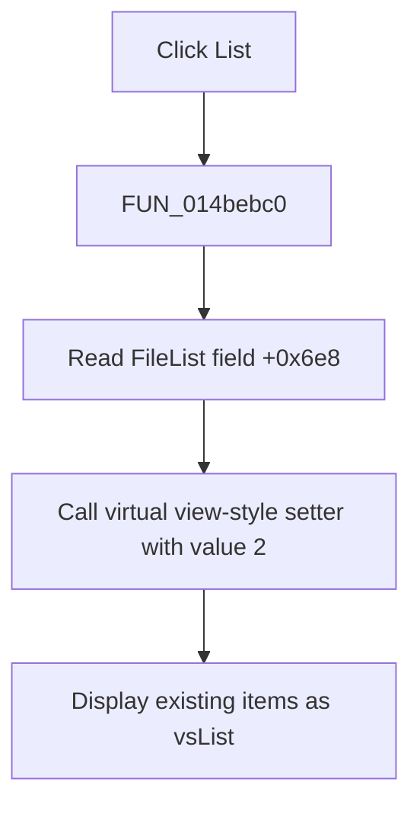

# List

> Analysis status: Evidence-backed source review complete.

## Control

| Property | Recovered value |
| --- | --- |
| Form | OpenWindow |
| Component path | OpenWindow.ListPopupMnu.ListMnu |
| Control class | TMenuItem |
| Caption | List |
| Hint | Not present in the recovered resource. |
| Text | Not present in the recovered resource. |
| Handler name | ListMnuClick |
| Handler address | 014bebc0 |
| Graph node | `resource:dfm:OpenWindow/OpenWindow.ListPopupMnu.ListMnu` |
| Handler node | `function:014bebc0` |
| Graph layer | UI |

## What happens when clicked

`FUN_014bebc0` calls a virtual setter on the FileList object at form field `+0x6e8` with value `2`. In Delphi VCL `TViewStyle`, value `2` is `vsList`. The command therefore changes the existing file-list presentation to list view.

The handler has no separate operation that clears or repopulates the item collection, changes the current folder, or refreshes the preview. It does not test `Sender` or compare the current style. It has no local error or rollback branch. The recovered graph has no direct call edge because the setter is an indirect VMT call.

## Click flow

## Handler evidence

- Source: [DecompiledSources/Tina16/functions/00000000014BEBC0__FUN_014bebc0.c](../../../DecompiledSources/Tina16/functions/00000000014BEBC0__FUN_014bebc0.c)
- Recovered role: Switch the OpenWindow FileList to Delphi `vsList` presentation.
- Current graph summary: Handles 1 Delphi UI event: OpenWindow.ListPopupMnu.ListMnu.OnClick.
- Current graph behavior: Invokes the FileList view-style setter with `TViewStyle` ordinal `2` and performs no item-model mutation.
- Current graph evidence: The handler reads form field `+0x6e8`, which FormCreate uses as the TListView when it creates Name, Size, and Date columns, and makes one indirect VMT call with value `2`; the paired Report command passes value `3`.
- Complexity: simple
- Distinct outgoing calls: 0

## Direct calls

- No direct call edge is present because the recovered operation is an indirect TListView VMT call at slot `+0x330`.

## Resource evidence

- Kind: Not present in the recovered resource.
- Modal result: Not present in the recovered resource.
- Checked state: Not present in the recovered resource.
- List items: Not present in the recovered resource.
- Image reference: Not present in the recovered resource.
- Extracted glyph: None.

## Nearby label candidates

Nearby labels are layout candidates only. They are not proof of behavior.

- No same-parent label candidate is available.

## Analysis limits

- The setter's recovered Delphi symbol is not available. The standard `TViewStyle` ordinal and the paired values establish the list/report mapping.
- The handler does not expose whether VCL repaints immediately or posts a native list-view message internally.
