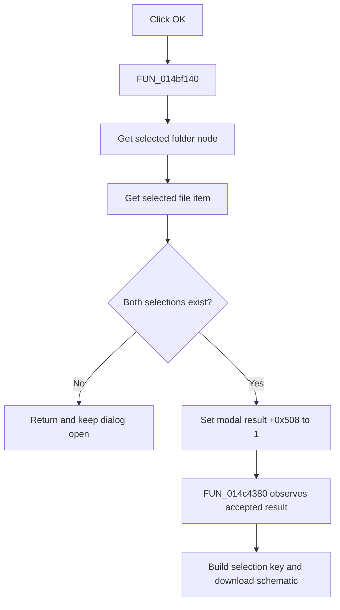

# OK

> Analysis status: Evidence-backed source review complete.

## Control

| Property | Recovered value |
| --- | --- |
| Form | OpenWindow |
| Component path | OpenWindow.RightPanel.ButtonPanel.OKBtn |
| Control class | TBitBtn |
| Caption | OK |
| Hint | Not present in the recovered resource. |
| Text | Not present in the recovered resource. |
| Handler name | OKBtnClick |
| Handler address | 014bf140 |
| Graph node | `resource:dfm:OpenWindow/OpenWindow.RightPanel.ButtonPanel.OKBtn` |
| Handler node | `function:014bf140` |
| Graph layer | UI |

## What happens when clicked

`FUN_014bf140` obtains the selected FolderTree node and the selected FileList item. Only when both exist does it set the form modal-result field at `+0x508` to `1`, the value used for successful modal acceptance. If either selection is missing, the dialog remains open and the handler gives no message.

The downstream caller `FUN_014c4380` proves how this state is consumed. It creates OpenWindow, loads the root folders, shows the form modally, and continues only when the modal result is `1`. It then builds the selected folder-and-file key, constructs a `tina4web.dll/schematic?tsc=` request, downloads the selected schematic, and returns its helper-managed local path. The click itself does not perform the download.

The recovered default-button property and two-frame check-mark glyph support the confirmation role. The selection guards and modal-result consumer establish the implementation.

## Click flow

## Handler evidence

- Source: [DecompiledSources/Tina16/functions/00000000014BF140__FUN_014bf140.c](../../../DecompiledSources/Tina16/functions/00000000014BF140__FUN_014bf140.c)
- Recovered role: Accept OpenWindow only when a folder and file are selected.
- Current graph summary: Handles 1 Delphi UI event: OpenWindow.RightPanel.ButtonPanel.OKBtn.OnClick.
- Current graph behavior: Validates both UI selections and sets modal result `1`; the caller then downloads the selected remote schematic.
- Current graph evidence: `FUN_006e2530` and `FUN_006f6fe0` return the selected tree and list items. The handler writes `1` only when both are nonzero. `FUN_014c4380` tests the modal return for `1`, calls the same selection-key helper, and forms the `tina4web.dll/schematic?tsc=` download request.
- Complexity: moderate
- Distinct outgoing calls: 2

## Direct calls

- `function:006e2530` — returns the selected FolderTree node, or zero when none is valid.
- `function:006f6fe0` — returns the selected FileList item through the list-view selection query path.

## Resource evidence

- Kind: Not present in the recovered resource.
- Modal result: Not present in the recovered resource.
- Checked state: Not present in the recovered resource.
- List items: Not present in the recovered resource.
- Image reference: Not present in the recovered resource.
- Extracted glyph: [`0293_OpenWindow_OpenWindow_RightPanel_ButtonPanel_OKBtn_Glyph_Data.png`](../../../glyph/0293_OpenWindow_OpenWindow_RightPanel_ButtonPanel_OKBtn_Glyph_Data.png)

## Nearby label candidates

Nearby labels are layout candidates only. They are not proof of behavior.

- No same-parent label candidate is available.

## Analysis limits

- The click handler does not validate the later schematic download or display a selection error.
- The helper-managed destination directory and the server error presentation are not recovered in this article.
- The caption, default state, and glyph support intent only; the guards, modal field, and downstream result check prove the behavior.
