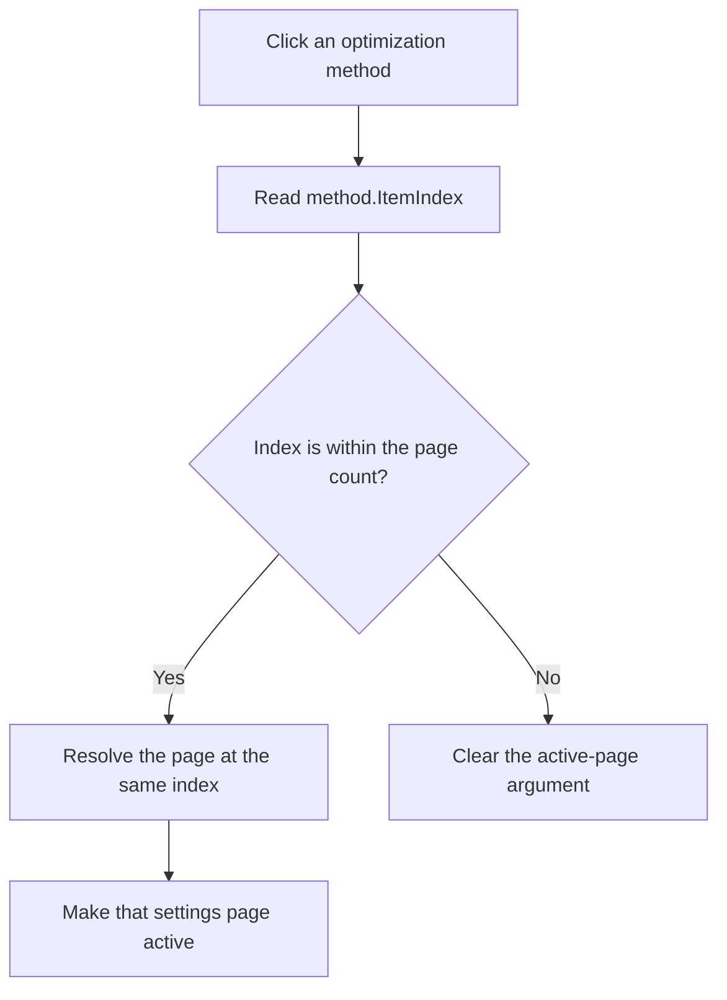

# Select the optimization method settings page

> Analysis status: Source and call path reviewed.

## Control

| Property | Recovered value |
| --- | --- |
| Form | Opt_DC |
| Component path | Opt_DC.Panel1.method |
| Control class | TRadioGroup |
| Caption | Optimization method |
| Items | Simple Search; Pattern Search |
| Handler name | methodClick |
| Handler address | 01370f40 |
| Graph node | `resource:dfm:Opt_DC/Opt_DC.Panel1.method` |
| Handler node | `function:01370f40` |
| Graph layer | UI |

## What happens when clicked

The VCL updates the radio group's selected-item index before it sends `OnClick`. The handler reads that index from the `method` control at form offset `+0x6B8`. It passes the index and the form's page control at `+0x768` to `FUN_006d8180`.

`FUN_006d8180` checks the index against the page count. For a valid index, it resolves the page at that index and makes it active. For an invalid negative or out-of-range index, it clears the active-page argument instead.

The DFM page order matches the radio-item order:

| Radio item | Index | Settings page | Recovered controls on that page |
| --- | ---: | --- | --- |
| Simple Search | 0 | `tsSS` | Maximum search-interval subdivision and Linear or Logarithmic parameter scale |
| Pattern Search | 1 | `tsPS` | Search-interval subdivision and the parameter attribute grid |

Thus, the click changes which method-specific settings page is active. It does not save a method value to the optimization model. The OK handler performs that later commit.

The handler has no local error message, exception recovery, or rollback. A repeated click with the same item requests the same page again.

## Click flow

## Handler evidence

- [Method click handler](../../../DecompiledSources/Tina16/functions/0000000001370F40__FUN_01370f40.c): passes the page control at `+0x768` and `method.ItemIndex` at `+0x6B8 + 0x4A8` to the page-index helper.
- [Page-index selector](../../../DecompiledSources/Tina16/functions/00000000006D8180__FUN_006d8180.c): validates the index, resolves a valid page, and passes the page or null to the active-page setter.
- [Page lookup](../../../DecompiledSources/Tina16/functions/00000000006D7610__FUN_006d7610.c): gets the indexed page from the page collection.
- [Page count](../../../DecompiledSources/Tina16/functions/00000000006D7630__FUN_006d7630.c): returns the current page count.
- [Active-page setter](../../../DecompiledSources/Tina16/functions/00000000006D78A0__FUN_006d78a0.c): applies the resolved page and uses index `-1` for a null page.
- [Form-create handler](../../../DecompiledSources/Tina16/functions/00000000013700C0__FUN_013700c0.c): initializes `method` to index `0` and loads both method-specific setting groups from the model.
- [OK handler](../../../DecompiledSources/Tina16/functions/0000000001370A40__FUN_01370a40.c): later reads `method.ItemIndex`, commits it to the model, and applies the Pattern Search-specific parameter update when the index is `1`.

## Direct calls

- `function:006d8180` — validates the radio index and selects the page at the same index.

## Resource evidence

- Caption: `Optimization method`.
- Items: `Simple Search`, `Pattern Search`.
- The `Notebook` page control contains `tsSS` followed by `tsPS`.
- `tsSS` contains `SS_SubDiv` and `ParamScaleRG`.
- `tsPS` contains `PS_SubDiv` and `AttributeGrid1`.
- Image reference: Not present in the recovered resource.
- Extracted glyph: None.
- UI evidence: [Recovered DFM resource data](../../../DecompiledSources/Tina16/resources/dfm/ui-evidence.json).

## Analysis limits

- The page mapping follows the recovered page collection and DFM order. The handler does not inspect a page name.
- The invalid-index path is recovered, but the normal radio group offers only indices `0` and `1`.
- The click changes UI page state only. The source does not show a model write, file write, or analysis start in this handler.
