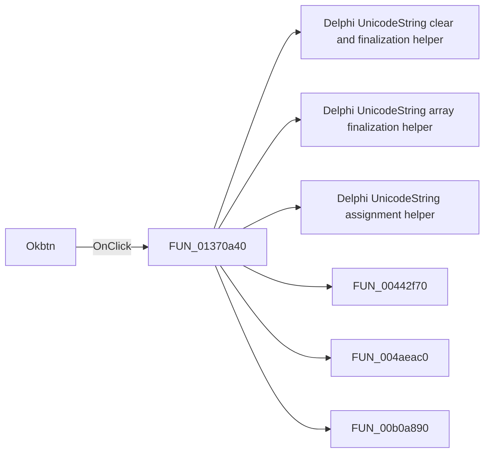

# Okbtn

> Analysis status: Pending individual source review.

## Control

| Property | Recovered value |
| --- | --- |
| Form | Opt_DC |
| Component path | Opt_DC.Panel2.Okbtn |
| Control class | TBitBtn |
| Caption | Not present in the recovered resource. |
| Hint | Not present in the recovered resource. |
| Text | Not present in the recovered resource. |
| Handler name | OkbtnClick |
| Handler address | 01370a40 |
| Graph node | `resource:dfm:Opt_DC/Opt_DC.Panel2.Okbtn` |
| Handler node | `function:01370a40` |
| Graph layer | UI |

## What happens when clicked

Pending individual analysis. An agent must read the recovered handler source and its relevant callees before it replaces this text.

## Click flow

## Handler evidence

- Source: [DecompiledSources/Tina16/functions/0000000001370A40__FUN_01370a40.c](../../../DecompiledSources/Tina16/functions/0000000001370A40__FUN_01370a40.c)
- Recovered role: Not present in the recovered resource.
- Current graph summary: Handles 1 Delphi UI event: Opt_DC.Panel2.Okbtn.OnClick.
- Current graph behavior: Not present in the recovered resource.
- Current graph evidence: Not present in the recovered resource.
- Complexity: complex
- Distinct outgoing calls: 14

## Direct calls

- `function:00414480` — Delphi UnicodeString clear and finalization helper
- `function:00414560` — Delphi UnicodeString array finalization helper
- `function:00414ad0` — Delphi UnicodeString assignment helper
- `function:00442f70` — FUN_00442f70
- `function:004aeac0` — FUN_004aeac0
- `function:00b0a890` — FUN_00b0a890
- `function:00b89270` — FUN_00b89270
- `function:00b8e520` — FUN_00b8e520
- `function:00b90090` — FUN_00b90090
- `function:00de8980` — FUN_00de8980
- `function:00f04d50` — FUN_00f04d50
- `function:012b2e80` — FUN_012b2e80
- `function:01370060` — FUN_01370060
- `function:01b05080` — FUN_01b05080

## Resource evidence

- Kind: bkOK
- Modal result: Not present in the recovered resource.
- Checked state: Not present in the recovered resource.
- List items: Not present in the recovered resource.
- Image reference: Not present in the recovered resource.
- Extracted glyph: None.

## Nearby label candidates

Nearby labels are layout candidates only. They are not proof of behavior.

- No same-parent label candidate is available.

## Analysis limits

- Do not infer behavior from the control class, caption, hint, glyph, or nearby label alone.
- Do not replace the pending status until the handler source and relevant call path provide enough evidence.
