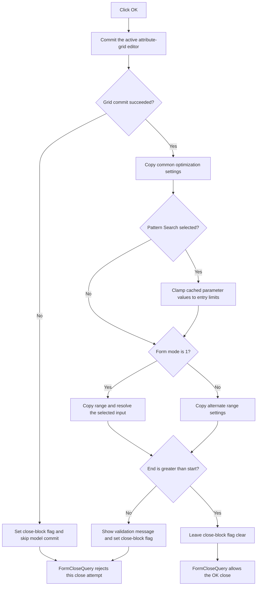

# Validate and save DC optimization settings

> Analysis status: Source and call path reviewed.

## Control

| Property | Recovered value |
| --- | --- |
| Form | Opt_DC |
| Component path | Opt_DC.Panel2.Okbtn |
| Control class | TBitBtn |
| Kind | bkOK |
| Caption | Not present in the recovered resource. |
| Handler name | OkbtnClick |
| Handler address | 01370a40 |
| Graph node | `resource:dfm:Opt_DC/Opt_DC.Panel2.Okbtn` |
| Handler node | `function:01370a40` |
| Graph layer | UI |

## What happens when clicked

The OK handler validates the active attribute-grid editor and then copies the dialog's optimization settings into its model object at form offset `+0x7B8`. It uses form byte `+0x7B1` as the close-block and validation-error flag.

First, it asks `FUN_00b0a890` to commit the active editor in `AttributeGrid1`. A zero result means that there is no active editor or that the editor commit succeeded. A nonzero result is stored in `+0x7B1`; the handler then skips every model assignment below.

When the grid gate succeeds, the handler commits these common settings:

- the selected optimization method;
- maximum iteration count;
- relative error;
- Simple Search maximum subdivision count;
- Pattern Search subdivision count; and
- the Simple Search Linear or Logarithmic parameter-scale index.

When `method.ItemIndex` is `1`, which is Pattern Search, it also walks the optimization-parameter collection. For each entry, it clamps the cached parameter value to the entry's recovered lower and upper limits and writes the result back to that entry.

## Mode-specific settings

The form constructor stores a caller-supplied mode byte at `+0x7B0`. Its exact Delphi field name is not recovered.

For mode `1`, the handler copies the point count, start value, and end value to model offsets `+0x838`, `+0x83A`, and `+0x842`. It also copies the selected input name, resolves that input in the model, and derives the associated input state. If the name cannot be resolved, it raises a localized application error with resource ID `0x1582`.

For the other recovered mode, it copies the point count, start value, and end value to model offsets `+0x870`, `+0x872`, and `+0x87A`. This branch also evaluates the recovered `-100` and `500` bounds. The recovered body does not show a separate message or state change for an isolated bounds failure.

Both branches report localized validation resource `0x134` when the end value is not greater than the start value. The error wrapper displays only the first validation message while `+0x7B1` is clear and then sets that flag.

## Close behavior and partial updates

The form's `OnCloseQuery` handler allows the close only when byte `+0x7B1` is clear. It then clears the byte for a later attempt. Therefore, a grid error or range error prevents this OK close attempt. The `bkOK` resource kind requests the normal OK close, but the click handler itself has no direct close call.

Numeric editor getters can raise their own validation exceptions. The selected-input failure also raises an application exception. The OK handler has no local exception handler or transaction. Because it writes fields in sequence, an exception after an earlier write can leave a partial model update. The close-query flag covers the recovered grid and range-error paths; the source does not prove rollback for other exceptions.

## Click flow

## Handler evidence

- [OK click handler](../../../DecompiledSources/Tina16/functions/0000000001370A40__FUN_01370a40.c): contains the grid gate, method branch, parameter clamping, model assignments, range comparisons, selected-input resolution, and error paths.
- [Form-create handler](../../../DecompiledSources/Tina16/functions/00000000013700C0__FUN_013700c0.c): performs the inverse load from the same model offsets and establishes the control-to-field mapping.
- [Form close-query handler](../../../DecompiledSources/Tina16/functions/0000000001370FB0__FUN_01370fb0.c): accepts the close only when byte `+0x7B1` is zero and clears the byte after the test.
- [Grid commit gate](../../../DecompiledSources/Tina16/functions/0000000000B0A890__FUN_00b0a890.c): returns zero without an active editor or forwards the editor validation and commit result.
- [Grid editor commit](../../../DecompiledSources/Tina16/functions/0000000000B0A150__FUN_00b0a150.c): validates the cell and returns zero after it commits the editor value and change state.
- [Integer editor reader](../../../DecompiledSources/Tina16/functions/0000000000F04D50__FUN_00f04d50.c) and [floating editor reader](../../../DecompiledSources/Tina16/functions/0000000000B90090__FUN_00b90090.c): parse editor text and enforce their configured editor validation rules.
- [Parameter collection lookup](../../../DecompiledSources/Tina16/functions/00000000004AEAC0__FUN_004aeac0.c): returns each indexed optimization-parameter entry.
- [Selected-input resolver](../../../DecompiledSources/Tina16/functions/00000000012B2E80__FUN_012b2e80.c): finds the named input object and stores the derived input metadata in the optimization model.
- [Range-error wrapper](../../../DecompiledSources/Tina16/functions/0000000001370060__FUN_01370060.c) and [first-error reporter](../../../DecompiledSources/Tina16/functions/0000000001B1CF30__FUN_01b1cf30.c): show the localized validation message once and set byte `+0x7B1`.
- [Localized selected-input error](../../../DecompiledSources/Tina16/functions/0000000001B05080__FUN_01b05080.c): constructs and raises the application error used when the selected input cannot be resolved.

## Direct calls

The application-relevant direct calls are:

- `function:00b0a890` — validates and commits the active attribute-grid editor.
- `function:004aeac0` — gets indexed optimization-parameter records.
- `function:00b90090` — reads and validates floating editor values.
- `function:00f04d50` — reads and validates integer editor values.
- `function:012b2e80` — resolves the selected input in the model.
- `function:01370060` — reports an ordered-range error and sets the close-block flag.
- `function:01b05080` — raises the localized selected-input error.

The remaining direct calls provide Delphi string lifetime, localization, and formatting support.

## Resource evidence

- Kind: `bkOK`.
- Modal result: Not present in the recovered resource.
- Default state: Not present in the recovered resource.
- Image reference: Not present in the recovered resource.
- Extracted glyph: None.
- UI evidence: [Recovered DFM resource data](../../../DecompiledSources/Tina16/resources/dfm/ui-evidence.json).

## Analysis limits

- The constructor mode byte at `+0x7B0` selects two different model layouts, but its Delphi field name and the business names of the two modes are not recovered.
- The exact localized text for resources `0x134` and `0x1582` is not present in the UI evidence.
- The non-mode-1 branch evaluates `-100` and `500` bounds, but the recovered body has no distinct action for a bounds-only failure. This article does not invent one.
- The built-in `bkOK` kind supports the close intent. The source-backed close veto comes from `FormCloseQuery` and byte `+0x7B1`.
