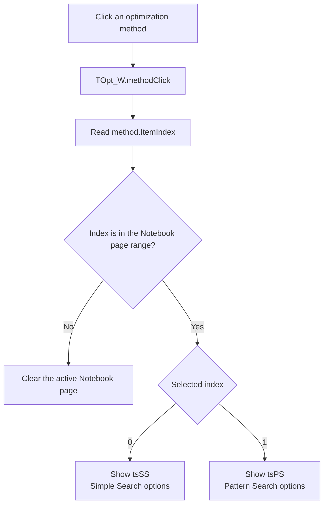

# Select the optimization method page

> Analysis status: Reviewed from the recovered click handler, page-control helper, form lifecycle handlers, and form resource.

## Control

| Property | Recovered value |
| --- | --- |
| Form | Opt_W |
| Form caption | Optimization settings |
| Component path | Opt_W.Panel1.method |
| Control class | TRadioGroup |
| Caption | Optimization method |
| Items | Simple Search; Pattern Search |
| Handler name | methodClick |
| Handler address | 0136f110 |
| Graph node | `resource:dfm:Opt_W/Opt_W.Panel1.method` |
| Handler node | `function:0136f110` |
| Graph layer | UI |

## What happens when clicked

`TOpt_W.methodClick` reads the radio group's zero-based `ItemIndex`. It passes that index to the page-control selection helper for `Notebook`.

The page order and the radio-item order match:

- index `0`, **Simple Search**, selects the first page, `tsSS`;
- index `1`, **Pattern Search**, selects the second page, `tsPS`.

The Simple Search page contains its maximum interval subdivision and Linear or Logarithmic sweep controls. The Pattern Search page contains its interval subdivision and parameter attribute grid.

This click changes only the active options page. It does not copy the selected method or any edit value to the optimization model. The OK handler performs that transfer later.

## Click flow

## Handler and page-selection evidence

- [FUN_0136f110](../../../DecompiledSources/Tina16/functions/000000000136F110__FUN_0136f110.c) reads `method.ItemIndex` from the radio group at form field `+0x6b8` and passes it with the page control at `+0x758` to `FUN_006d8180`.
- [FUN_006d8180](../../../DecompiledSources/Tina16/functions/00000000006D8180__FUN_006d8180.c) checks the requested index against the page count. It selects the page at a valid index and supplies a null page for a negative or out-of-range index.
- [FUN_006d78a0](../../../DecompiledSources/Tina16/functions/00000000006D78A0__FUN_006d78a0.c) applies the selected page to the page control.
- [FUN_0136eb70](../../../DecompiledSources/Tina16/functions/000000000136EB70__FUN_0136eb70.c) initializes the method radio group to index `0` when the form is created.
- [FUN_0136ee20](../../../DecompiledSources/Tina16/functions/000000000136EE20__FUN_0136ee20.c) later stores the same selected index in the working optimization model when the user clicks OK.

## Resource evidence

- The radio group contains `Simple Search` followed by `Pattern Search`.
- The page control contains `tsSS` followed by `tsPS` in the recovered component order.
- `tsSS` contains `SS_SubDiv` and `ParamScaleRG`, whose items are `Linear` and `Logarithmic`.
- `tsPS` contains `PS_SubDiv` and `AttributeGrid1`.
- The control has no caption-independent hint, image reference, or extracted glyph.

## State and no-op behavior

- A valid click immediately changes the visible Notebook page.
- A negative or out-of-range item index clears the active page through the same helper. Normal user selection supplies only indexes `0` and `1`.
- The handler has no error message, model write, calculation, or optimization start path.

## Analysis limits

- The recovered source identifies the tabs by their component order and fields. It does not contain user-facing tab captions.
- This handler controls presentation only. The method's effect on optimization is outside this click path.
