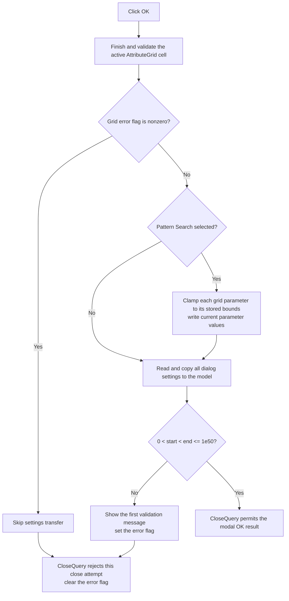

# Validate and apply optimization settings

> Analysis status: Reviewed from the recovered click handler, grid commit path, numeric edit readers, shared validation reporter, close-query handler, form initialization, and form resource.

## Control

| Property | Recovered value |
| --- | --- |
| Form | Opt_W |
| Form caption | Optimization settings |
| Component path | Opt_W.Panel2.Okbtn |
| Control class | TBitBtn |
| Button kind | bkOK |
| Handler name | OkbtnClick |
| Handler address | 0136ee20 |
| Graph node | `resource:dfm:Opt_W/Opt_W.Panel2.Okbtn` |
| Handler node | `function:0136ee20` |
| Graph layer | UI |

## What happens when clicked

`TOpt_W.OkbtnClick` first asks `AttributeGrid1` to finish and validate its active cell editor. It stores the returned error flag in form field `+0x7a1`. A nonzero result stops all settings transfer.

When the grid result is zero, the handler copies the dialog values to the supplied optimization model at form field `+0x7a8`:

- the selected method, Simple Search or Pattern Search;
- relative error and maximum iteration count;
- the Simple Search and Pattern Search subdivision counts;
- the Simple Search sweep type, Linear or Logarithmic;
- the number of frequency points;
- the start and end frequencies.

The integer and floating-point edit getters parse the current text and enforce each edit's configured bounds before they return a value.

## Pattern Search parameter values

When the selected method index is `1`, Pattern Search, the handler processes each model parameter shown in `AttributeGrid1`. It clamps the edited per-parameter value to the lower and upper bounds in that parameter record. It then stores the clamped value as the parameter's current optimization value.

This loop does not run for method index `0`, Simple Search. Both methods still save the method, general settings, subdivision values, sweep type, and frequency range.

## Frequency validation and close behavior

After it writes the edit values to the model, the handler checks the frequency range. The range is valid only when:

- start frequency is greater than zero;
- end frequency is greater than start frequency;
- end frequency is no greater than `1e50`.

For an invalid range, it loads localized string `0x134` and calls the form's shared error reporter. The reporter shows the message only if no earlier error is active, then sets error flag `+0x7a1`.

The button's `bkOK` kind supplies the normal modal OK action. `TOpt_W.FormCloseQuery` allows the form to close only while the error flag is zero. It then clears the flag for the next attempt. Therefore, a grid error or invalid frequency range keeps the dialog open. A valid transfer lets the modal dialog return its OK result.

## Click flow

## Handler and validation evidence

- [FUN_0136ee20](../../../DecompiledSources/Tina16/functions/000000000136EE20__FUN_0136ee20.c) contains the grid gate, Pattern Search clamp loop, model writes, frequency validation, and call to the shared error reporter.
- [FUN_00b0a890](../../../DecompiledSources/Tina16/functions/0000000000B0A890__FUN_00b0a890.c) obtains the active grid editor and calls the cell commit path when an editor exists.
- [FUN_00b0a150](../../../DecompiledSources/Tina16/functions/0000000000B0A150__FUN_00b0a150.c) returns a nonzero flag when the active cell cannot be committed. A successful commit updates the grid's stored cell data and dirty state.
- [FUN_00b90090](../../../DecompiledSources/Tina16/functions/0000000000B90090__FUN_00b90090.c) parses and validates a floating-point edit value.
- [FUN_00f04d50](../../../DecompiledSources/Tina16/functions/0000000000F04D50__FUN_00f04d50.c) parses and validates an integer edit value.
- [FUN_0136eb10](../../../DecompiledSources/Tina16/functions/000000000136EB10__FUN_0136eb10.c) passes a validation message to the one-message reporter with the form error flag.
- [FUN_01b1cf30](../../../DecompiledSources/Tina16/functions/0000000001B1CF30__FUN_01b1cf30.c) shows the message only when the flag is clear and then sets the flag.
- [FUN_0136f180](../../../DecompiledSources/Tina16/functions/000000000136F180__FUN_0136f180.c) is the form's close-query handler. It rejects closing when the flag is set and clears the flag afterward.
- [FUN_0136eb70](../../../DecompiledSources/Tina16/functions/000000000136EB70__FUN_0136eb70.c) initializes the grid and dialog edits from the same optimization model.

## Resource evidence

- The form caption is `Optimization settings`.
- `method` supplies the `Simple Search` and `Pattern Search` selections.
- The `Settings` group labels `Max.It.Num.` and `Rel. Error`.
- The Simple Search page supplies `Max. search interval subdivison` and the `Linear` or `Logarithmic` sweep choices.
- The Pattern Search page supplies `Search interval subdivison` and `AttributeGrid1`.
- The frequency panel labels `Start frequency`, `End frequency`, `Points`, and `[Hz]`.
- `Okbtn` has `Kind = bkOK`. It has no separate caption, hint, image reference, or extracted glyph in the resource evidence.

## State, error, and no-op behavior

- A grid commit error stops the handler before it changes the optimization model.
- An invalid frequency range is detected after the handler has copied values to the model. The source has no rollback, so the model changes remain while the dialog stays open.
- Pattern Search parameter values are also clamped and written before the final frequency check. Those writes are not rolled back after an invalid range.
- Numeric edit readers have exception paths for invalid text, configured-range failure, and failed validation callbacks. The OK handler has no local catch or rollback for those exceptions.
- The reporter suppresses later validation messages during the same close attempt after the first message sets the error flag.
- The handler applies settings only. It does not start the optimization calculation.

## Analysis limits

- The recovered model has no Delphi field names. The resource controls and the paired form-initialization writes establish the setting meanings used here.
- The localized text for string `0x134` is not recovered as plain text in this path. Its call site proves that it reports the invalid frequency range.
- The later optimization engine behavior is outside this click handler.
