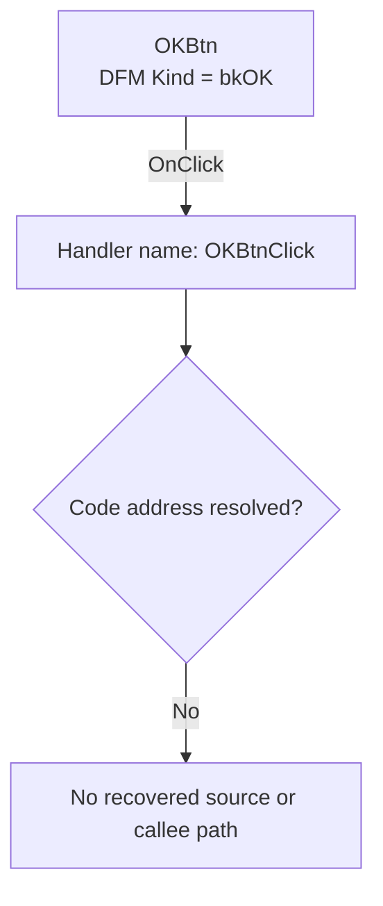

# OKBtn

> Analysis status: Blocked by an unresolved event-handler address.

## Control

| Property | Recovered value |
| --- | --- |
| Form | PageSetupDlg |
| Component path | PageSetupDlg.OKBtn |
| Control class | TBitBtn |
| Caption | Not present in the recovered resource. |
| Hint | Not present in the recovered resource. |
| Text | Not present in the recovered resource. |
| Handler name | OKBtnClick |
| Handler address | Not present in the recovered resource. |
| Graph node | `resource:dfm:PageSetupDlg/PageSetupDlg.OKBtn` |
| Handler node | `concept:dfm-handler:TPageSetupDlg/OKBtnClick` |
| Graph layer | tina.exe |

## What happens when clicked

The recovered DFM stream binds `PageSetupDlg.OKBtn.OnClick` to the method name
`OKBtnClick`. The checked-in extractor could not resolve a code address from
the event binding or from the `TPageSetupDlg` published-method table. The
graph therefore contains an unresolved handler concept, not a recovered
function.

The `bkOK` resource property identifies the control as the dialog's OK button.
It does not prove what `OKBtnClick` does. No recovered evidence shows whether
the handler validates the page values, copies them to another object, sets a
modal result, closes the dialog, reports an error, or returns without a state
change.

## Click flow

## Handler evidence

- Source: [DecompiledSources/Tina16/resources/dfm/ui-evidence.json](../../../DecompiledSources/Tina16/resources/dfm/ui-evidence.json)
- Extractor: [analysis/undelphi/TiaraUiEvidence.rs](../../../analysis/undelphi/TiaraUiEvidence.rs)
- Recovered role: Unknown because no handler function was resolved.
- Current graph summary: Unresolved Delphi event handler TPageSetupDlg.OKBtnClick, referenced by 1 UI event.
- Current graph behavior: Unknown.
- Current graph evidence: The trigger edge preserves the DFM method name, but its handler address is null.
- Complexity: simple
- Distinct outgoing calls: None. The handler node is an unresolved concept.

## Direct calls

- No direct call edge is present. A call tree cannot start without a recovered
  handler address.

## Resource evidence

- Kind: bkOK
- Modal result: Not present in the recovered resource.
- Checked state: Not present in the recovered resource.
- List items: Not present in the recovered resource.
- Image reference: Not present in the recovered resource.
- Extracted glyph: None.

## Nearby label candidates

Nearby labels are layout candidates only. They are not proof of behavior.

- Rank 1: &H&eight: at distance 200.
- Rank 2: &Width: at distance 226.
- Rank 3: Pape&r Size: at distance 278.

## Analysis limits

- The DFM provides the `OKBtnClick` name but no address.
- RTTI and VMT resolution did not find this method for `TPageSetupDlg`.
- The recovered graph has no function node, source file, outgoing call, glyph,
  or function annotation for this binding.
- A later recovery must identify the handler address and inspect its source and
  relevant callees before it can describe application behavior.
