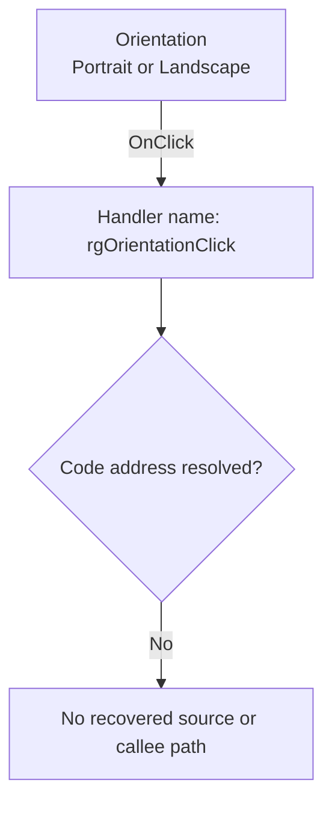

#  Orientation

> Analysis status: Blocked by an unresolved event-handler address.

## Control

| Property | Recovered value |
| --- | --- |
| Form | PageSetupDlg |
| Component path | PageSetupDlg.rgOrientation |
| Control class | TRadioGroup |
| Caption |  Orientation  |
| Hint | Not present in the recovered resource. |
| Text | Not present in the recovered resource. |
| Handler name | rgOrientationClick |
| Handler address | Not present in the recovered resource. |
| Graph node | `resource:dfm:PageSetupDlg/PageSetupDlg.rgOrientation` |
| Handler node | `concept:dfm-handler:TPageSetupDlg/rgOrientationClick` |
| Graph layer | tina.exe |

## What happens when clicked

The recovered DFM stream binds `PageSetupDlg.rgOrientation.OnClick` to the
method name `rgOrientationClick`. The checked-in extractor could not resolve a
code address from the event binding or from the `TPageSetupDlg`
published-method table. The graph therefore contains an unresolved handler
concept, not a recovered function.

The radio group lists `Portrait` and `Landscape`. This text identifies the
selection that the control presents. It does not prove how the missing handler
uses the selection. No recovered evidence shows whether the handler swaps the
width and height fields, changes margins, writes a page-setting object, updates
a preview, reports an error, or returns without another state change.

## Click flow

## Handler evidence

- Source: [DecompiledSources/Tina16/resources/dfm/ui-evidence.json](../../../DecompiledSources/Tina16/resources/dfm/ui-evidence.json)
- Extractor: [analysis/undelphi/TiaraUiEvidence.rs](../../../analysis/undelphi/TiaraUiEvidence.rs)
- Recovered role: Unknown because no handler function was resolved.
- Current graph summary: Unresolved Delphi event handler TPageSetupDlg.rgOrientationClick, referenced by 1 UI event.
- Current graph behavior: Unknown.
- Current graph evidence: The trigger edge preserves the DFM method name, but its handler address is null.
- Complexity: simple
- Distinct outgoing calls: None. The handler node is an unresolved concept.

## Direct calls

- No direct call edge is present. A call tree cannot start without a recovered
  handler address.

## Resource evidence

- Kind: Not present in the recovered resource.
- Modal result: Not present in the recovered resource.
- Checked state: Not present in the recovered resource.
- List items: ("Portra&it", "Lands&cape")
- Image reference: Not present in the recovered resource.
- Extracted glyph: None.

## Nearby label candidates

Nearby labels are layout candidates only. They are not proof of behavior.

- Rank 1: &H&eight: at distance 32.
- Rank 2: &Width: at distance 58.
- Rank 3: Pape&r Size: at distance 106.

## Analysis limits

- The DFM provides the `rgOrientationClick` name but no address.
- RTTI and VMT resolution did not find this method for `TPageSetupDlg`.
- The recovered graph has no function node, source file, outgoing call, glyph,
  or function annotation for this binding.
- A later recovery must identify the handler address and inspect its source and
  relevant callees before it can describe application behavior.
