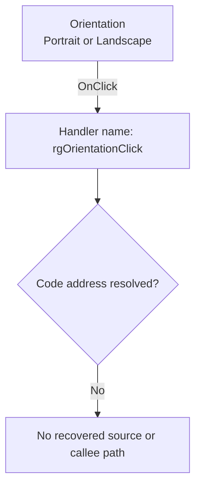

#  Orientation

> Analysis status: Blocked by an unresolved event-handler address.

## Control

| Property | Recovered value |
| --- | --- |
| Form | PageSetupDlg |
| Component path | PageSetupDlg.rgOrientation |
| Control class | TRadioGroup |
| Caption |  Orientation  |
| Hint | Not present in the recovered resource. |
| Text | Not present in the recovered resource. |
| Handler name | rgOrientationClick |
| Handler address | Not present in the recovered resource. |
| Graph node | `resource:dfm:PageSetupDlg/PageSetupDlg.rgOrientation` |
| Handler node | `concept:dfm-handler:TPageSetupDlg/rgOrientationClick` |
| Graph layer | tina.exe |

## What happens when clicked

The recovered DFM stream binds `PageSetupDlg.rgOrientation.OnClick` to the
method name `rgOrientationClick`. The checked-in extractor could not resolve a
code address from the event binding or from the `TPageSetupDlg`
published-method table. The graph therefore contains an unresolved handler
concept, not a recovered function.

The radio group lists `Portrait` and `Landscape`. This text identifies the
selection that the control presents. It does not prove how the missing handler
uses the selection. No recovered evidence shows whether the handler swaps the
width and height fields, changes margins, writes a page-setting object, updates
a preview, reports an error, or returns without another state change.

## Click flow

## Handler evidence

- Source: [DecompiledSources/Tina16/resources/dfm/ui-evidence.json](../../../DecompiledSources/Tina16/resources/dfm/ui-evidence.json)
- Extractor: [analysis/undelphi/TiaraUiEvidence.rs](../../../analysis/undelphi/TiaraUiEvidence.rs)
- Recovered role: Unknown because no handler function was resolved.
- Current graph summary: Unresolved Delphi event handler TPageSetupDlg.rgOrientationClick, referenced by 1 UI event.
- Current graph behavior: Unknown.
- Current graph evidence: The trigger edge preserves the DFM method name, but its handler address is null.
- Complexity: simple
- Distinct outgoing calls: None. The handler node is an unresolved concept.

## Direct calls

- No direct call edge is present. A call tree cannot start without a recovered
  handler address.

## Manual runtime recovery

The rebuilt PE has one `TPageSetupDlg` byte sequence. It starts at raw offset
`0x34DAD85`, directly after the `TPF0` marker at `0x34DAD80`. Thus, this
sequence is the DFM object-class field, not a Delphi VMT class-name record.
The same DFM stream contains `cbPaperSizeChange` at `0x34DB1E1` and
`rgOrientationClick` at `0x34DB280`. Neither name occurs in another location
in the rebuilt PE. The captured runtime image and process dump have the same
single DFM occurrence for each name.

The first code-region `PageSetupDlg` name is a different item. A published
script-method record at raw offset `0x149F6CF` maps that name to
[`FUN_018aaa40`](../../../DecompiledSources/Tina16/functions/00000000018AAA40__FUN_018aaa40.c).
The function creates the class reference at `0189ae80`. The
published-method pointer at `0189ade8` leads to table `0189b6f2`, whose seven
methods are `FormShow`, `FormHide`, `PortraitRBClick`, `SizeCBClick`,
`WidthEChange`, `FormKeyDown`, and `EditorKeyPress`. Its class name is
`TfrxPageSettingsForm`. It is a FastReport page-settings form and is not the
DFM class `TPageSetupDlg`. This check rejects the only address-backed
`PageSetupDlg` name as a false match.

## Resource evidence

- Kind: Not present in the recovered resource.
- Modal result: Not present in the recovered resource.
- Checked state: Not present in the recovered resource.
- List items: ("Portra&it", "Lands&cape")
- Image reference: Not present in the recovered resource.
- Extracted glyph: None.

## Nearby label candidates

Nearby labels are layout candidates only. They are not proof of behavior.

- Rank 1: &H&eight: at distance 32.
- Rank 2: &Width: at distance 58.
- Rank 3: Pape&r Size: at distance 106.

## Analysis limits

- The DFM provides the `rgOrientationClick` name but no address. The rebuilt
  PE, runtime image, and process dump contain no second copy that can belong to
  a published-method table.
- The three runtime artifacts do not contain a separate `TPageSetupDlg` RTTI
  class-name record. They contain the name only in the DFM stream. Therefore,
  the VMT and its published-method table cannot be identified by the proven
  class-name method.
- The address-backed script method named `PageSetupDlg` constructs
  `TfrxPageSettingsForm`, not `TPageSetupDlg`, and cannot supply this event
  address.
- The recovered graph has no function node, source file, outgoing call, glyph,
  or function annotation for this binding.
- A later recovery needs a mapped module or runtime capture that contains the
  `TPageSetupDlg` VMT or another address-backed reference to that exact class.
  It must then map `rgOrientationClick` to executable code before source and
  callee review can start.
