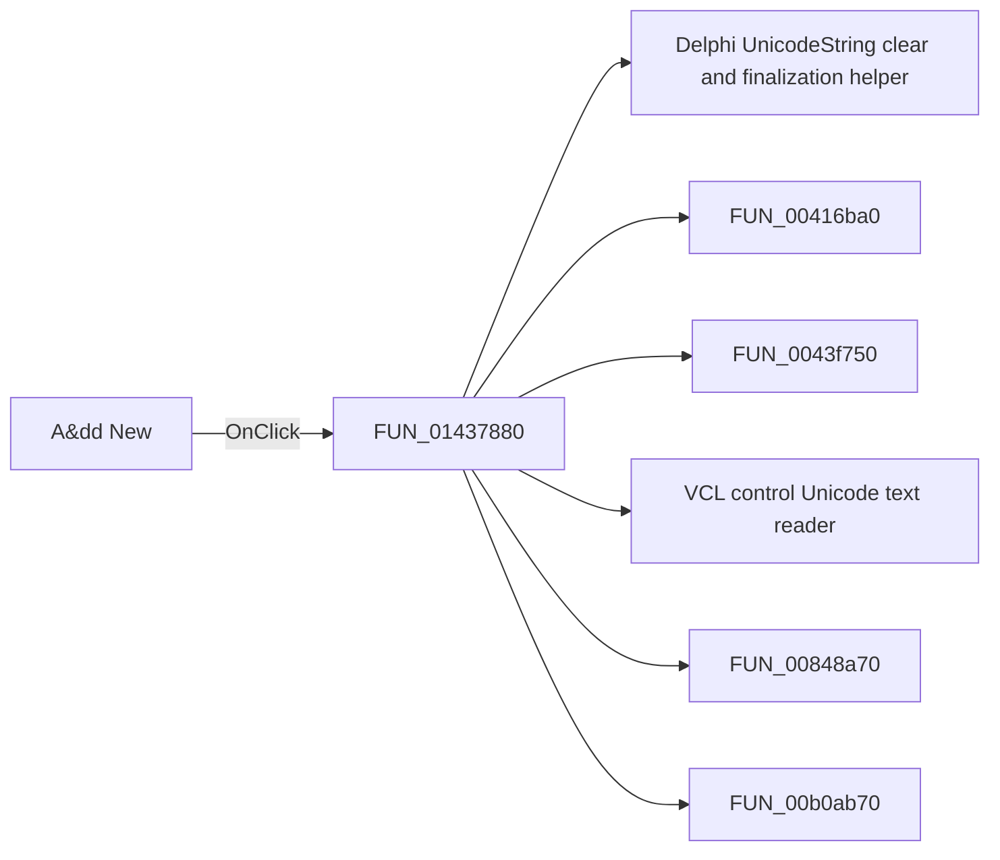

# A&dd New

> Analysis status: Pending individual source review.

## Control

| Property | Recovered value |
| --- | --- |
| Form | ParStepListEditor |
| Component path | ParStepListEditor.AddNew |
| Control class | TBitBtn |
| Caption | A&dd New |
| Hint | Not present in the recovered resource. |
| Text | Not present in the recovered resource. |
| Handler name | AddNewClick |
| Handler address | 01437880 |
| Graph node | `resource:dfm:ParStepListEditor/ParStepListEditor.AddNew` |
| Handler node | `function:01437880` |
| Graph layer | UI |

## What happens when clicked

Pending individual analysis. An agent must read the recovered handler source and its relevant callees before it replaces this text.

## Click flow

## Handler evidence

- Source: [DecompiledSources/Tina16/functions/0000000001437880__FUN_01437880.c](../../../DecompiledSources/Tina16/functions/0000000001437880__FUN_01437880.c)
- Recovered role: Not present in the recovered resource.
- Current graph summary: Handles 1 Delphi UI event: ParStepListEditor.AddNew.OnClick.
- Current graph behavior: Not present in the recovered resource.
- Current graph evidence: Not present in the recovered resource.
- Complexity: complex
- Distinct outgoing calls: 7

## Direct calls

- `function:00414480` — Delphi UnicodeString clear and finalization helper
- `function:00416ba0` — FUN_00416ba0
- `function:0043f750` — FUN_0043f750
- `function:0064dd90` — VCL control Unicode text reader
- `function:00848a70` — FUN_00848a70
- `function:00b0ab70` — FUN_00b0ab70
- `function:014313c0` — FUN_014313c0

## Resource evidence

- Kind: Not present in the recovered resource.
- Modal result: Not present in the recovered resource.
- Checked state: Not present in the recovered resource.
- List items: Not present in the recovered resource.
- Image reference: Not present in the recovered resource.
- Extracted glyph: None.

## Nearby label candidates

Nearby labels are layout candidates only. They are not proof of behavior.

- Rank 1: Parameter # at distance 108.

## Analysis limits

- Do not infer behavior from the control class, caption, hint, glyph, or nearby label alone.
- Do not replace the pending status until the handler source and relevant call path provide enough evidence.
