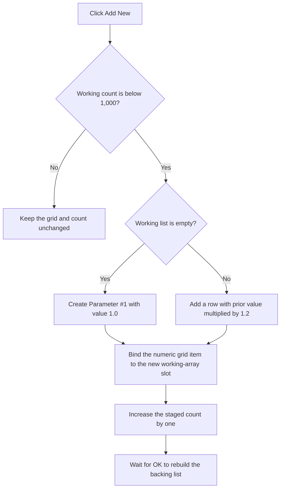

# Add a Step Value

> Analysis status: Recovered handler, form initialization, grid-item binding, limits, and accepted consumer reviewed.

## Control

| Property | Recovered value |
| --- | --- |
| Form | ParStepListEditor |
| Component path | ParStepListEditor.AddNew |
| Control class | TBitBtn |
| Caption | A&dd New |
| Handler name | AddNewClick |
| Handler address | 01437880 |
| Graph node | `resource:dfm:ParStepListEditor/ParStepListEditor.AddNew` |
| Handler node | `function:01437880` |
| Graph layer | UI |

## What happens when clicked

The editor keeps the number of working values in form field `+0x718` and the
values in a fixed global double array that starts at `DAT_0210c580`.
`FormShow` fills this working array before the user can add a row:

- If the supplied list exists and has at least one item, it copies every list
  item and uses the supplied count.
- Otherwise, it creates three values from the supplied start value, their
  midpoint, and the supplied end value.

The Add handler first checks the working count. If it is already 1,000, the
click is a no-op. Otherwise it appends one grid item with the next ordinal
label. The label combines the hidden resource caption `Parameter #` with the
new one-based number.

The initial value depends on the prior count:

- An empty working list gets `1.0` as its first value.
- A nonempty list gets the prior last value multiplied by `1.2`.

The numeric grid item points at the new array slot, so later grid edits change
that working value. The handler then increases the working count. It does not
change the caller's backing list. [OK](okbtn-228c7da9c5.md) performs that copy.

## Click flow

## State, output, and error behavior

- The click changes the working grid, array slot, and count only.
- The hard upper limit is 1,000 working values.
- The first generated value is exactly `1.0`. Later generated values use a
  geometric factor of `1.2` without range or ordering checks.
- The handler does not save a file, run an analysis, or change the source
  stepping configuration immediately.
- At the limit, it returns without a message or other visible state change.
- The handler has no local catch, retry, or allocation-failure branch.

## Handler evidence

- Add handler: [FUN_01437880](../../../DecompiledSources/Tina16/functions/0000000001437880__FUN_01437880.c)
- Working-list initialization: [FUN_014375b0](../../../DecompiledSources/Tina16/functions/00000000014375B0__FUN_014375b0.c)
- Numeric grid-item constructor: [FUN_014313c0](../../../DecompiledSources/Tina16/functions/00000000014313C0__FUN_014313c0.c)
- Accepted list rebuild: [FUN_014377e0](../../../DecompiledSources/Tina16/functions/00000000014377E0__FUN_014377e0.c)
- Generic caller: [FUN_01438880](../../../DecompiledSources/Tina16/functions/0000000001438880__FUN_01438880.c)
- Temperature caller: [FUN_01155460](../../../DecompiledSources/Tina16/functions/0000000001155460__FUN_01155460.c)
- Recovered form evidence: [ui-evidence.json](../../../DecompiledSources/Tina16/resources/dfm/ui-evidence.json)
- Complexity: complex
- Distinct outgoing graph calls: 7

## Resource evidence

- The button caption is `A&dd New`.
- The hidden same-parent label has caption `Parameter #`. The handler reads it
  and appends the ordinal, so this is direct call-path evidence rather than a
  proximity inference.
- `AttributeGrid` is the only list-like editor on the form.
- No hint, action, image reference, or custom glyph is present.

## Analysis limits

- The original Delphi names for the working array and fields `+0x718` and
  `+0x710` are not recovered.
- `FUN_014313c0` binds a numeric attribute to the double slot. The recovered
  code does not expose the original numeric attribute class name.
- The handler assumes that the working count and source list fit the 1,000-item
  array. The source does not contain a separate overrun report for bad input.
