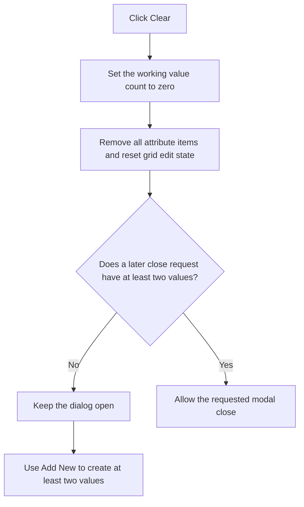

# Clear the Working Step List

> Analysis status: Recovered handler, grid-clear helper, OK consumer, and close guard reviewed.

## Control

| Property | Recovered value |
| --- | --- |
| Form | ParStepListEditor |
| Component path | ParStepListEditor.Clear |
| Control class | TButton |
| Caption | &Clear |
| Handler name | ClearClick |
| Handler address | 01437b20 |
| Graph node | `resource:dfm:ParStepListEditor/ParStepListEditor.Clear` |
| Handler node | `function:01437b20` |
| Graph layer | UI |

## What happens when clicked

The handler sets the working value count at form field `+0x718` to zero. It
then requests zero rows from `AttributeGrid` and calls the attribute-grid clear
helper. The row-count helper clamps the grid's physical row count to at least
one, but the clear helper removes every attached attribute and resets the grid
selection and edit state. The result is an empty working list.

The click does not clear the caller's backing numeric list. It also does not
zero the old double values in the working array; the zero count makes those
stale slots inactive. A later Add click overwrites the first slot with `1.0`.

The form's `OnCloseQuery` permits a close only while the working count is
greater than one. Therefore a Clear click leaves the dialog open until the user
adds at least two values. This guard applies to subsequent OK, Cancel, or window
close attempts.

There is one important ordering effect. If the user clicks OK while the count
is zero, `OKBtnClick` clears or creates the form's backing list before
`OnCloseQuery` rejects the close. The dialog remains visible. If the caller
supplied an existing list, that shared object has already been emptied. For a
null input, the form holds a new empty list that has not been copied back.
Adding two or more values and accepting again rebuilds the active list.

## Click flow

## State, output, and error behavior

- The immediate output is an empty working grid and count zero.
- The Clear handler does not mutate the supplied list, write a file, or change
  the caller's visible step-count control.
- A close request with zero or one value is rejected without an explicit error
  dialog in this handler or the close-query handler.
- The handler has no confirmation prompt, undo record, retry, or local catch.

## Handler evidence

- Clear handler: [FUN_01437b20](../../../DecompiledSources/Tina16/functions/0000000001437B20__FUN_01437b20.c)
- Grid row-count helper: [FUN_00848a70](../../../DecompiledSources/Tina16/functions/0000000000848A70__FUN_00848a70.c)
- Attribute-grid clear helper: [FUN_00b0ae40](../../../DecompiledSources/Tina16/functions/0000000000B0AE40__FUN_00b0ae40.c)
- OK list rebuild: [FUN_014377e0](../../../DecompiledSources/Tina16/functions/00000000014377E0__FUN_014377e0.c)
- Close guard: [FUN_01437bf0](../../../DecompiledSources/Tina16/functions/0000000001437BF0__FUN_01437bf0.c)
- Recovered form evidence: [ui-evidence.json](../../../DecompiledSources/Tina16/resources/dfm/ui-evidence.json)
- Complexity: moderate
- Distinct outgoing graph calls: 2

## Resource evidence

- The button caption is `&Clear`.
- `AttributeGrid` is the form's working list editor.
- The nearby `Parameter #` label is hidden. The handler's grid calls, not the
  label distance, establish the clear behavior.
- No hint, action, image reference, or custom glyph is present.

## Analysis limits

- The original Delphi name of working count field `+0x718` is not recovered.
- The row helper retains one physical grid row when asked for zero. The
  attribute clear makes that retained row empty; it is not a valid step value.
- The close guard reports no reason. The recovered path does not show whether
  another framework layer supplies a sound or visual cue for a rejected close.
