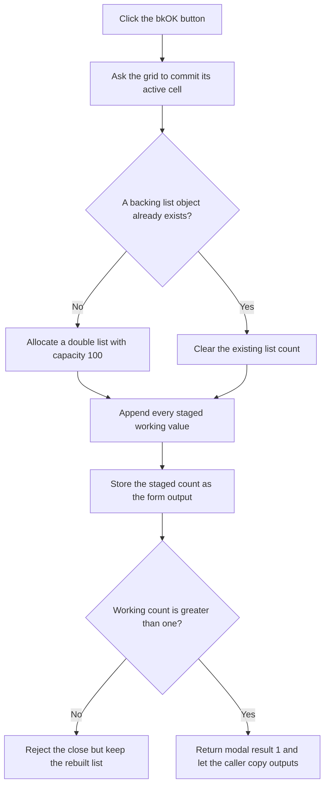

# Apply the Step List

> Analysis status: Recovered handler, active-cell commit, list rebuild, close guard, modal callers, and resource kind reviewed.

## Control

| Property | Recovered value |
| --- | --- |
| Form | ParStepListEditor |
| Component path | ParStepListEditor.OKBtn |
| Control class | TBitBtn |
| Kind | bkOK |
| Handler name | OKBtnClick |
| Handler address | 014377e0 |
| Graph node | `resource:dfm:ParStepListEditor/ParStepListEditor.OKBtn` |
| Handler node | `function:014377e0` |
| Graph layer | UI |

## What happens when clicked

The built-in `bkOK` button starts the VCL accepted-close path. Its application
handler then processes the current working list:

1. It asks `AttributeGrid` to commit the active cell editor. The helper returns
   a status, but this handler does not test it.
2. If the supplied list pointer at form field `+0x710` is null, it allocates a
   new double list with initial capacity 100. Otherwise it clears the existing
   list count and reuses the object.
3. It appends the first `+0x718` doubles from the working array at
   `DAT_0210c580`.
4. It copies that working count to 16-bit output field `+0x708`.

After the click handler returns, `FormCloseQuery` allows the modal close only
when the working count is greater than one. With two or more values, modal
result `1` reaches the caller, which reads the output count and list reference
and then destroys the editor form. Other modal results do not run that caller
copy-back.

With zero or one value, the close is rejected and the dialog stays open. The
list rebuild occurs before this guard. Therefore the form's list already holds
the invalid short working list even though the caller has not received an
accepted result. If the caller supplied an existing list, it shares this
mutation. A newly allocated list remains private to the form until acceptance.
The user must add values before the form can close.

## Click flow

## State, output, and error behavior

- The output is a rebuilt double list and a 16-bit value count.
- The handler does not validate increasing order, bounds, duplicates, or the
  relationship to the supplied start and end values.
- It ignores the active-cell commit status and continues with the current
  working array.
- The close guard rejects fewer than two values but shows no local error text.
- The handler has no rollback, retry, or local exception recovery.
- Acceptance does not save a file or start an analysis. It returns values to
  the temperature or generic stepping-parameter caller.

## Handler evidence

- OK handler: [FUN_014377e0](../../../DecompiledSources/Tina16/functions/00000000014377E0__FUN_014377e0.c)
- Active-cell commit entry: [FUN_00b0a890](../../../DecompiledSources/Tina16/functions/0000000000B0A890__FUN_00b0a890.c)
- Double-list constructor: [FUN_01d0efe0](../../../DecompiledSources/Tina16/functions/0000000001D0EFE0__FUN_01d0efe0.c)
- Double-list clear: [FUN_01d0f160](../../../DecompiledSources/Tina16/functions/0000000001D0F160__FUN_01d0f160.c)
- Double-list append: [FUN_01d0f0e0](../../../DecompiledSources/Tina16/functions/0000000001D0F0E0__FUN_01d0f0e0.c)
- Close guard: [FUN_01437bf0](../../../DecompiledSources/Tina16/functions/0000000001437BF0__FUN_01437bf0.c)
- Generic modal caller: [FUN_01438880](../../../DecompiledSources/Tina16/functions/0000000001438880__FUN_01438880.c)
- Temperature modal caller: [FUN_01155460](../../../DecompiledSources/Tina16/functions/0000000001155460__FUN_01155460.c)
- Recovered form evidence: [ui-evidence.json](../../../DecompiledSources/Tina16/resources/dfm/ui-evidence.json)
- Complexity: complex
- Distinct outgoing graph calls: 4

## Resource evidence

- `OKBtn` has built-in kind `bkOK`, which supplies standard modal acceptance.
- `AttributeGrid` is the working numeric list editor.
- No explicit caption, hint, action, image reference, or custom glyph is
  stored for this button.
- The hidden `Parameter #` label does not establish acceptance behavior. The
  handler, `bkOK` kind, close guard, and caller result test do.

## Analysis limits

- Original Delphi names for the double-list type, working array, and fields
  `+0x708`, `+0x710`, and `+0x718` are not recovered.
- The active-cell helper returns a status that this handler ignores. The
  recovered path does not prove which invalid editor strings display a grid
  error before the list rebuild continues.
- The caller reads outputs only for modal result `1`, but the reused list object
  can already change during a vetoed OK attempt.
