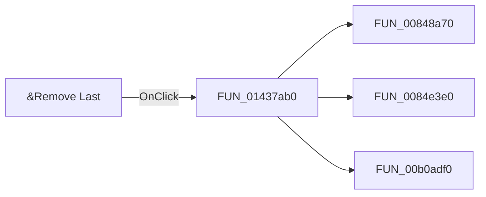

# &Remove Last

> Analysis status: Pending individual source review.

## Control

| Property | Recovered value |
| --- | --- |
| Form | ParStepListEditor |
| Component path | ParStepListEditor.RemoveLast |
| Control class | TBitBtn |
| Caption | &Remove Last |
| Hint | Not present in the recovered resource. |
| Text | Not present in the recovered resource. |
| Handler name | RemoveLastClick |
| Handler address | 01437ab0 |
| Graph node | `resource:dfm:ParStepListEditor/ParStepListEditor.RemoveLast` |
| Handler node | `function:01437ab0` |
| Graph layer | UI |

## What happens when clicked

Pending individual analysis. An agent must read the recovered handler source and its relevant callees before it replaces this text.

## Click flow

## Handler evidence

- Source: [DecompiledSources/Tina16/functions/0000000001437AB0__FUN_01437ab0.c](../../../DecompiledSources/Tina16/functions/0000000001437AB0__FUN_01437ab0.c)
- Recovered role: Not present in the recovered resource.
- Current graph summary: Handles 1 Delphi UI event: ParStepListEditor.RemoveLast.OnClick.
- Current graph behavior: Not present in the recovered resource.
- Current graph evidence: Not present in the recovered resource.
- Complexity: complex
- Distinct outgoing calls: 3

## Direct calls

- `function:00848a70` — FUN_00848a70
- `function:0084e3e0` — FUN_0084e3e0
- `function:00b0adf0` — FUN_00b0adf0

## Resource evidence

- Kind: Not present in the recovered resource.
- Modal result: Not present in the recovered resource.
- Checked state: Not present in the recovered resource.
- List items: Not present in the recovered resource.
- Image reference: Not present in the recovered resource.
- Extracted glyph: None.

## Nearby label candidates

Nearby labels are layout candidates only. They are not proof of behavior.

- Rank 1: Parameter # at distance 76.

## Analysis limits

- Do not infer behavior from the control class, caption, hint, glyph, or nearby label alone.
- Do not replace the pending status until the handler source and relevant call path provide enough evidence.
